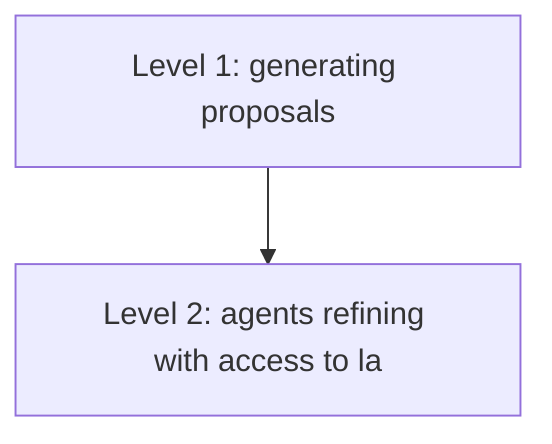
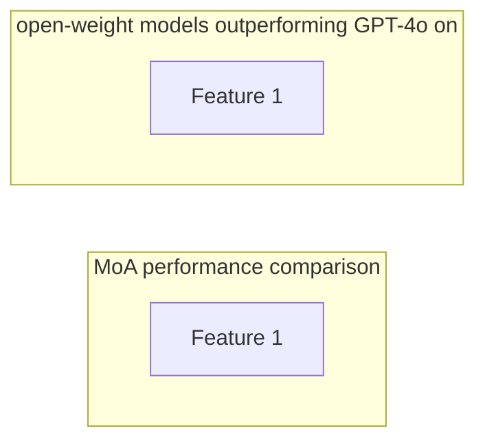

# Mixture of Agents (MoA)

**One-Line Summary**: Mixture of Agents uses multiple LLMs collaboratively in layered rounds -- each model refining the outputs of others -- to achieve aggregate quality that exceeds any individual model, including frontier systems.

**Prerequisites**: Understanding of multi-agent systems, LLM-as-judge, prompt engineering, and ensemble methods in machine learning.

## What Is Mixture of Agents?

Imagine a panel of experts writing a report. In the first round, each expert drafts their own version independently. In the second round, each expert reads everyone else's drafts and writes an improved version that synthesizes the best ideas. In the third round, a senior editor reads all the refined drafts and produces the final document. The result is consistently better than any single expert could produce alone, because each round filters out individual weaknesses and amplifies collective strengths.




Mixture of Agents (MoA), introduced by Together AI in 2024, is an inference-time technique that leverages the **collaborative synergy** between multiple LLMs. Rather than relying on a single model's output, MoA arranges multiple models in layers where each layer's models can see and refine the outputs from the previous layer. The final layer produces a synthesized response that consistently outperforms any individual model in the ensemble.

## How It Works




### The Collaborativeness Phenomenon

The foundation of MoA is an empirical observation: LLMs tend to generate better responses when provided with reference outputs from other models, even if those reference outputs are individually of lower quality. This property, called **collaborativeness**, holds across model families and sizes. A model that scores 70% on a benchmark when generating from scratch might score 80% when given two or three other models' attempts as context.

This is not simply copying the best response. The models genuinely synthesize and improve upon the references, combining the strongest elements, correcting errors, and adding nuance. The improvement is most pronounced when the reference models have diverse strengths (one is better at reasoning, another at factual accuracy, a third at clear writing).

### Architecture

MoA uses a simple layered structure:

**Layer 1 -- Proposers**: Multiple LLMs independently generate responses to the input prompt. These models are chosen for diversity -- different model families, different sizes, different training recipes. Diversity is more important than individual quality; even weaker models contribute useful perspectives.

**Layers 2 through N -- Refiners**: Each model in these intermediate layers receives the original prompt plus all outputs from the previous layer as reference material. They generate improved responses that synthesize the best elements. Each successive layer further refines quality.

**Final Layer -- Aggregator**: A single strong model produces the final response given all outputs from the penultimate layer. This is typically the highest-quality model available.

```
Layer 1: [Model A, Model B, Model C] → 3 independent responses
Layer 2: [Model D, Model E, Model F] → 3 refined responses (seeing Layer 1 outputs)
Layer 3: [Model G (aggregator)] → 1 final response (seeing Layer 2 outputs)
```

### Model Roles

The paper identifies two key roles that models play, with different models excelling at each:

- **Proposers**: Models that generate diverse, high-quality initial responses. Good proposers tend to be creative and cover different angles of the problem. Even smaller or weaker models can be effective proposers if they bring diverse perspectives.
- **Aggregators**: Models that excel at synthesizing and selecting from multiple inputs. Strong aggregators need good judgment and the ability to identify and combine the best elements from reference responses.

Some models are strong at both roles; others excel at one but not the other. The MoA framework allows each model to be placed where its strengths are most valuable.

### Results

MoA achieved remarkable results by combining relatively modest open-weight models:

- **AlpacaEval 2.0**: MoA using open-weight models (Qwen-1.5-110B, LLaMA-3-70B, and others) scored 65.1%, surpassing GPT-4o's 57.5% -- a case where a committee of weaker models outperformed a single frontier model.
- **MT-Bench**: Similar improvements, with MoA ensemble scores exceeding individual model scores by 1-2 points on the 10-point scale.
- **Diminishing returns**: Most of the improvement comes from layers 1 and 2. Adding a third layer provides marginal gains, and fourth layers rarely help. Similarly, beyond 4-6 proposers per layer, additional models add minimal value.

## Why It Matters

1. **Accessible frontier quality**: Organizations without access to frontier models can achieve comparable or superior results by ensembling open-weight models, democratizing high-quality AI.
2. **Complementary to scaling**: While scaling laws improve individual model quality, MoA improves system-level quality at inference time. The two approaches are complementary.
3. **Robustness**: Ensembles are inherently more robust than individual models. If one model hallucinates or makes an error, other models in the ensemble are likely to catch and correct it.
4. **Cost-quality flexibility**: By adjusting the number of layers and models, users can trade inference cost for quality on a per-query basis, using more models for important queries and fewer for routine ones.

## Key Technical Details

- The optimal number of proposers per layer is typically 3-6. More than 6 provides diminishing returns while linearly increasing cost.
- Two layers of refinement capture most of the benefit. Three layers provide marginal improvement; four or more rarely help.
- Latency increases linearly with the number of layers (each layer must wait for the previous layer's outputs), but parallelism within layers keeps per-layer latency equal to the slowest model.
- Total cost is approximately (number of models per layer) × (number of layers) × (single model cost), making MoA 6-18x more expensive than a single model call. The cost-quality tradeoff is favorable only for high-value queries.
- Model diversity matters more than individual model quality for the proposer layer. Ensembling three instances of the same model provides less improvement than three different models of similar quality.
- MoA is most effective on open-ended generation tasks (writing, analysis, summarization) and less impactful on tasks with short, deterministic answers (factual lookup, classification).

## Common Misconceptions

- **"MoA is just majority voting."** Majority voting (self-consistency) selects the most common answer from multiple samples. MoA has models actively reading and synthesizing each other's outputs, producing genuinely new responses that combine the best elements -- fundamentally different from selection.
- **"You need frontier models for MoA to work."** The most striking MoA result is that ensembles of open-weight models *outperform* frontier models. The technique is specifically designed to leverage weaker models collaboratively.
- **"More models always helps."** Diminishing returns set in quickly. The improvement from 3 to 6 proposers is much smaller than from 1 to 3, and beyond 6 the cost usually outweighs the quality gain.
- **"MoA is too expensive for production."** While full MoA is expensive, lightweight variants (2 proposers + 1 aggregator in a single layer) provide meaningful quality improvements at only 3x cost, which may be justified for high-value applications.

## Connections to Other Concepts

- `multi-agent-systems.md`: MoA is a structured form of multi-agent collaboration where agents operate in defined roles and layers (see `multi-agent-systems.md`).
- `llm-as-judge.md`: The aggregator role in MoA is closely related to LLM-as-judge, where one model evaluates and synthesizes outputs from others (see `llm-as-judge.md` in Evaluation).
- `self-consistency.md`: MoA generalizes the self-consistency approach (sampling multiple answers and aggregating) by using diverse models and active synthesis rather than passive voting (see `sampling-strategies.md` in Inference & Deployment).
- `compound-ai-systems.md`: MoA is a compound system where the "components" are different LLMs arranged in a specific topology (see `compound-ai-systems.md`).
- `model-routing.md`: While model routing selects a single model per query, MoA uses multiple models per query. These approaches can be combined: route easy queries to a single model, use MoA for hard queries (see `model-routing.md` in Inference & Deployment).
- `inference-time-scaling-laws.md`: MoA is an inference-time scaling strategy -- spending more compute at inference to improve quality (see `inference-time-scaling-laws.md`).

## Further Reading

- **"Mixture-of-Agents Enhances Large Language Model Capabilities" (Wang et al., Together AI, 2024)** -- The original MoA paper demonstrating that layered LLM collaboration outperforms individual frontier models on major benchmarks.
- **"More Agents Is All You Need" (Li et al., 2024)** -- Shows that simply scaling the number of LLM agents (via sampling and majority voting) improves performance, providing theoretical grounding for multi-agent inference approaches.
- **"LLM-Blender: Ensembling Large Language Models with Pairwise Ranking and Generative Fusion" (Jiang et al., 2023)** -- An earlier approach to combining outputs from multiple LLMs using learned ranking and fusion, predating MoA but exploring similar ideas.
