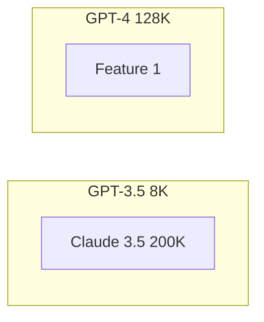

# Context Window Mechanics

**One-Line Summary**: The context window is the fixed-capacity input buffer that constrains every LLM interaction, with sizes ranging from 8K to 2M+ tokens, where nominal capacity and effective capacity diverge significantly.

**Prerequisites**: `what-is-a-prompt.md`, `tokenization-for-prompt-engineers.md`.

## What Is the Context Window?

Think of a desk that can only hold a fixed number of papers. You can spread out reference documents, notes, and instructions — but the desk has hard edges. Once it is full, adding a new paper means something falls off. You can choose a bigger desk (a larger context window), but bigger desks are more expensive to rent and take longer to scan when you need to find something. And here is the critical nuance: even though the desk might technically hold 200 papers, your ability to find and use a specific piece of information degrades once you have more than about 50-100 papers spread across it.

The context window is the maximum number of tokens an LLM can process in a single forward pass. It includes everything: system instructions, conversation history, retrieved documents, the current user query, and the model's own output. This is a hard ceiling — exceed it and the API returns an error. The budget is shared between input and output: a model with a 128K context window that receives 120K tokens of input can generate at most 8K tokens of output (subject to any separate output length cap the provider imposes).

Context windows have grown dramatically — from 2K tokens in GPT-2 (2019) to 2M tokens in Gemini 1.5 Pro (2024) — but bigger is not simply better. Cost scales linearly with token count, latency increases with context length, and retrieval accuracy degrades in predictable patterns as the window fills. Understanding these mechanics is essential for designing production LLM systems.

*Source: Lilian Weng, "LLM Powered Autonomous Agents," lilianweng.github.io, 2023. The context window is the central constraint connecting all components.*

*Source: Adapted from Hsieh et al., "RULER: What's the Real Context Size of Your Long-Context Language Models?" 2024.*

## How It Works

### Size Landscape (2024-2025)

The context window sizes available across major models:

- **8K tokens**: GPT-3.5 Turbo (original), many open-source 7B models
- **32K tokens**: GPT-4 (32K variant), Mistral Large
- **128K tokens**: GPT-4 Turbo, GPT-4o, Claude 3.5 Sonnet, Llama 3.1 405B
- **200K tokens**: Claude 3.5 Sonnet / Claude 3 Opus (Anthropic's standard)
- **1M tokens**: Gemini 1.5 Pro
- **2M tokens**: Gemini 1.5 Pro (extended)

These numbers represent the total token budget. A 200K window is roughly 150,000 English words — equivalent to a 500-page book. But filling it to capacity has consequences.

### The Input-Output Budget Constraint

The context window is a shared pool. If a model has a 128K context window and a maximum output length of 4K tokens, then your input can be at most 124K tokens. In practice, many models impose separate output caps:

- GPT-4o: 128K context, 16K max output
- Claude 3.5 Sonnet: 200K context, 8K max output (default, extendable)
- Gemini 1.5 Pro: 1M context, 8K max output

This means you must plan your token budget: system prompt + history + retrieved context + user query + expected output <= context window. In production, build in a 5-10% buffer to account for tokenization variance and avoid edge-case failures.

### Nominal vs. Effective Context Length

A model advertising 128K context can technically process 128K tokens, but its ability to use information at all positions is not uniform. Research consistently shows:

- **Strong performance zone**: The first ~10% and last ~10% of the context window receive the most attention.
- **Degradation zone**: Information in the middle 60-80% is recalled with lower accuracy — the "lost in the middle" phenomenon (Liu et al., 2023).
- **Effective context length**: For many models, the "effective" context — where recall accuracy exceeds 90% — is 30-50% of the nominal context window.

A 128K model might have an effective context of 40-65K tokens for tasks requiring precise retrieval of specific facts. This is the single most important gap between marketing and engineering reality in the LLM space.

### Cost Scaling

API pricing is per-token, so longer contexts cost more linearly. But computational cost scales super-linearly due to attention's quadratic nature (though providers absorb this into per-token pricing). The practical cost implications:

- A 1,000-token prompt costs X.
- A 100,000-token prompt costs 100X in input token fees.
- Latency for the "prefill" phase (processing input) scales roughly linearly: a 100K prompt takes ~10x longer to prefill than a 10K prompt.
- Time to first token (TTFT) is directly affected: 100K input tokens might add 5-15 seconds of TTFT depending on the provider.

## Why It Matters

### System Architecture Decisions

The context window determines the fundamental architecture of your LLM application. With an 8K window, you need aggressive retrieval and summarization — only the most relevant 3-4 pages of text fit alongside instructions. With 200K, you might fit an entire codebase or document set directly, eliminating retrieval complexity but increasing cost. The choice between RAG (retrieval-augmented generation) and "stuff it all in the context" depends directly on context window size, cost tolerance, and accuracy requirements.

### Quality-Cost-Latency Triangle

Every prompt design decision navigates a three-way tradeoff. Including more context improves coverage (quality) but increases cost and latency. Using a larger context window gives more room but costs more per request. Truncating context saves money but risks losing critical information. Effective prompt engineering finds the sweet spot for each application — typically using 20-60% of the available context window for optimal quality-cost balance.

### Conversation Memory Management

In multi-turn applications (chatbots, agents), conversation history accumulates across turns. Without management, a 20-turn conversation can consume 15-30K tokens of history alone. Strategies include: sliding window (keep only the last N turns), summarization (compress old turns into a summary), and selective retention (keep only turns matching relevance criteria). Each strategy has different quality-cost tradeoffs that depend on the context window size.

## Key Technical Details

- Context windows range from 8K tokens (small models) to 2M tokens (Gemini 1.5 Pro) as of 2025.
- The input-output budget is shared: input_tokens + output_tokens <= context_window (minus any provider-specific output cap).
- Effective context length (>90% recall accuracy) is typically 30-50% of nominal context for precise fact retrieval tasks.
- Cost scales linearly with token count: 10x more context = 10x higher input cost.
- Time to first token (TTFT) scales roughly linearly with input length: 100K tokens can add 5-15 seconds of latency.
- Most production applications achieve optimal quality-cost balance using 20-60% of available context.
- Output length caps are typically 4K-16K tokens regardless of context window size, though some providers offer extended output modes.
- Context window overflow returns a 400-level API error; always validate total token count before sending requests.

## Common Misconceptions

**"A 128K context model can effectively use all 128K tokens."** Nominal and effective context differ significantly. The "lost in the middle" effect means information placed in the central 60-80% of a full context window is recalled less accurately. Effective context for high-accuracy retrieval is often 30-50% of nominal capacity.

**"Bigger context windows are always better."** Larger contexts increase cost, latency, and attention diffusion. For many tasks, a well-curated 10K-token prompt outperforms a 100K-token prompt that includes irrelevant information. The right context size depends on the task, not just the model's maximum.

**"Context window size equals memory."** The context window is not persistent memory — it resets with each API call. Multi-turn "memory" is simulated by including conversation history in each new request, consuming tokens and budget every time.

**"All tokens in the context window are equally useful."** Position effects (primacy, recency) mean that where you place information within the context window matters as much as whether you include it. Critical instructions at the beginning and end are recalled better than identical instructions buried in the middle.

## Connections to Other Concepts

- `attention-and-position-effects.md` — Explains why information placement within the context window matters: the U-shaped attention curve.
- `tokenization-for-prompt-engineers.md` — Token counting is the prerequisite for context window budget management.
- `prompt-engineering-vs-context-engineering.md` — Context engineering is fundamentally about deciding what occupies the limited context window.
- `many-shot-prompting.md` — Many-shot techniques consume large portions of the context window and require careful budgeting.
- `prompt-chaining.md` — Chaining is one strategy for working around context window limitations by splitting work across multiple calls.

## Further Reading

- Liu et al., "Lost in the Middle: How Language Models Use Long Contexts," 2023. The landmark study on position-dependent recall in long contexts.
- Google DeepMind, "Gemini 1.5: Unlocking Multimodal Understanding Across Millions of Tokens of Context," 2024. Technical details on the longest context windows available.
- Anthropic, "Long Context Prompting Tips," 2024. Practical guidance on using Claude's 200K context window effectively.
- Hsieh et al., "RULER: What's the Real Context Size of Your Long-Context Language Models?" 2024. Benchmark for evaluating effective vs. nominal context lengths.
