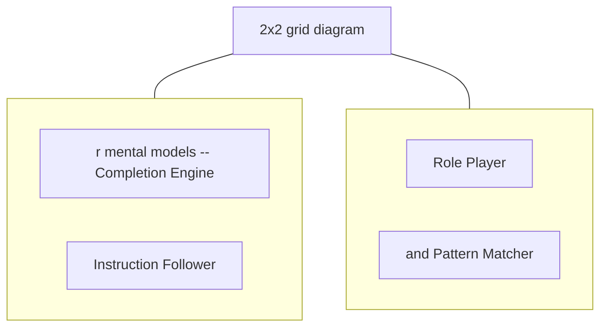

# Mental Models for Prompting

**One-Line Summary**: Four mental models — completion engine, instruction follower, role player, and pattern matcher — provide complementary lenses for understanding LLM behavior, and knowing which model to apply in a given situation determines prompt effectiveness.

**Prerequisites**: `what-is-a-prompt.md`, `how-llms-process-prompts.md`, `in-context-learning.md`.

## What Are Mental Models for Prompting?

Imagine you need to communicate with someone, but you are not sure whether you are talking to a parrot, an employee, an actor, or a mimic. A parrot continues whatever sentence you start — it does not understand meaning, it just predicts the next likely word. An employee follows instructions — give clear directives and they execute. An actor embodies a character — tell them who they are and they stay in role. A mimic replicates patterns — show them an example and they reproduce the format with new content. Each requires a fundamentally different communication strategy, and using the wrong one leads to frustration.

LLMs are complex systems that exhibit all four behaviors depending on how you interact with them. No single mental model captures the full picture. The completion engine model explains why prompt structure and word choice matter mechanically. The instruction follower model explains why explicit directives work with instruction-tuned models. The role player model explains why persona prompting activates domain expertise. The pattern matcher model explains why few-shot examples are so effective. Skilled prompt engineers switch fluidly between these models, applying whichever lens best fits the task at hand.

These are not competing theories of how LLMs work — they are complementary perspectives that each highlight different aspects of model behavior. Understanding all four gives you a richer toolkit for prompt design and a better diagnostic framework when prompts fail.

*Source: Adapted from the four mental models framework described in this document.*

*Source: Lilian Weng, "Prompt Engineering," lilianweng.github.io, 2023. The different prompting techniques align with the four mental models: instructions map to the instruction follower, examples map to the pattern matcher, and prefilling maps to the completion engine.*

## How It Works

### Model 1: The Completion Engine

The most mechanistically accurate model. An LLM is fundamentally a next-token predictor trained on massive text corpora. Given a sequence of tokens, it outputs a probability distribution for the next token. This model explains:

- **Why structure matters**: The model completes patterns it has seen in training data. Starting a prompt with "Q:" and "A:" triggers question-answering patterns. Starting with "Dear Sir/Madam" triggers letter-writing patterns.
- **Why prefilling works**: If you start the assistant response with `{"result":`, the model continues the JSON pattern because that is the most probable continuation.
- **Why prompts can "leak"**: The model might continue generating past your intended stop point because the most probable next tokens continue the pattern rather than stopping.

**When to apply**: Use this model when designing prompt structure, choosing opening words, using prefilling, or debugging unexpected continuations. It is most useful with base (non-instruction-tuned) models.

### Model 2: The Instruction Follower

Instruction-tuned models (ChatGPT, Claude, Gemini) have been fine-tuned via RLHF/RLAIF to follow instructions. This model explains:

- **Why explicit instructions work**: "Summarize in 3 bullet points" is followed more reliably than implicit patterns suggesting a 3-bullet format.
- **Why system messages have authority**: The model has been trained to prioritize instructions in the system role.
- **Why instruction specificity correlates with output quality**: Vague instructions produce variable output because the model must guess the intent. Specific instructions narrow the output space.

**When to apply**: Use this model when writing system messages, crafting task descriptions, specifying output constraints, and designing instruction-heavy prompts. It is the dominant model for instruction-tuned chat models in production.

### Model 3: The Role Player

When given a persona ("You are a senior tax attorney with 20 years of experience in corporate tax law"), models produce output that measurably differs from unpersonated output. This model explains:

- **Why domain-specific personas improve quality**: The persona activates a cluster of training data associated with that domain, biasing the model toward domain-appropriate vocabulary, reasoning patterns, and knowledge.
- **Why detailed character sheets work**: More specific persona descriptions provide stronger activation signals: "You are a pediatric oncologist at Johns Hopkins" activates a narrower, more expert knowledge cluster than "You are a doctor."
- **Why personas can conflict with instructions**: A persona might have implicit behavioral norms that conflict with explicit instructions, requiring careful design.

**When to apply**: Use this model when the task requires domain expertise, a specific voice or tone, or when you want to shift the model's default behavior toward a particular knowledge domain. Most effective for knowledge-intensive tasks.

### Model 4: The Pattern Matcher

In-context learning (ICL) reveals the model's ability to identify and replicate patterns from examples. This model explains:

- **Why few-shot examples work**: The model identifies the input-output pattern and applies it to new inputs.
- **Why format matters more than label correctness**: The model matches the structural pattern, not the semantic mapping.
- **Why example diversity matters**: Diverse examples define a broader pattern; repeated similar examples define a narrower one.
- **Why output format is contagious**: If all examples produce JSON, the model produces JSON. If all examples use bullet points, the model uses bullet points.

**When to apply**: Use this model when designing few-shot examples, establishing output formats through demonstration, or when you need the model to replicate a specific style or structure.

## Why It Matters

### Diagnostic Power

When a prompt fails, the right mental model helps you diagnose why:

- Output continues past the intended endpoint? Think **completion engine** — add stop sequences or structural cues.
- Model ignores a specific constraint? Think **instruction follower** — was the instruction specific enough? Was it placed in a high-attention position?
- Output lacks domain depth? Think **role player** — add or refine the persona.
- Output format is wrong? Think **pattern matcher** — add examples in the desired format.

### Technique Selection

Each mental model maps to a family of techniques:

| Mental Model | Primary Techniques |
|---|---|
| Completion engine | Prefilling, stop sequences, prompt structure design |
| Instruction follower | System messages, explicit constraints, task decomposition |
| Role player | Persona prompting, domain framing, voice/tone specification |
| Pattern matcher | Few-shot examples, output format demonstrations, style templates |

Choosing the right technique starts with choosing the right mental model for the situation.

### Team Communication

When working in teams, having shared vocabulary for these models reduces misunderstanding. Saying "this is a pattern matching problem — we need more examples, not more instructions" is more productive than debating specific prompt wording without a shared framework.

## Key Technical Details

- Base models respond primarily as completion engines; instruction-tuned models respond primarily as instruction followers.
- Persona prompting has been measured to improve domain-specific task performance by 10-20% (depends on task and model).
- Few-shot pattern matching (ICL) reaches ~85% of its maximum benefit with 3-8 examples for most formatting and classification tasks.
- Instruction following is strongest in the system message (first position) and weakest in the middle of long contexts.
- The completion engine model is most accurate for predicting behavior at the token level; the instruction follower model is most accurate for predicting behavior at the task level.
- Models can operate in multiple modes simultaneously: following instructions (instruction follower) while maintaining a persona (role player) and replicating a demonstrated format (pattern matcher).
- The pattern matcher model predicts that format consistency across examples matters more than example count — validated by Min et al. (2022).

## Common Misconceptions

**"One mental model is correct and the others are wrong."** All four models capture real aspects of LLM behavior. The completion engine is the most mechanistically accurate, but the instruction follower and pattern matcher models are more practically useful for prompt design with instruction-tuned models. Use whichever model is most predictive for your specific situation.

**"Instruction-tuned models only respond to instructions."** Instruction-tuned models still exhibit completion engine behavior (they continue patterns), role player behavior (they respond to personas), and pattern matcher behavior (they replicate few-shot formats). Instruction tuning adds instruction-following capability; it does not remove the other behaviors.

**"The completion engine model means LLMs are 'just' autocomplete."** While mechanistically accurate, this framing understates the emergent capabilities that arise from next-token prediction at scale. The completion engine model explains the mechanism but not the full range of emergent behaviors, including reasoning, planning, and creative generation.

**"You should pick one model and always use it."** The best practitioners switch models fluidly. They might use the instruction follower model for the system message, the pattern matcher model for few-shot examples, and the completion engine model for prefilling — all within a single prompt.

## Connections to Other Concepts

- `in-context-learning.md` — The theoretical basis for the pattern matcher mental model.
- `role-and-persona-prompting.md` — Practical application of the role player mental model.
- `instruction-prompting.md` — Practical application of the instruction follower mental model.
- `prefilling-and-output-priming.md` — Practical application of the completion engine mental model.
- `few-shot-prompting.md` — Practical application of the pattern matcher mental model.

## Further Reading

- Brown et al., "Language Models are Few-Shot Learners," 2020. The paper that revealed the pattern matcher and completion engine behaviors at scale.
- Shanahan, "Talking About Large Language Models," 2023. Philosophical analysis of appropriate and misleading mental models for LLMs.
- Min et al., "Rethinking the Role of Demonstrations," 2022. Provides evidence that distinguishes the pattern matcher from the instruction follower model.
- Wei et al., "Emergent Abilities of Large Language Models," 2022. Documents the scale thresholds at which different model behaviors emerge.
- Reynolds and McDonell, "Prompt Programming for Large Language Models: Beyond the Few-Shot Paradigm," 2021. Early work articulating the completion engine mental model for prompt design.
