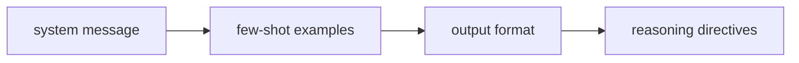

# Prompt Engineering vs. Context Engineering

**One-Line Summary**: Prompt engineering crafts the instructions telling the model what to do, while context engineering designs the information environment — what documents, history, state, and tools enter the context window — and production systems require both.

**Prerequisites**: `what-is-a-prompt.md`, `context-window-mechanics.md`.

## What Is the Distinction?

Think of designing a university exam. Prompt engineering is writing the exam questions: choosing the wording, specifying the format of expected answers, deciding how many points each question is worth, and adding clarifying instructions. Context engineering is deciding what study materials students can bring into the exam room: a textbook? A one-page formula sheet? Their class notes? A calculator? The quality of student responses depends on both — the best exam question fails if students lack the reference materials to answer it, and the best reference materials are wasted on a poorly worded question.

Prompt engineering (PE) has been the dominant framing since GPT-3: how do you write instructions, examples, and constraints that get the model to do what you want? This encompasses techniques like few-shot prompting, chain-of-thought, role prompting, and output format specification. PE focuses on the directive content of the prompt — the "what to do" and "how to do it."

Context engineering (CE), a framing popularized by Andrej Karpathy and others in 2024-2025, addresses a different question: what information should be present in the context window when the model generates its response? This includes retrieval strategy (what documents to fetch), conversation memory management (what history to include), state injection (what tool results or database records to provide), and information ordering (where to place each piece of content). As LLM applications move from demos to production, CE is often the larger engineering challenge.

*Source: Lilian Weng, "LLM Powered Autonomous Agents," lilianweng.github.io, 2023. The distinction between crafting instructions (PE) and designing the information environment (CE) maps onto how agents assemble their context.*

*Source: Adapted from Karpathy's context engineering framing, 2025, and Anthropic's "Building Effective Agents," 2024.*

## How It Works

### Prompt Engineering: Crafting the Directive Layer

PE operates on the instruction and example content of the prompt. Its techniques include:

- **System message design**: Writing the persona, behavioral constraints, and global instructions that frame model behavior.
- **Instruction specificity**: Moving from vague ("summarize this") to precise ("summarize in 3 bullet points, each under 20 words, focusing on financial implications").
- **Few-shot example curation**: Selecting, ordering, and formatting input-output examples that demonstrate the desired behavior.
- **Output format specification**: Defining the structure of expected output (JSON schema, markdown template, numbered list).
- **Chain-of-thought and reasoning directives**: Instructing the model to reason step-by-step before answering.

PE is what most tutorials teach. It is necessary but not sufficient for production systems.

### Context Engineering: Designing the Information Environment

CE operates on the non-directive content that fills the context window. Its challenges include:

- **Retrieval strategy**: Deciding what documents, code, or data to retrieve and include. Semantic search? Keyword search? Hybrid? How many chunks? What chunk size?
- **Memory management**: In multi-turn applications, deciding which conversation turns to keep, summarize, or discard.
- **State injection**: Incorporating real-time data — user profiles, database records, API responses, tool call results — into the context.
- **Information ordering**: Placing retrieved content to align with attention patterns (primacy/recency) for maximum model utilization.
- **Context budget allocation**: Deciding how many tokens to allocate to instructions (PE) vs. context (CE) vs. reserved output space.

### Where They Intersect

The boundary between PE and CE is not always crisp. A few-shot example is both an instruction (showing the desired behavior) and context (providing reference information). A system message that says "You have access to the following user data: {user_profile}" is PE in its framing and CE in its content injection. In practice, skilled practitioners design both simultaneously, recognizing that the instruction layer and the information layer are co-dependent.

### The Karpathy Framing

Andrej Karpathy's articulation of context engineering (2024-2025) emphasizes that as LLM applications mature, the bottleneck shifts from "how to write good prompts" to "how to build systems that assemble the right context for each interaction." In an agentic system, the LLM might process hundreds of different context configurations per session — different tool results, different retrieved documents, different conversation histories — and the quality of each configuration determines the quality of each action. This is engineering, not prompt writing.

## Why It Matters

### Production Systems Are Context-Engineering Problems

In a production RAG application, the prompt template (PE) might be 500 tokens of fixed instructions. The retrieved documents (CE) might be 5,000-50,000 tokens of variable content. The retrieval quality — which documents were selected, how they were chunked, whether they actually contain the answer — determines output quality far more than the prompt wording. Studies on RAG systems consistently show that retrieval improvements yield 2-3x the quality gains of prompt improvements alone.

### Different Skills, Different Teams

PE requires understanding LLM behavior, instruction-following patterns, and output formatting. CE requires understanding information retrieval, database design, API integration, and system architecture. In production teams, these often map to different skill sets. A prompt engineer might optimize the system message, while a backend engineer designs the retrieval pipeline. Both need to understand the other's work, but the day-to-day tasks are distinct.

### The Evolution of the Field

The terminology shift from "prompt engineering" to "context engineering" reflects the maturation of the field. Early LLM applications were simple prompt-in, completion-out systems where PE was the whole game. Modern applications are complex systems where the prompt is assembled from multiple dynamic sources, and the quality of assembly — the context engineering — is the primary differentiator.

## Key Technical Details

- In production RAG systems, retrieval quality (CE) typically accounts for 60-70% of output quality variance, while prompt quality (PE) accounts for 20-30%.
- The typical token budget split in production: 5-15% system instructions (PE), 50-70% retrieved context (CE), 10-20% conversation history (CE), 5-15% reserved for output.
- Context engineering decisions include: chunk size (256-1024 tokens typical), retrieval count (3-10 documents typical), reranking strategy, and context ordering.
- Prompt engineering decisions include: instruction specificity, example count and selection, output format, and reasoning directives.
- A/B testing shows that prompt template changes typically yield 5-15% quality improvements, while retrieval/context changes yield 10-40% improvements in RAG systems.
- Agentic systems may assemble 10-50 different context configurations per session, each requiring CE decisions about what to include.
- Prompt caching disproportionately benefits CE-heavy systems: stable system instructions (PE) are cached, while variable retrieved context (CE) is appended after the cached prefix, reducing the cost of large dynamic contexts.
- Evaluation metrics differ: PE effectiveness is measured by instruction compliance and output quality on fixed inputs, while CE effectiveness is measured by retrieval precision, recall, and end-to-end task accuracy across variable inputs.
- The debugging workflow differs as well: PE issues are diagnosed by inspecting the prompt template and model behavior, while CE issues require tracing the retrieval pipeline, checking what documents were selected, and verifying that relevant information was actually present in the context.

## Common Misconceptions

**"Prompt engineering is all you need for production LLM systems."** For simple, single-turn applications, PE alone may suffice. For RAG, agentic, or multi-turn systems, CE — designing what information enters the context — is typically the larger engineering challenge and the primary driver of quality.

**"Context engineering replaces prompt engineering."** CE and PE are complementary, not competing. You need well-designed instructions (PE) AND well-curated context (CE). An excellent retrieval system with a poor prompt template wastes the retrieved information. A perfect prompt template with irrelevant context produces irrelevant output.

**"Context engineering is just RAG."** RAG is one form of CE, but CE also includes conversation memory management, state injection, tool result integration, information ordering, and context budget allocation. An agentic system that manages tool call results and conversation state is doing CE without necessarily doing retrieval.

**"You should focus on PE first, then CE."** In practice, the two should be co-designed. The prompt template must be written to reference and utilize the context that will be provided. A system message that says "Answer based on the provided documents" only works if CE ensures relevant documents are actually provided.

**"Context engineering is only relevant for large-scale systems."** Even a simple chatbot with a system prompt and conversation history is making CE decisions: how many turns of history to keep, whether to summarize older turns, and how to handle context window overflow. Any application that manages dynamic content in the prompt is doing context engineering, regardless of scale. The difference between a prototype and production system is often the sophistication of these CE decisions — not whether they exist.

**"More sophisticated retrieval always means better CE."** Retrieval is one lever, but CE also involves knowing when not to include information. Over-stuffing the context with marginally relevant documents introduces noise that competes for the model's attention. Effective CE requires precision — including exactly what the model needs and nothing more. The best CE systems use relevance thresholds, deduplication, and content compression to curate a focused context.

## Connections to Other Concepts

- `what-is-a-prompt.md` — The prompt anatomy maps directly: system message and instructions are PE; retrieved documents, history, and tool results are CE.
- `context-window-mechanics.md` — The context window is the shared resource that both PE and CE must budget within.
- `attention-and-position-effects.md` — CE must account for position effects when deciding where to place retrieved content.
- `few-shot-prompting.md` — Few-shot examples sit at the intersection: PE in their instructional role, CE in their informational role.
- `prompt-templates-and-variables.md` — Templates are the engineering tool that bridges PE (the template structure) and CE (the variable content).

## Further Reading

- Karpathy, Andrej. Twitter/X thread on context engineering, 2025. The articulation that popularized the CE framing.
- Lewis et al., "Retrieval-Augmented Generation for Knowledge-Intensive NLP Tasks," 2020. The foundational RAG paper that launched the CE paradigm.
- Anthropic, "Building Effective Agents," 2024. Practical guide that addresses both PE and CE in agentic systems.
- Gao et al., "Retrieval-Augmented Generation for Large Language Models: A Survey," 2024. Comprehensive survey of CE techniques in RAG systems.
