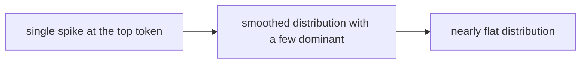
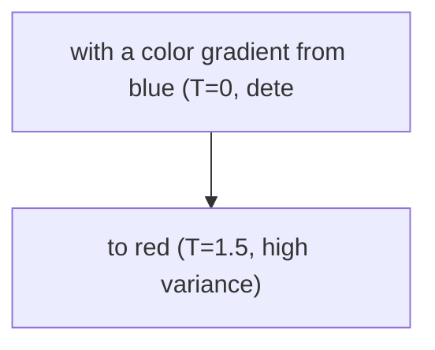

# Temperature and Sampling

**One-Line Summary**: Temperature, top-k, and top-p (nucleus sampling) are the control knobs that determine how the model selects from its predicted probability distribution, ranging from deterministic extraction to creative exploration.

**Prerequisites**: `how-llms-process-prompts.md`.

## What Is Temperature and Sampling?

Imagine adjusting a faucet between ice-cold precision and scalding-hot creativity. At the cold end (temperature = 0), the water flows in a single, predictable stream — the model always picks the most probable next token, producing consistent, safe, and sometimes boring output. Crank the handle toward hot (temperature = 1.0-2.0), and the stream sprays in unpredictable directions — the model samples from a wider range of possibilities, producing varied, surprising, and occasionally incoherent output. The skill is knowing exactly where to set the dial for each task.

After the LLM processes your prompt through its transformer layers, it outputs a probability distribution (logits) over the entire vocabulary for the next token. "The" might have probability 0.3, "A" might have 0.15, "In" might have 0.08, and so on down to thousands of tokens with vanishingly small probabilities. Temperature and sampling parameters control how the model selects from this distribution. They do not change the model's knowledge or reasoning — they change its decision-making policy at the final selection step.

These parameters interact with prompt design in important ways. A carefully crafted prompt can be undermined by inappropriate sampling settings, and a simple prompt can produce excellent results with the right temperature. Understanding this interaction is essential for consistent production quality.

*Source: Adapted from Holtzman et al., "The Curious Case of Neural Text Degeneration," 2019.*

*Source: Adapted from Renze and Guven, "The Effect of Sampling Temperature on Problem Solving in Large Language Models," 2024.*

## How It Works

### Temperature: Scaling the Distribution

Temperature (T) is applied to the raw logits before the softmax function: softmax(logits / T). The effect is mathematically precise:

- **T = 0** (or effectively 0.01): The softmax becomes a hard argmax. The highest-probability token is always selected. Output is deterministic — the same prompt always produces the same output. Ideal for classification, extraction, and any task where consistency matters.
- **T = 0.3-0.5**: The distribution is sharpened but not collapsed. The top few tokens still have a chance, but unlikely tokens are effectively eliminated. Good for code generation, structured output, and analytical writing.
- **T = 0.7-1.0**: The distribution approximately matches the model's trained probabilities. Moderate diversity, good for general-purpose text generation, creative writing with coherence, and brainstorming.
- **T = 1.5-2.0**: The distribution is flattened significantly. Even low-probability tokens get selected frequently. Useful for maximum creative diversity but produces more errors, non-sequiturs, and incoherence.

### Top-k Sampling

Top-k restricts selection to the k most probable tokens, then renormalizes the probabilities among them. If k=50, the model can only pick from the top 50 tokens regardless of their absolute probabilities. The problem: a fixed k is suboptimal across different contexts. After "The capital of France is", there is essentially one correct answer (k=50 is wasteful). After "The color of the sunset was", many tokens are reasonable (k=50 might be too restrictive). Top-k is largely superseded by top-p in modern practice but is still available in most APIs.

### Top-p (Nucleus Sampling)

Top-p (nucleus sampling, Holtzman et al. 2019) dynamically adjusts the number of candidate tokens based on cumulative probability. If top-p = 0.9, the model selects from the smallest set of tokens whose cumulative probability reaches 90%. This is adaptive:

- When the model is confident (one token has 0.85 probability), the nucleus might contain just 2-3 tokens.
- When the model is uncertain (many tokens around 0.02-0.05), the nucleus might contain 50-100 tokens.

Common settings: top-p = 0.9-0.95 for general use, top-p = 1.0 to disable (letting temperature alone control diversity). Most practitioners recommend using either temperature OR top-p, not both, as their interaction can be unpredictable.

### Interaction with Prompt Design

Sampling parameters and prompt quality are compensatory. A vague prompt with T=0 produces deterministic but potentially misguided output — the model confidently generates the most likely (but not necessarily correct) completion. A precise prompt with T=1.0 produces varied output that stays on-task because the prompt constrains the viable generation space. The practical implication:

- For production systems: use T=0 to T=0.3 and invest in prompt quality.
- For creative/exploratory tasks: use T=0.7-1.0 and accept variation as a feature.
- For evaluation/testing: always use T=0 for reproducibility.

## Why It Matters

### Task-Specific Calibration

Different tasks have optimal temperature ranges, and miscalibration produces measurable quality loss:

| Task | Recommended Temperature | Reasoning |
|------|------------------------|-----------|
| Classification / extraction | 0.0 | Consistency, determinism |
| Code generation | 0.0-0.3 | Correctness over creativity |
| Analytical writing | 0.3-0.5 | Coherent variation |
| General conversation | 0.7-0.8 | Natural variation |
| Creative writing | 0.8-1.0 | Diverse expression |
| Brainstorming / ideation | 1.0-1.3 | Maximum exploration |

Using T=1.0 for JSON extraction can produce malformed output 10-30% of the time that would be well-formed at T=0.

### Reproducibility and Testing

At T=0, the same prompt produces the same output (with the same model version), enabling deterministic testing. This is critical for prompt evaluation: you cannot A/B test prompt variants if sampling variance exceeds the signal from prompt changes. Running evaluations at T=0 isolates prompt quality from sampling randomness. In production, T=0 also enables caching — identical inputs produce identical outputs, allowing you to cache and reuse responses.

### Cost Implications of Sampling

Temperature does not directly affect cost (you pay per token regardless), but indirectly, lower temperature produces shorter, more focused outputs (fewer "wandering" tokens), while higher temperature can produce longer, more exploratory responses. For high-volume applications, T=0 outputs are typically 10-20% shorter than T=1.0 outputs for the same prompt, translating to real output token savings.

## Key Technical Details

- Temperature mathematically scales logits before softmax: softmax(logits / T). T=0 is implemented as argmax.
- Top-p = 0.9 means the model samples from the smallest token set covering 90% cumulative probability.
- Top-k = 50 means the model samples from exactly the top 50 tokens by probability.
- OpenAI defaults: temperature = 1.0, top-p = 1.0. Anthropic defaults: temperature = 1.0, top-k = not applied.
- Most APIs support temperature range 0.0-2.0, though values above 1.5 rarely produce useful output.
- At T=0, output is deterministic given the same prompt, model version, and infrastructure (minor non-determinism can arise from floating-point operations across hardware).
- Using both temperature and top-p simultaneously is supported but can produce unexpected distributions; best practice is to adjust one and leave the other at default.
- Frequency penalty and presence penalty (available in some APIs) further modify sampling by penalizing repeated tokens.

## Common Misconceptions

**"Temperature controls the model's intelligence or reasoning ability."** Temperature only affects how the model selects from its probability distribution. It does not change the distribution itself. A model at T=0 is not "smarter" — it is more predictable. It always picks the most likely token, which is often but not always the best token.

**"Higher temperature means more creative and better writing."** Higher temperature increases diversity but not quality. Beyond T=1.0, output quality typically degrades as the model increasingly selects low-probability (and often incoherent) tokens. The sweet spot for creative writing is usually T=0.7-1.0, not T=1.5+.

**"T=0 is always best for production."** T=0 is best for deterministic tasks, but for conversational applications, T=0 produces robotic, repetitive output. Users report higher satisfaction with T=0.5-0.8 for conversational AI. The right temperature depends on the use case, not a universal rule.

**"Top-p and top-k do the same thing."** Top-p adapts to the model's confidence level (more candidates when uncertain, fewer when confident). Top-k uses a fixed number of candidates regardless of confidence. Top-p is generally superior for natural language generation because it handles variable-confidence situations gracefully.

## Connections to Other Concepts

- `how-llms-process-prompts.md` — Temperature and sampling are the final stage of the generation pipeline described there.
- `prefilling-and-output-priming.md` — Prefilling constrains the generation start point; temperature controls the diversity from that point forward.
- `zero-shot-prompting.md` — Zero-shot performance is highly sensitive to temperature settings, especially for structured output tasks.
- `few-shot-prompting.md` — Few-shot examples partially compensate for high temperature by constraining the output distribution through demonstrated patterns.
- `in-context-learning.md` — Temperature affects how reliably the model replicates patterns learned in-context.

## Further Reading

- Holtzman et al., "The Curious Case of Neural Text Degeneration," 2019. Introduced nucleus (top-p) sampling and demonstrated the failure modes of pure top-k and temperature.
- Renze and Guven, "The Effect of Sampling Temperature on Problem Solving in Large Language Models," 2024. Systematic evaluation of temperature effects across reasoning tasks.
- OpenAI, "API Reference: Chat Completions," 2024. Canonical documentation on temperature and sampling parameters.
- Wang et al., "Self-Consistency Improves Chain of Thought Reasoning in Language Models," 2022. Uses temperature > 0 with multiple samples to improve reasoning — a key technique that leverages sampling diversity.
