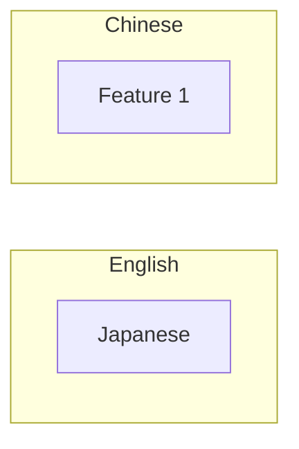

# Tokenization for Prompt Engineers

**One-Line Summary**: Tokenization determines how text is segmented into the fundamental units an LLM processes, directly affecting cost, multilingual performance, and prompt behavior in ways that are invisible but consequential.

**Prerequisites**: `what-is-a-prompt.md`, `how-llms-process-prompts.md`.

## What Is Tokenization?

Think of tokenization like shipping costs calculated by weight class. A shipping company does not charge by the exact gram — they round up to the nearest bracket. A 1.1 kg package costs the same as a 1.9 kg package. Similarly, LLMs do not process individual characters or whole words — they process tokens, which are subword chunks of varying length. The word "understanding" might ship as one token (one unit of cost), while "misunderstanding" might ship as two tokens ("mis" + "understanding"), doubling the cost for three extra characters. And if you are shipping in Japanese, every character might be its own package — dramatically increasing the shipment count and total cost.

Tokenization is the deterministic preprocessing step that converts raw text into a sequence of integer IDs from a fixed vocabulary. It happens before the neural network sees your input. The most common algorithm is Byte Pair Encoding (BPE), which builds a vocabulary by iteratively merging the most frequent character pairs in a training corpus. The resulting vocabulary typically contains 32K-100K+ token entries. Every cost calculation, context window budget, and rate limit in the LLM ecosystem operates on token counts, not word counts or character counts.

For prompt engineers, tokenization is the invisible tax system. You cannot optimize what you do not measure, and measuring requires understanding how your text converts to tokens — especially when working across languages, with structured data, or at scale.


*Source: Jay Alammar, "The Illustrated GPT-2," jalammar.github.io, 2019.*


*Source: Adapted from Petrov et al., "Language Model Tokenizers Introduce Unfairness Between Languages," 2023.*

## How It Works

### BPE: The Dominant Algorithm

Byte Pair Encoding starts with individual bytes (or characters) and iteratively merges the most frequent adjacent pairs. After thousands of merge operations on a large training corpus, the vocabulary emerges. Common English words like "the," "and," and "is" become single tokens. Less common words get split: "tokenization" → "token" + "ization" (2 tokens). Very rare terms get split further: "defenestration" → "def" + "en" + "est" + "ration" (4 tokens). The vocabulary is fixed at training time — it never changes during inference. GPT-4's cl100k_base vocabulary has ~100,256 entries; Claude's tokenizer has a similar scale.

### Token-to-Word Ratios by Language

English is the most efficiently tokenized language because BPE vocabularies are built predominantly on English text. The ratios are stark:

- **English**: ~1.0-1.3 tokens per word (approximately 4 characters per token)
- **Spanish/French**: ~1.2-1.5 tokens per word
- **German**: ~1.5-2.0 tokens per word (compound words get split)
- **Chinese**: ~2-3 tokens per character (each character may require multiple tokens)
- **Japanese**: ~2-3 tokens per character
- **Korean**: ~2-3 tokens per syllable block
- **Arabic/Hindi**: ~2-4 tokens per word

This means the same semantic content in Chinese can cost 3-5x more tokens than in English, consuming more context window and more budget. Multilingual applications must account for this disparity in their token budgets.

### Cost Implications at Scale

At GPT-4o pricing (~$2.50/1M input tokens, ~$10/1M output tokens, as of early 2025) and Claude 3.5 Sonnet (~$3/1M input, ~$15/1M output), tokenization efficiency directly affects the bottom line. Consider a production system processing 1 million requests per day, each with a 2,000-token prompt and 500-token response:

- Input cost: 2B tokens/day × $2.50/1M = $5,000/day
- Output cost: 500M tokens/day × $10/1M = $5,000/day
- Monthly total: ~$300,000

Reducing average prompt length by 20% through tokenization-aware writing saves $60,000/month. At frontier model pricing (GPT-4 at ~$30/1M output tokens for the most capable variant), the numbers are even more dramatic.

### Whitespace, Formatting, and Edge Cases

Tokenizers treat whitespace inconsistently. A leading space before a word often merges with the word token (" Hello" → 1 token), while extra spaces create additional tokens. Newlines, tabs, and formatting characters each consume tokens. Common pitfalls:

- Triple backticks (```) for code blocks: 1-3 tokens depending on spacing
- XML tags like `<context>`: typically 3-5 tokens per tag pair
- JSON keys and structural characters (`{`, `"`, `:`, `,`): each typically 1 token
- Repeated characters ("========") can consume many tokens with no semantic value

A JSON wrapper around data adds roughly 20-40% token overhead compared to plain text for the same information content.

## Why It Matters

### Budget Planning Requires Token Literacy

Context windows are measured in tokens, not words. When a model advertises 128K context, that is 128,000 tokens — approximately 96,000 English words but only 40,000-50,000 Chinese characters. Prompt engineers who plan in "words" systematically underestimate their token usage, leading to truncation errors, budget overruns, and degraded performance from context window pressure.

### Tokenization Affects Model Reasoning

The token boundaries influence how the model "sees" concepts. The word "unhappy" tokenized as "un" + "happy" may allow the model to decompose the negation. But "indefatigable" tokenized as "ind" + "ef" + "atig" + "able" scatters the morphological structure across tokens with no meaningful boundaries. This is one reason LLMs struggle with character-level tasks (counting letters, reversing words) — the characters are hidden inside token boundaries that do not align with character positions.

### Counting and Measurement Strategies

In production, you need to count tokens before sending API calls to avoid errors and manage costs. Options include:

- **tiktoken** (OpenAI's library): Fast, exact counts for OpenAI models. `tiktoken.encoding_for_model("gpt-4o").encode(text)` returns the token list.
- **Anthropic's token counting API**: Returns exact counts for Claude models.
- **Rule of thumb**: English ≈ words × 1.3; this is accurate within ±15% for typical English prose but unreliable for code, structured data, or non-English text.
- **Pre-call validation**: Always count tokens before API calls in production to prevent 400 errors from exceeding context limits.

## Key Technical Details

- GPT-4/4o uses the cl100k_base tokenizer with ~100,256 vocabulary entries; GPT-3.5 used the same.
- Claude models use a proprietary BPE tokenizer of similar scale (exact vocab size not publicly documented).
- English text averages ~1.0-1.3 tokens per word; CJK languages average ~2-3 tokens per character.
- A typical English paragraph (100 words) ≈ 130 tokens; a full page (~500 words) ≈ 650 tokens.
- JSON and XML structural overhead adds 20-40% more tokens compared to equivalent plain text.
- Numbers are tokenized inconsistently: "1000" is typically 1 token, "1,000" is 3 tokens, "1000.50" is 3-4 tokens.
- Code is generally less token-efficient than prose: Python averages ~2-3 tokens per "word" due to operators, indentation, and syntax.
- Leading/trailing whitespace in prompts wastes tokens; prompt trimming is a free optimization.

## Common Misconceptions

**"One word equals one token."** English averages 1.0-1.3 tokens per word, but code, numbers, punctuation, and non-English text can be 2-5x less efficient. "Hello" is 1 token, but "Hello!!!" might be 3 tokens.

**"All languages cost the same to process."** The same semantic content in Chinese or Japanese can cost 3-5x more tokens than in English. This is a structural bias built into BPE vocabularies trained predominantly on English corpora.

**"Tokenization does not affect model quality."** Token boundaries influence reasoning. Tasks requiring character-level awareness (spelling, letter counting, acronym expansion) are harder because the model operates on subword chunks, not individual characters.

**"You can reduce token count by removing all whitespace."** Removing necessary whitespace can actually increase token count because the tokenizer relies on space boundaries to identify word tokens. "the cat" = 2 tokens; "thecat" = 1-2 tokens but may lose semantic clarity. Optimize formatting, but do not sacrifice readability.

**"Token counts are the same across models."** Different models use different tokenizers. The same text can be 10-20% more or fewer tokens depending on the model. Always count with the model-specific tokenizer.

## Connections to Other Concepts

- `context-window-mechanics.md` — The context window is measured in tokens; tokenization determines how much content fits.
- `how-llms-process-prompts.md` — Tokenization is the first stage of the LLM processing pipeline.
- `delimiter-and-markup-strategies.md` — XML tags and markdown headers consume tokens; understanding the overhead informs delimiter choice.
- `many-shot-prompting.md` — Many-shot techniques with 100+ examples must be budgeted at the token level to avoid context overflow.
- `prompt-templates-and-variables.md` — Template overhead (static tokens) should be measured and minimized.

## Further Reading

- Sennrich et al., "Neural Machine Translation of Rare Words with Subword Units," 2016. The foundational BPE paper.
- OpenAI, "tiktoken" library documentation, 2023. The standard tool for token counting with OpenAI models.
- Petrov et al., "Language Model Tokenizers Introduce Unfairness Between Languages," 2023. Quantifies the multilingual tokenization disparity.
- Ahia et al., "Do All Languages Cost the Same? Tokenization in the Era of Commercial Language Models," 2023. Cost analysis of tokenization bias across 17 languages.
