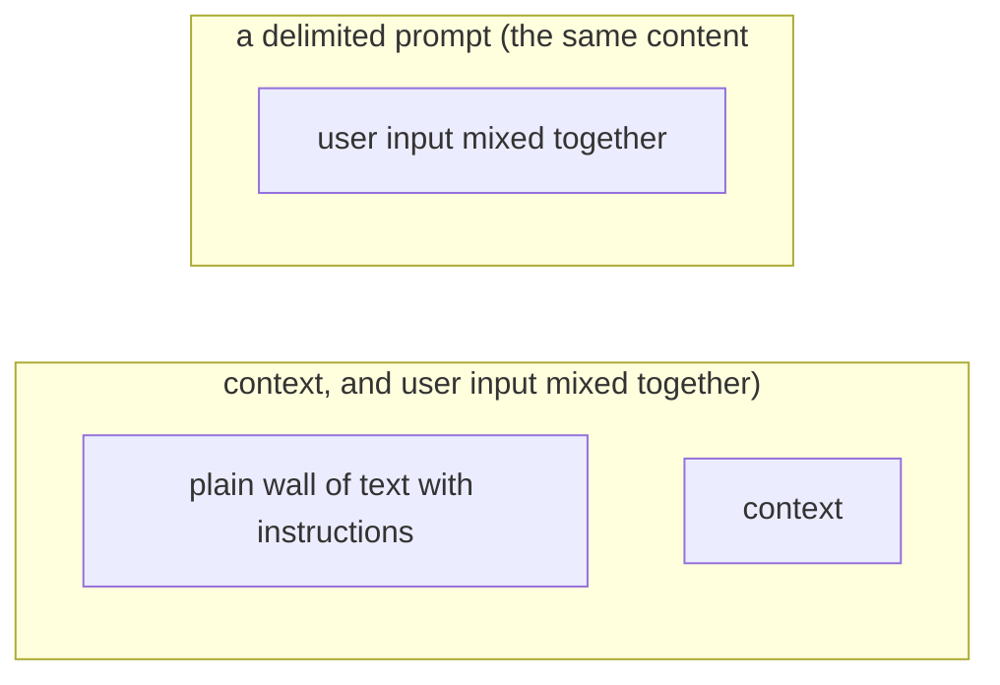

# Delimiter and Markup Strategies

**One-Line Summary**: Using structural delimiters — XML tags, markdown headers, triple quotes, and custom markers — to separate prompt sections improves model comprehension by 15-20%, enables reliable parsing, and is the foundation of professional prompt layout.

**Prerequisites**: `what-is-a-prompt.md`, `instruction-prompting.md`, `prompt-templates-and-variables.md`.

## What Are Delimiter and Markup Strategies?

Think of dividers in a filing cabinet. Without dividers, you have a single pile of papers — a contract might be stuck between a receipt and a meeting agenda, and finding anything requires reading everything. Add labeled dividers ("Legal," "Finance," "Meeting Notes") and suddenly each document has a clear home. Anyone can find what they need quickly, and new documents go into the right section without ambiguity. The dividers do not change the content — they organize it for efficient retrieval.

Delimiters in prompts serve the same function. When a prompt contains multiple types of content — instructions, context documents, examples, user input, output format specifications — delimiters tell the model where each section begins and ends, what type of content each section contains, and how to treat each section. Without delimiters, the model must infer boundaries from content alone, which is unreliable. A sentence from a retrieved document might be misinterpreted as an instruction. An example might bleed into the system message. Delimiters make boundaries explicit.

Research and production experience consistently show that structured prompts with clear delimiters outperform unstructured prompts by 15-20% on section adherence and overall task accuracy. This is one of the highest-ROI techniques in prompt engineering: minimal token overhead for significant quality improvement.


*Source: Adapted from Peng et al., "Does Prompt Formatting Have Any Impact on LLM Performance?" 2024.*


*Source: Adapted from Anthropic's "Use XML Tags" guide, 2024, and OpenAI's "Prompt Engineering Best Practices," 2024.*

## How It Works

### XML Tags

XML-style tags are the most structured delimiter option and are explicitly recommended by Anthropic for Claude models:

```xml
<system_instructions>
You are a financial analyst. Respond only with data from the provided documents.
</system_instructions>

<context>
<document title="Q3 Earnings Report">
Revenue increased 12% year-over-year to $4.2B...
</document>
<document title="Analyst Consensus">
Wall Street expects Q4 revenue of $4.5B...
</document>
</context>

<user_query>
What were the key revenue drivers in Q3?
</user_query>

<output_format>
Respond in 3-5 bullet points. Cite the source document for each claim.
</output_format>
```

**Advantages**: Unambiguous nesting, named sections, attribute support, familiar to models from pretraining on HTML/XML data. Claude models show particularly strong XML tag adherence.

**Token cost**: A typical tag pair (`<context>...</context>`) costs 4-8 tokens. For a prompt with 5 sections, total delimiter overhead is 20-40 tokens — negligible.

### Markdown Headers

Markdown headers use `#`, `##`, `###` to delineate sections:

```markdown
## Instructions
Summarize the document below. Focus on financial implications.

## Document
Revenue increased 12% year-over-year to $4.2B...

## Output Format
- 3-5 bullet points
- Each under 25 words
- Cite specific figures
```

**Advantages**: Familiar, readable, lightweight. Works well with OpenAI models, which are heavily trained on markdown from GitHub and documentation.

**Limitations**: No nesting semantics (a `###` subsection inside a `##` section is convention, not enforced). No closing tags, so section boundaries are implicit (each section ends where the next begins).

### Triple Quotes and Backticks

Triple quotes (`"""`) and triple backticks (` ``` `) delimit data blocks:

```
Analyze the following customer review:

"""
I purchased this product last week and while the build quality is excellent,
the battery life falls far short of the advertised 12 hours. I'm getting
6 hours at best.
"""

Classify the sentiment and identify specific complaints.
```

**Advantages**: Clear visual separation of data from instructions. Well-suited for demarcating user input, code blocks, or quoted text.

**Limitations**: Cannot nest. No semantic naming (unlike XML's `<customer_review>`). Multiple triple-quoted sections in one prompt can be ambiguous.

### Provider Preferences

Different model providers respond best to different delimiter styles:

- **Anthropic (Claude)**: Strongly recommends XML tags. Claude models are specifically trained to recognize and respect XML structure. Tag adherence is 95%+ on Claude 3.5.
- **OpenAI (GPT-4)**: Works well with markdown headers and XML tags. Markdown is slightly more natural given GPT-4's heavy GitHub/documentation training data.
- **Google (Gemini)**: Works with both XML and markdown. No strong documented preference.
- **Open-source models**: Variable support. Markdown is the safest default due to broad pretraining exposure.

### Combining Delimiter Types

Effective prompts often combine multiple delimiter types:

```xml
## Instructions
<role>Senior financial analyst</role>
Analyze the quarterly report below. Focus on:
1. Revenue trends
2. Risk factors
3. Forward guidance

## Source Document
<document>
{quarterly_report}
</document>

## Output Requirements
Return a JSON object:
```json
{"revenue_trend": "...", "risks": [...], "guidance": "..."}
```
```

Here, markdown headers create top-level sections, XML tags wrap specific content blocks, and backticks delimit the output format example. This layered approach provides multiple levels of structural clarity.

## Why It Matters

### Measurable Quality Improvement

Studies and production evaluations show:

- Prompts with clear delimiters achieve 15-20% higher section adherence (the model respects section boundaries) compared to undelimited prompts.
- XML-tagged prompts reduce content contamination (model confusing context with instructions) by 25-35%.
- Structured prompts improve output format compliance by 10-15% because the model can clearly identify the format specification section.

### Reliable Programmatic Parsing

When the model's output needs to be parsed by downstream code, asking the model to wrap output in delimiters enables reliable extraction:

```
Wrap your analysis in <analysis> tags and your recommendation in <recommendation> tags.
```

This produces output that can be parsed with simple string operations or XML parsers, avoiding fragile regex-based extraction from unstructured text. Parse failure rates drop from 5-10% (unstructured) to <1% (delimited).

### Prompt Injection Defense

Delimiters are a key defense against prompt injection. By wrapping user input in explicit tags and instructing the model to treat tagged content as data:

```xml
<instructions>Only answer questions based on the document below.</instructions>
<user_input>{user_query}</user_input>
<document>{retrieved_doc}</document>
```

The model is more likely to treat `<user_input>` content as data rather than instructions, reducing injection success rates.

## Key Technical Details

- XML tags are recommended by Anthropic for Claude; markdown headers work well across all providers.
- Delimiter token overhead is typically 20-60 tokens per prompt (5-10 tag/header pairs), which is negligible relative to content.
- Structured prompts with delimiters improve section adherence by 15-20% and reduce content contamination by 25-35%.
- Output parsing reliability improves from 90-95% (unstructured) to 99%+ (delimited) when asking models to wrap output in tags.
- Nesting depth should stay shallow (2-3 levels max). Deeply nested XML confuses models and wastes tokens.
- Consistent delimiter style within a prompt is important: mixing XML, markdown, and triple quotes for the same purpose (section separation) creates ambiguity.
- Claude models show 95%+ tag adherence when instructed to wrap output in specific XML tags.
- Delimiter-based prompts are easier to maintain, debug, and version because the structure is explicit and parseable.

## Common Misconceptions

**"Delimiters are cosmetic — they only help humans read the prompt."** Delimiters directly affect model processing. The attention mechanism uses structural tokens as anchors for identifying relevant content. Models trained on structured data (HTML, XML, markdown) leverage delimiter patterns for better comprehension.

**"Any delimiter style works equally well."** Different models respond differently to different delimiter types. Claude strongly favors XML. GPT-4 responds well to markdown and XML. Using the provider-recommended delimiter style can improve adherence by 5-10% compared to using a non-preferred style.

**"Adding delimiters significantly increases cost."** Typical delimiter overhead is 20-60 tokens per prompt — less than 1% of a 5,000-token prompt. The quality improvement far outweighs the marginal cost increase.

**"Delimiters prevent prompt injection."** Delimiters reduce injection success but do not eliminate it. A determined adversary can include closing tags in their input to break out of the delimited section. Delimiters are one layer of defense, not a complete solution.

**"You should use the same delimiter style for everything."** Different content types benefit from different delimiters. XML tags for semantic sections (instructions, context, output). Markdown headers for high-level organization. Triple quotes for literal data blocks. The combination is more effective than any single style.

## Connections to Other Concepts

- `prompt-templates-and-variables.md` — Templates use delimiters to separate variable slots from static instructions and to defend against injection.
- `attention-and-position-effects.md` — Delimiters create attention anchors that partially mitigate the "lost in the middle" effect by marking section boundaries.
- `instruction-prompting.md` — Delimiters enable clear separation of instructions from context, improving instruction adherence.
- `what-is-a-prompt.md` — Delimiters make the prompt anatomy (system, context, user input, format) explicit and parseable.
- `prefilling-and-output-priming.md` — Combining output delimiters with prefilling (starting the response with an opening tag) maximizes format compliance.

## Further Reading

- Anthropic, "Use XML Tags," Prompt Engineering Guide, 2024. Anthropic's official recommendation for using XML tags in Claude prompts.
- OpenAI, "Prompt Engineering Best Practices," 2024. Covers delimiter strategies for GPT models.
- Peng et al., "Does Prompt Formatting Have Any Impact on LLM Performance?" 2024. Empirical analysis of how structural formatting affects output quality.
- OWASP, "LLM Top 10: Prompt Injection," 2023. Security perspective on delimiters as a prompt injection defense layer.
