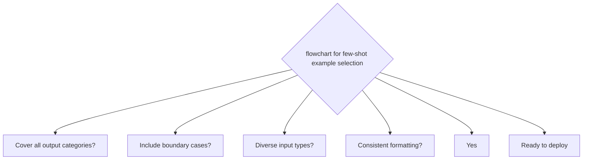

# Few-Shot Prompting

**One-Line Summary**: Few-shot prompting provides 3-8 input-output examples in the prompt to demonstrate the desired task, leveraging in-context learning to improve output quality, format consistency, and task comprehension beyond what instructions alone achieve.

**Prerequisites**: `in-context-learning.md`, `zero-shot-prompting.md`.

## What Is Few-Shot Prompting?

Think of training a new hire by showing them completed examples of the work. Instead of describing the company's report format in abstract terms, you hand them three finished reports and say: "Write one like these for this new client." They immediately see the structure, tone, level of detail, and formatting conventions. Three good examples communicate more clearly than three pages of instructions. And if you select examples that cover different scenarios — a simple case, a complex case, and an edge case — the new hire understands not just the format but the range of expected situations.

Few-shot prompting provides a small number of input-output examples (typically 3-8) in the prompt before presenting the actual task input. The model uses in-context learning (ICL) to identify the pattern from these examples and apply it to the new input. This technique bridges the gap between zero-shot (instructions only, which can be ambiguous) and fine-tuning (training on thousands of examples, which is expensive and slow). Few-shot prompting is the workhorse of production prompt engineering — it is the most common technique for achieving reliable, formatted output without custom model training.

The art of few-shot prompting lies not in the technique itself — it is straightforward to implement — but in the selection, ordering, and formatting of examples. Research shows that example quality matters more than example quantity, and that seemingly minor choices (random vs. sorted ordering, diverse vs. similar examples) produce measurable quality differences.

*Source: Lilian Weng, "Prompt Engineering," lilianweng.github.io, 2023. Demonstrates how few-shot performance scales with model size.*

*Source: Adapted from Liu et al., "What Makes Good In-Context Examples for GPT-3?" 2022, and Min et al., "Rethinking the Role of Demonstrations," 2022.*

## How It Works

### Example Selection Strategy

The examples you choose determine few-shot effectiveness. Key selection principles:

- **Diversity over quantity**: 5 diverse examples outperform 8 similar ones. Select examples that cover different input types, edge cases, and output variations. For a classification task with 5 categories, include at least one example per category rather than 5 examples from the most common category.
- **Representative inputs**: Examples should reflect the actual distribution of inputs the model will see in production. If 30% of real inputs are ambiguous, include ambiguous examples.
- **Boundary cases**: Include at least one example near a decision boundary. For sentiment analysis, include a mixed-sentiment review, not just clearly positive and clearly negative ones.
- **Complexity gradient**: Include both simple and complex examples to show the model the expected range of output detail.

### Ordering Effects

The order of few-shot examples measurably affects output quality:

- **Random ordering generally outperforms sorted ordering** (Lu et al., 2022). When examples are sorted (e.g., all positive then all negative), the model may develop a recency bias toward the last-seen category.
- **Place the most representative example last** (closest to the actual input) to leverage recency effects from `attention-and-position-effects.md`.
- **Avoid clustering examples by category**. Interleaving categories (positive, negative, positive, neutral, negative) produces better calibration than grouping them.
- **For complex tasks**, order examples from simple to complex — this implicitly teaches the model to handle increasing difficulty.

In Lu et al.'s experiments, the difference between the best and worst example orderings was as large as 30% accuracy on some tasks — comparable to the difference between zero-shot and few-shot itself.

### Label Balance

The distribution of labels across examples affects the model's output distribution:

- If 5 out of 5 sentiment examples are positive, the model over-predicts positive sentiment by 15-25%.
- Balanced label distributions (equal representation of each category) produce the best-calibrated output.
- When some categories are rarer in practice, include at least 1 example of each category, even rare ones, to prevent the model from ignoring them entirely.

### The Format-Over-Labels Finding

Min et al. (2022) showed that format consistency matters more than label correctness. In their experiments:

- Correct labels: 82% accuracy.
- Random labels (wrong input-label pairings): 78% accuracy.
- Correct format with random labels still vastly outperformed zero-shot (65%) on the same tasks.

This means the examples primarily teach the model the format and task type, not the specific mapping. However, correct labels do help — especially for harder tasks and more capable models — so always use correct labels when possible. The practical takeaway: if you cannot verify label correctness for all examples, prioritize format consistency over label accuracy.

## Why It Matters

### Format Compliance

Few-shot examples are the most reliable way to achieve consistent output formatting. Instructions like "respond in JSON" achieve 85-90% compliance. Adding 3 examples of the desired JSON output achieves 95-99% compliance. For structured extraction tasks where downstream systems parse the model's output, this difference between 90% and 99% is the difference between a fragile pipeline and a reliable one.

### Quality Beyond Zero-Shot

Across a range of benchmarks, few-shot outperforms zero-shot by 5-15% on average, with larger gaps for:

- Novel or unusual output formats (20-30% improvement)
- Domain-specific classification (10-20% improvement)
- Style-matched generation (15-25% improvement)
- Complex extraction with multiple fields (10-15% improvement)

The gains are smaller for common tasks (translation, simple summarization) where zero-shot performance is already high.

### Practical Token Economics

Few-shot examples consume tokens, creating a per-request cost. A typical few-shot setup:

- 5 examples × 100 tokens each = 500 tokens of examples
- Plus ~100 tokens of instructions
- Total prompt overhead: ~600 tokens

At $2.50/1M input tokens, this is $1.50 per million requests. If few-shot improves quality from 80% to 95%, avoiding the cost of errors (human correction, bad user experience) almost always justifies the additional token cost. The exception is ultra-high-volume, low-stakes tasks where zero-shot is acceptable.

## Key Technical Details

- Optimal example count for most tasks: 3-8 examples. Returns diminish after 5-8 for standard classification and formatting tasks.
- Example ordering can affect accuracy by up to 30% (Lu et al., 2022); random ordering is a safe default.
- Format consistency across examples is more important than label correctness (Min et al., 2022), though correct labels improve results by 2-5% on average.
- Label balance (equal examples per category) improves calibration by 10-20% compared to imbalanced distributions.
- Few-shot achieves 95-99% format compliance for structured outputs, compared to 85-90% for instruction-only approaches.
- Including one "boundary case" example improves edge-case handling by 15-25% compared to only prototypical examples.
- Few-shot token cost overhead: typically 300-1,500 tokens depending on example complexity and count.
- For retrieval-augmented few-shot (selecting examples dynamically based on input similarity), quality improves an additional 5-10% over static examples.

## Common Misconceptions

**"More examples always mean better results."** Returns diminish rapidly. 3 well-chosen examples often match or outperform 8 poorly chosen ones. Quality and diversity of examples matter more than quantity for standard few-shot (3-8 examples). Many-shot (20+) is a separate technique with different dynamics.

**"Any examples of the task will work."** Example selection has a large effect. Examples that are too easy fail to demonstrate edge-case handling. Examples that are too similar fail to show the output range. Examples with inconsistent formatting actively harm performance by confusing the pattern the model tries to match.

**"Few-shot examples teach the model new knowledge."** Few-shot examples demonstrate format and task type — they do not inject new knowledge into the model. If the model lacks domain knowledge, examples will not compensate. They activate existing capabilities; they do not create new ones.

**"You should always use few-shot over zero-shot."** For well-defined tasks on capable models (GPT-4, Claude 3.5), zero-shot often performs within 2-5% of few-shot. The additional token cost and maintenance burden of curating examples is not always justified. Start with zero-shot and escalate to few-shot only when quality is insufficient.

**"Example labels must be verified by domain experts."** While correct labels help, the format-over-labels finding means that format consistency is the higher priority. If you have limited expert time, spend it on ensuring examples have consistent, clear formatting rather than verifying every label.

## Connections to Other Concepts

- `in-context-learning.md` — Few-shot prompting is the direct practical application of ICL theory.
- `zero-shot-prompting.md` — Zero-shot is the baseline; few-shot is the escalation when zero-shot quality is insufficient.
- `many-shot-prompting.md` — The extension of few-shot to 20-500+ examples, with different quality dynamics and cost tradeoffs.
- `attention-and-position-effects.md` — Example ordering effects are partially explained by the U-shaped attention curve.
- `prompt-templates-and-variables.md` — Production few-shot prompts use templates with variable slots for dynamic example selection.

## Further Reading

- Brown et al., "Language Models are Few-Shot Learners," 2020. The seminal paper establishing the few-shot prompting paradigm with GPT-3.
- Min et al., "Rethinking the Role of Demonstrations: What Makes In-Context Learning Work?" 2022. The influential format-over-labels study.
- Lu et al., "Fantastically Ordered Prompts and Where to Find Them: Overcoming Few-Shot Prompt Order Sensitivity," ACL 2022. Systematic study of ordering effects in few-shot prompting.
- Liu et al., "What Makes Good In-Context Examples for GPT-3?" 2022. Empirical analysis of example selection strategies, including retrieval-based selection.
- Zhao et al., "Calibrate Before Use: Improving Few-Shot Performance of Language Models," ICML 2021. Techniques for mitigating biases in few-shot prompting, including label balance.
