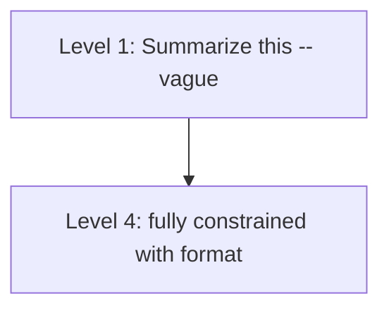

# Instruction Prompting

**One-Line Summary**: Instruction prompting uses clear, specific, actionable directives to guide model behavior, where the specificity gradient — from vague ("summarize") to precise ("summarize in 3 bullet points of max 20 words each") — directly determines output quality and consistency.

**Prerequisites**: `what-is-a-prompt.md`, `zero-shot-prompting.md`.

## What Is Instruction Prompting?

Imagine the difference between giving someone GPS turn-by-turn directions versus telling them to "head roughly north." GPS directions are unambiguous: "Turn left on Main Street in 200 meters." There is one correct interpretation and one correct action. "Head roughly north" is vague: the person must guess the best route, make judgment calls at each intersection, and may end up somewhere quite different from where you intended. Both are directions, but the GPS version eliminates interpretation variance.

Instruction prompting is the practice of crafting explicit, unambiguous directives that tell the model exactly what to do, how to do it, and what the output should look like. Every prompt contains instructions, but the difference between amateur and expert instruction prompting is specificity. A novice writes "summarize this article." An expert writes "Summarize this article in exactly 3 bullet points. Each bullet must be under 20 words. Focus on the financial implications. Do not include the author's opinions." The expert version eliminates interpretation degrees of freedom, producing more consistent, more useful output.

Instruction prompting is the backbone of zero-shot prompting and a complement to few-shot prompting. Even when examples are provided, clear instructions frame how the model interprets those examples. In production systems, instruction quality often matters more than any other single factor in prompt design.


*Source: Adapted from production evaluation data on instruction specificity and output variance.*


*Source: Lilian Weng, "Prompt Engineering," lilianweng.github.io, 2023. Instruction quality is the backbone of all prompting techniques.*

## How It Works

### The Specificity Gradient

Instructions exist on a spectrum from vague to precise. Each level of specificity constrains the model's output space:

**Level 1 — Vague**: "Summarize this."
- The model must guess: How long? What format? What focus? Formal or casual?

**Level 2 — Directional**: "Write a short summary of the key points."
- Better, but "short" and "key points" are subjective.

**Level 3 — Specific**: "Summarize in 3 bullet points, each under 20 words."
- Format, length, and structure are defined. Focus is still implicit.

**Level 4 — Fully constrained**: "Summarize in 3 bullet points, each under 20 words. Focus on financial data. Use past tense. Do not include opinions or predictions."
- Every dimension of the output is specified.

Moving from Level 1 to Level 4 typically reduces output variance by 60-80% and increases user satisfaction with the output by 20-40%, based on production evaluation data.

### Imperative vs. Declarative Framing

Instructions can be framed imperatively ("Extract the names") or declaratively ("The output should contain all names"). Research and practice suggest:

- **Imperative framing** ("Extract," "List," "Classify," "Generate") is more reliable for task specification. The model is trained to respond to imperative instructions through instruction tuning.
- **Declarative framing** ("The output should be," "The response must include") is effective for constraints and quality criteria.
- **Best practice**: Use imperative for the primary task, declarative for constraints. Example: "Classify the following email into one of the categories below. The output must be a single word — the category name."

### Task Decomposition Within Instructions

Complex tasks benefit from being broken into sequential sub-steps within the instructions:

```
Analyze the following customer review:

1. First, identify the product being discussed.
2. Then, determine the overall sentiment (positive, negative, or mixed).
3. Next, list the specific features mentioned.
4. Finally, produce a JSON object with keys: product, sentiment, features.
```

This numbered decomposition achieves two things: it guides the model through a logical process (similar to chain-of-thought), and it makes the instruction unambiguous by specifying the order of operations. Tasks decomposed into 3-5 steps consistently outperform single-sentence instructions for complex work, with improvements of 10-25% on multi-component tasks.

### Negative vs. Positive Instructions

How you frame constraints matters. The model processes positive and negative instructions differently:

- **Negative (avoid)**: "Do not include personal opinions." "Do not hallucinate." "Do not use technical jargon."
- **Positive (do)**: "Only include facts from the provided document." "Cite a source for every claim." "Use language accessible to a general audience."

Positive framing is generally more effective because it tells the model what to do rather than what to avoid. Negative instructions can paradoxically increase the unwanted behavior (see `negative-prompting-and-constraints.md`). However, explicit negative constraints can be useful as a secondary reinforcement after the positive instruction: "Use language accessible to a general audience. Avoid acronyms and technical terms."

## Why It Matters

### Consistency at Scale

In production systems serving thousands or millions of requests, output consistency is critical. Vague instructions produce high variance: some responses are excellent, some are poor, and the distribution is unpredictable. Specific instructions narrow the distribution: most responses cluster near the desired output. This consistency enables reliable downstream processing, better user experience, and more predictable system behavior.

### Reducing Iteration Cycles

Clear instructions fail in clear ways. If you specify "3 bullet points" and get 5, you know exactly what to fix. If you write "summarize briefly" and get an unsatisfactory result, you do not know whether the issue is length, format, focus, or style. Specific instructions create a testable contract between the prompt and the model, enabling systematic iteration rather than guesswork.

### Complementing Other Techniques

Instructions do not compete with other techniques — they enhance them:

- **With few-shot**: Instructions frame how the model interprets examples. "Following the format shown in the examples below, classify..." is more reliable than examples alone.
- **With chain-of-thought**: "Think step by step" is an instruction that activates CoT reasoning.
- **With role prompting**: "You are a tax attorney. When answering, cite specific tax code sections" combines persona with instructional specificity.

## Key Technical Details

- Moving from vague to specific instructions reduces output variance by 60-80% on formatting and structure tasks.
- Imperative framing ("Extract," "Classify") has 5-10% higher task adherence than declarative framing ("The output should contain") for primary tasks.
- Task decomposition into 3-5 numbered steps improves complex task performance by 10-25%.
- Positive constraint framing ("only include X") outperforms negative framing ("do not include Y") by 5-15% on constraint adherence.
- Instruction length has an optimal range: 50-300 tokens for most tasks. Below 50, instructions are typically too vague. Above 300, the instructions themselves become complex enough to introduce interpretation errors.
- Including explicit output format specification in instructions (JSON schema, template, field names) improves format compliance from ~70% (no specification) to 90-95%.
- Combining instructions with examples (instructed few-shot) outperforms either technique alone by 3-8% on average.

## Common Misconceptions

**"The model should understand what I mean from brief instructions."** Models are literal and statistical, not telepathic. They optimize for the most likely interpretation of your words given their training data. Ambiguity in instructions leads to the model's default interpretation, which may not match your intent. Being specific is not being redundant — it is being clear.

**"More instructions are always better."** Instruction overload is real. When instructions exceed 500-1,000 tokens, the model must parse a complex document before it can start the task. Contradictions become more likely, and the model may follow some instructions while ignoring others. If your instructions are very long, consider whether examples would be more efficient.

**"Instructions are less important when using few-shot."** Instructions frame how the model interprets examples. Without instructions, the model may identify the wrong pattern in the examples (matching on irrelevant features rather than the intended task). Instructions + examples > examples alone.

**"Natural language instructions should be conversational."** Formal, imperative instructions are followed more reliably than conversational requests. "Please, if you could, maybe try to summarize..." is followed less reliably than "Summarize the following text." Politeness is fine, but clarity should not be sacrificed for it.

## Connections to Other Concepts

- `zero-shot-prompting.md` — Zero-shot prompting relies entirely on instruction quality since there are no examples.
- `few-shot-prompting.md` — Instructions complement examples; the combination is more effective than either alone.
- `negative-prompting-and-constraints.md` — Deep dive into the psychology and mechanics of negative vs. positive instructions.
- `role-and-persona-prompting.md` — Persona instructions are a specialized form of instruction prompting.
- `delimiter-and-markup-strategies.md` — Structural markers help organize complex instructions for better model comprehension.

## Further Reading

- Wei et al., "Finetuned Language Models are Zero-Shot Learners" (FLAN), 2022. Demonstrates how instruction tuning enables models to follow novel instructions.
- Mishra et al., "Cross-Task Generalization via Natural Language Crowdsourcing Instructions," ACL 2022. Studies instruction formulation and its effect on task performance.
- Ouyang et al., "Training Language Models to Follow Instructions with Human Feedback," 2022 (InstructGPT paper). The foundational work on instruction-following through RLHF.
- Anthropic, "Prompt Engineering Guide," 2024. Practical guidance on writing effective instructions for Claude.
- OpenAI, "Prompt Engineering Best Practices," 2024. Provider-specific recommendations for instruction design.
