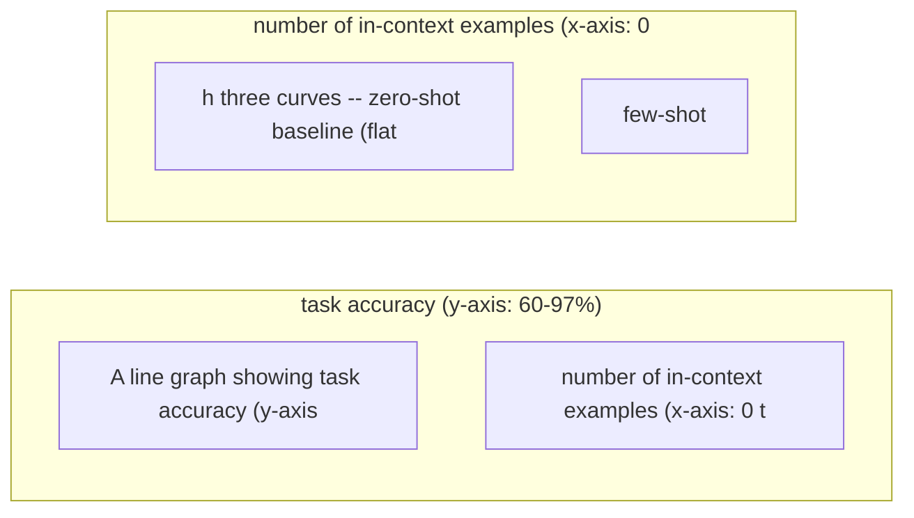
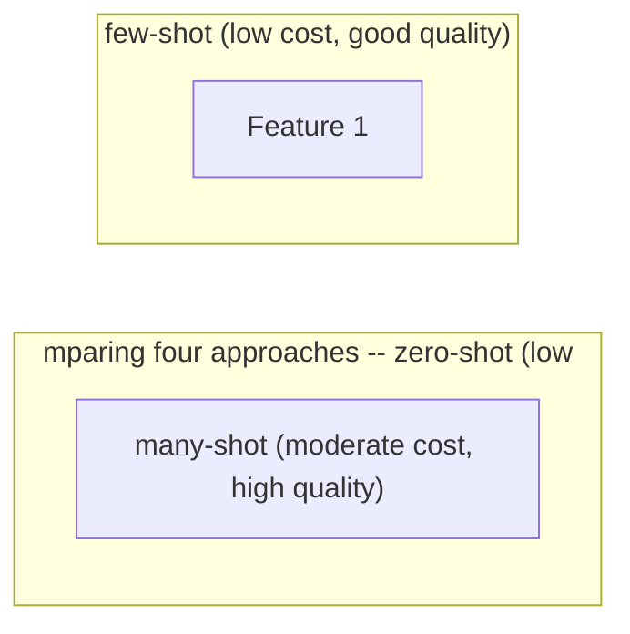

# Many-Shot Prompting

**One-Line Summary**: Many-shot prompting uses 20-500+ examples in long-context models, approaching fine-tuning quality on some tasks while preserving the flexibility of in-context learning, with most gains realized by around 50 examples.

**Prerequisites**: `few-shot-prompting.md`, `context-window-mechanics.md`, `in-context-learning.md`.

## What Is Many-Shot Prompting?

Think about the difference between showing someone 3 vacation photos and showing them a full album. With 3 photos, they get the general idea — you went to a beach, it looked sunny, you had fun. With a full album of 50-100 photos, they understand the trip: the progression from arrival to departure, the variety of activities, the recurring characters, the quiet moments alongside the highlights. The album tells a story that 3 photos cannot. But there is a point — maybe photo 60 or 70 — where additional images add diminishing value. You have seen the trip; more photos are redundant.

Many-shot prompting extends the few-shot paradigm from 3-8 examples to 20-500+ examples, made possible by the long context windows of modern models (128K-2M tokens). This crosses a qualitative threshold: with enough examples, the model can learn nuanced patterns, handle rare edge cases, and approximate the quality of models fine-tuned on the same data — all without a single gradient update. Google DeepMind's research (Agarwal et al., 2024) demonstrated that many-shot ICL can match or exceed fine-tuned model performance on several benchmarks.

This technique sits in a strategic middle ground between few-shot prompting (cheap, fast, moderate quality) and fine-tuning (expensive, slow, high quality). It offers fine-tuning-like quality with ICL's flexibility: you can change the task, add new categories, or update the examples instantly, without retraining.

*Source: Adapted from Agarwal et al., "Many-Shot In-Context Learning," Google DeepMind, 2024.*

*Source: Adapted from Agarwal et al., 2024, and OpenAI/Anthropic pricing data.*

## How It Works

### Scaling Example Count

The quality curve as example count increases follows a characteristic pattern:

- **0 examples (zero-shot)**: Baseline performance, often 60-80% on classification tasks.
- **3-8 examples (few-shot)**: Significant jump, capturing format and basic patterns. Typically 80-90%.
- **10-20 examples**: Continued improvement, capturing more edge cases. Typically 85-93%.
- **30-50 examples**: Approaching saturation for most tasks. Typically 90-95%.
- **50-100 examples**: Marginal gains. The model has seen enough variety to generalize well. Typically 92-97%.
- **100-500 examples**: Diminishing returns, but can still help for tasks with high variance or many categories. Some tasks show gains up to 200-300 examples.

The general rule: most gains are realized by 50 examples. Beyond that, each additional example provides less incremental value, while token costs continue to increase linearly.

### Cost Analysis

Many-shot prompting has a direct cost tradeoff. If each example is 50-150 tokens:

- 50 examples × 100 tokens = 5,000 tokens of examples
- 200 examples × 100 tokens = 20,000 tokens of examples
- 500 examples × 100 tokens = 50,000 tokens of examples

At $2.50/1M input tokens (GPT-4o), 50,000 tokens costs $0.125 per request. At 1 million requests/month, that is $125,000/month just for examples. Compare this to fine-tuning, which has a one-time training cost of $50-500 (depending on the model and dataset size) and then uses standard inference pricing with no example overhead. The economic breakeven depends on request volume:

- Low volume (<10K requests/month): Many-shot is cheaper than fine-tuning.
- Medium volume (10K-100K): Roughly equivalent, depending on fine-tuning costs.
- High volume (>100K): Fine-tuning is almost always cheaper per-request.

### Reinforced and Unsupervised ICL Variants

Agarwal et al. (2024) introduced variants that extend many-shot:

- **Reinforced ICL**: Instead of human-written outputs, use model-generated rationales that were verified for correctness. This is cheaper to produce than expert-written examples and performs comparably.
- **Unsupervised ICL**: Provide only inputs (no outputs) as examples, letting the model infer the task from input distribution alone. Performance is lower but the approach eliminates the need for labeled data entirely.

These variants address the main bottleneck of many-shot: the cost and effort of curating hundreds of high-quality labeled examples.

### Example Curation at Scale

Curating 50-500 examples requires a systematic approach:

- **Stratified sampling**: Ensure proportional representation of all categories, especially rare ones.
- **Difficulty distribution**: Include easy, moderate, and hard examples. Over-indexing on easy examples underrepresents the model's ability to handle complex cases.
- **Deduplication**: Redundant examples waste tokens without adding signal. Ensure diversity.
- **Quality assurance**: At 200+ examples, manual review of each is impractical. Use spot-checking and automated validation (e.g., checking that JSON examples parse correctly).

## Why It Matters

### The Middle Path Between Few-Shot and Fine-Tuning

Many-shot prompting fills a gap in the practitioner's toolkit. Few-shot is quick and cheap but plateaus at 85-90% on complex tasks. Fine-tuning achieves 93-97% but requires training infrastructure, data pipelines, and model version management. Many-shot achieves 90-97% with nothing more than a well-curated example set pasted into the prompt. For teams without ML engineering capacity for fine-tuning, many-shot is the highest-quality approach available.

### Instant Adaptability

Unlike fine-tuned models, many-shot prompts can be updated instantly. Add a new classification category? Insert 10 examples of the new category into the prompt. Discovered an edge case? Add examples covering it. Changed the output format? Update all examples. This flexibility is valuable in rapidly changing domains (content moderation policies, compliance rules, product categorization) where the task definition evolves frequently.

### Overcomes ICL's "Novel Task" Limitation

Standard few-shot ICL struggles with tasks that are poorly represented in pretraining data. With many-shot, the sheer volume of examples can teach genuinely novel patterns that the model has not seen in pretraining — approaching the learning capacity of fine-tuning. Agarwal et al. (2024) showed that many-shot ICL could overcome the performance ceiling of few-shot on tasks like low-resource translation and specialized classification.

## Key Technical Details

- Many-shot typically uses 20-500+ examples, consuming 2,000-50,000+ tokens depending on example length.
- Most quality gains are achieved by ~50 examples; the 50-to-200 range yields 2-5% additional improvement on most tasks.
- Agarwal et al. (2024) showed many-shot ICL matching fine-tuned performance on GSM8K (math), MATH, and several NLU benchmarks.
- Reinforced ICL (model-generated, verified rationales) performs within 1-3% of human-written examples, reducing curation cost.
- Unsupervised ICL (inputs only, no outputs) achieves 70-85% of fully supervised many-shot performance.
- Cost per request scales linearly: 200 examples at 100 tokens each = 20,000 tokens = $0.05/request at $2.50/1M input tokens.
- Requires models with context windows of 32K+ tokens; optimal range is 128K-200K for 100-300 examples.
- Ordering effects diminish at many-shot scale — with 100+ examples, the specific ordering matters less than with 5 examples.

## Common Misconceptions

**"Many-shot is just few-shot with more examples."** The quality dynamics change at scale. Many-shot can teach patterns that few-shot cannot, including novel task types and fine-grained distinctions that require dozens of examples to disambiguate. It is quantitatively and qualitatively different from adding a few more examples.

**"You need hundreds of examples for many-shot to work."** The steepest quality gains are from 10 to 50 examples. Going from 50 to 500 provides much smaller improvements. Start with 30-50 examples and add more only if quality is still insufficient.

**"Many-shot replaces fine-tuning."** For high-volume applications, fine-tuning is more cost-efficient because examples are baked into model weights rather than repeated in every API call. Many-shot is best for low-to-medium volume or rapidly changing tasks where fine-tuning iteration speed is a bottleneck.

**"All examples should be expert-curated."** Reinforced ICL shows that model-generated, verified examples perform nearly as well as expert-written ones. A practical workflow: generate candidate outputs with the model, filter for correctness, and use the verified outputs as many-shot examples.

**"Many-shot works for any task."** Tasks requiring real-time information, multi-step reasoning, or capabilities absent from the model's pretraining data still will not benefit from many-shot. More examples of a task the model fundamentally cannot do does not create the capability.

## Connections to Other Concepts

- `few-shot-prompting.md` — Many-shot is the direct extension of few-shot, with different quality curves and cost dynamics.
- `context-window-mechanics.md` — Many-shot is enabled by long context windows (128K+); context budget management is critical.
- `in-context-learning.md` — Many-shot pushes ICL to its theoretical limits, providing evidence for the implicit learning interpretation.
- `attention-and-position-effects.md` — With hundreds of examples spanning the full context, position effects on individual examples diminish.
- `tokenization-for-prompt-engineers.md` — Token counting is critical for budgeting many-shot example sets within context limits.

## Further Reading

- Agarwal et al., "Many-Shot In-Context Learning," Google DeepMind, 2024. The primary research paper demonstrating many-shot ICL's potential to match fine-tuning.
- Li et al., "In-Context Learning with Many Demonstration Examples," 2023. Earlier work exploring the scaling behavior of ICL with increasing example counts.
- Brown et al., "Language Models are Few-Shot Learners," 2020. The foundation paper that established the few-shot paradigm extended by many-shot.
- Anthropic, "Long Context Prompting Tips," 2024. Practical guidance on using long context windows effectively, relevant to managing many-shot example sets.
