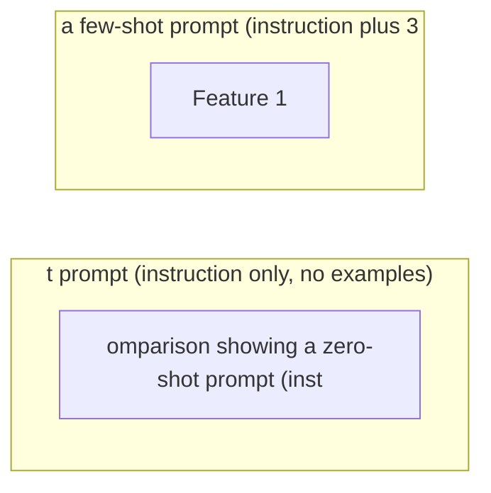

# Zero-Shot Prompting

**One-Line Summary**: Zero-shot prompting provides only instructions — no examples — relying entirely on the model's pretrained knowledge and instruction tuning to perform a task, and works best for well-defined tasks on capable, instruction-tuned models.

**Prerequisites**: `what-is-a-prompt.md`, `in-context-learning.md`.

## What Is Zero-Shot Prompting?

Imagine asking a new employee to complete a task with only verbal instructions and no completed examples. You say: "Read this customer email and classify it as billing, technical, or general inquiry. Respond with just the category name." If the employee is experienced and the task is clear, they succeed. If the task is ambiguous or the employee is junior, they struggle — they may guess at the format, misunderstand edge cases, or produce inconsistent output. That is the zero-shot tradeoff: simplicity and speed when it works, but fragility when the task is unclear or the model is less capable.

Zero-shot prompting means providing instructions and input to the model without any input-output examples. The prompt contains a task description, any relevant constraints, the input data, and optionally an output format specification — but zero demonstrations of what the desired output looks like. This is the simplest prompting paradigm and often the starting point for any new task.

Zero-shot works surprisingly well on instruction-tuned models (GPT-4, Claude 3.5, Gemini) for tasks they have been heavily trained on: summarization, translation, classification, extraction, question answering. It fails more often on novel output formats, domain-specific tasks, or ambiguous specifications where examples would disambiguate intent. Understanding when zero-shot is sufficient and when to escalate to few-shot or more complex techniques saves both development time and token costs.


*Source: Lilian Weng, "Prompt Engineering," lilianweng.github.io, 2023. Zero-shot prompting is the simplest approach, relying on instructions alone without demonstrations.*


*Source: Adapted from Brown et al., "Language Models are Few-Shot Learners," 2020, and Kojima et al., "Large Language Models are Zero-Shot Reasoners," 2022.*

## How It Works

### Task Framing

The core of zero-shot prompting is clear task framing. The model must understand what to do from instructions alone. Effective task framing includes:

- **Action verb**: Start with what the model should do: "Classify," "Extract," "Summarize," "Translate," "Generate."
- **Input specification**: Describe what the input is: "the following customer email," "the JSON object below," "this Python function."
- **Output specification**: Define what the output should look like: "a single category name," "a JSON object with keys 'name' and 'email'," "3 bullet points."
- **Constraints**: Add boundaries: "Use only information from the provided text," "Respond in under 50 words," "Use formal tone."

A weak zero-shot prompt: "What is this about?" A strong zero-shot prompt: "Classify the following support ticket into exactly one of these categories: billing, technical, account, or other. Respond with only the category name, lowercase, no punctuation."

### Explicit Constraint Specification

Zero-shot prompts compensate for the absence of examples by being highly explicit about constraints. Where examples implicitly demonstrate output length, format, tone, and scope, zero-shot prompts must specify these explicitly:

- **Length**: "Respond in exactly 3 sentences" rather than leaving length ambiguous.
- **Format**: "Return a JSON object with keys: summary, sentiment, confidence" rather than hoping the model guesses the schema.
- **Scope**: "Only use information from the provided document; do not use external knowledge" rather than leaving the knowledge boundary unclear.
- **Exclusions**: "Do not include explanations, caveats, or meta-commentary" rather than hoping the model stays focused.

### Output Format Specification

Without examples showing the desired output format, the model falls back to its default formatting — which varies by model, prompt phrasing, and topic. Explicit format specification is critical:

```
Extract the following fields from the resume below:
- name: string
- email: string
- years_experience: integer
- skills: list of strings

Return the result as a JSON object. Do not include any text outside the JSON.
```

This level of specificity achieves 85-95% format compliance in zero-shot. Without the explicit format specification, the same extraction task might produce prose, markdown tables, or inconsistently structured output.

### When Zero-Shot Fails

Zero-shot prompting fails predictably in several scenarios:

- **Novel or unusual output formats**: If the desired output structure is uncommon in training data, the model cannot reliably produce it without examples.
- **Ambiguous tasks**: When the task can be interpreted multiple ways, zero-shot gives the model no disambiguation signal. "Analyze this text" could mean sentiment analysis, theme extraction, readability assessment, or fact-checking.
- **Domain-specific conventions**: If the task requires following conventions specific to a field (legal citation format, medical coding standards), instructions alone may not convey the full specification.
- **Precise style matching**: If the output must match a specific writing style (a company's brand voice, a particular author's tone), examples are far more effective than verbal descriptions of style.

## Why It Matters

### Cost Efficiency

Zero-shot prompts are the cheapest prompting technique. They use the fewest tokens — no examples consuming context space. A zero-shot classification prompt might use 50-100 tokens of instruction; a few-shot version of the same task might use 500-1,000 tokens for 5 examples. At scale (millions of requests), this difference is significant: a 500-token savings per request at $2.50/1M input tokens saves $1.25 per million requests. For high-volume production systems, starting with zero-shot and only escalating when quality is insufficient is a sound economic strategy.

### Development Speed

Zero-shot is the fastest technique to iterate on. Changing the instructions takes seconds. Adding or modifying examples for few-shot requires curating, formatting, and validating each example. For rapid prototyping and initial task exploration, zero-shot lets you test whether the model can handle a task at all before investing in example curation.

### Baseline for Evaluation

Zero-shot performance establishes the baseline for any task. If zero-shot achieves 90% accuracy, investing in few-shot examples for a 93% improvement may not be worth the additional tokens. If zero-shot achieves 60%, few-shot is clearly needed. Without a zero-shot baseline, you cannot measure the marginal value of more complex techniques.

## Key Technical Details

- Zero-shot performance on classification tasks ranges from 70-95% depending on task clarity and model capability (GPT-4 class models achieve the upper range).
- Instruction-tuned models outperform base models on zero-shot tasks by 20-40% on average, as instruction tuning specifically improves the model's ability to follow novel task specifications.
- Output format compliance in zero-shot is 85-95% with explicit format instructions, dropping to 50-70% without them.
- Zero-shot is typically sufficient for: sentiment classification, language translation, simple summarization, entity extraction, and standard QA.
- Zero-shot typically underperforms few-shot by 5-15% on: novel output formats, domain-specific classification, style-matched generation, and complex extraction tasks.
- Adding the phrase "Let's think step by step" to a zero-shot prompt (zero-shot CoT) improves reasoning task performance by 10-40% (Kojima et al., 2022).
- Token cost for zero-shot is typically 50-200 tokens of instruction, compared to 500-2,000 tokens for few-shot with 5 examples.

## Common Misconceptions

**"Zero-shot means the model has never seen this type of task."** Zero-shot refers to the prompt containing no examples — not the model's pretraining. Models have seen millions of classification, summarization, and extraction tasks during pretraining. Zero-shot prompting activates this prior training through instructions rather than examples.

**"If zero-shot fails, the model cannot do the task."** Zero-shot failure often means the instructions were insufficient, not that the model lacks the capability. Adding examples (few-shot), refining instructions, or decomposing the task often resolves the issue. Only if few-shot also fails should you conclude the model may lack the capability.

**"Zero-shot is always worse than few-shot."** For well-defined tasks on instruction-tuned models, zero-shot can match or even exceed few-shot performance, especially when examples are poorly chosen or when the task is so standard that examples add noise rather than signal. GPT-4 and Claude 3.5 perform at near-ceiling on many common tasks in zero-shot.

**"More detailed instructions always improve zero-shot."** Over-specified instructions can confuse the model or introduce contradictions. There is an optimal level of specificity — enough to disambiguate the task, but not so much that the instructions become a complex document the model must parse. If instructions exceed 500-1,000 tokens, consider whether examples would be more efficient.

## Connections to Other Concepts

- `few-shot-prompting.md` — The natural escalation when zero-shot is insufficient; few-shot adds examples to supplement instructions.
- `instruction-prompting.md` — Zero-shot relies entirely on instruction quality; that concept covers instruction design in depth.
- `in-context-learning.md` — Zero-shot is the baseline against which ICL (few-shot) improvements are measured.
- `temperature-and-sampling.md` — Zero-shot output consistency is highly sensitive to temperature; T=0 is recommended for deterministic zero-shot tasks.
- `mental-models-for-prompting.md` — Zero-shot maps primarily to the "instruction follower" mental model.

## Further Reading

- Kojima et al., "Large Language Models are Zero-Shot Reasoners," NeurIPS 2022. Demonstrated that adding "Let's think step by step" significantly improves zero-shot reasoning performance.
- Wei et al., "Finetuned Language Models are Zero-Shot Learners," ICLR 2022. The FLAN paper showing how instruction tuning dramatically improves zero-shot capability.
- Brown et al., "Language Models are Few-Shot Learners," 2020. Established the zero-shot/few-shot evaluation paradigm.
- Sanh et al., "Multitask Prompted Training Enables Zero-Shot Task Generalization," ICLR 2022. The T0 paper demonstrating how multitask training improves zero-shot generalization.
