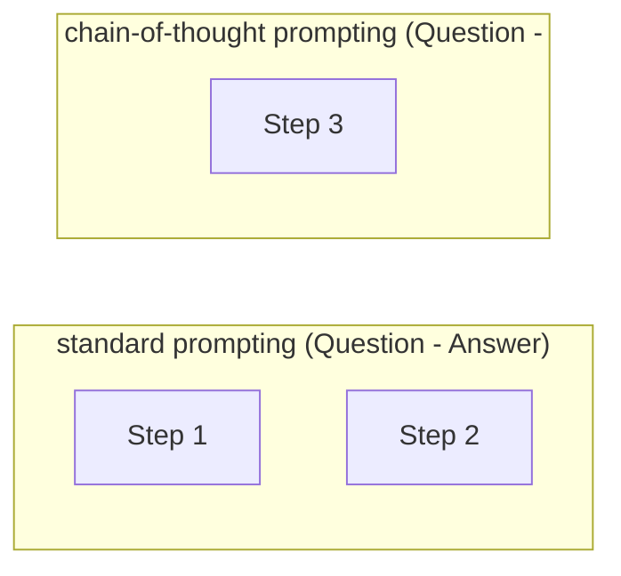
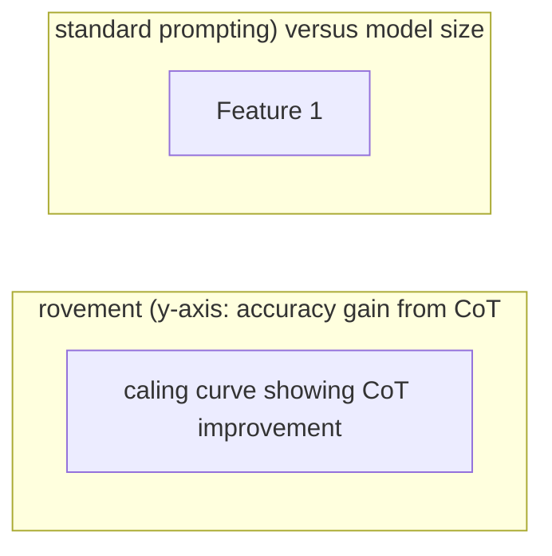

# Chain-of-Thought Prompting

**One-Line Summary**: Chain-of-thought prompting dramatically improves LLM reasoning by including step-by-step worked examples that teach the model to show its work before answering.
**Prerequisites**: `02-core-prompting-techniques/few-shot-prompting.md`, `01-foundations/how-llms-process-prompts.md`

## What Is Chain-of-Thought Prompting?

Imagine you are taking a math exam. If the instructions say "show your work," you are far more likely to arrive at the correct answer than if you just write down a number. You catch your own mistakes, you keep track of intermediate values, and the structure of the problem becomes visible on the page. Chain-of-thought (CoT) prompting works the same way: instead of asking a model to jump straight to an answer, you provide few-shot examples that include explicit intermediate reasoning steps, training the model to generate its own step-by-step reasoning before producing a final answer.

The technique was introduced by Wei et al. (2022) at Google Brain and demonstrated that simply adding reasoning traces to few-shot examples could unlock arithmetic, commonsense, and symbolic reasoning capabilities that standard prompting could not. On the GSM8K grade-school math benchmark, standard few-shot prompting with a PaLM 540B model achieved only 17.7% accuracy. Adding chain-of-thought examples to the same prompts boosted accuracy to 58% -- a 3.3x improvement with no model changes, no fine-tuning, and no additional data.

Chain-of-thought prompting is one of the most important discoveries in prompt engineering because it revealed that LLMs already possess latent reasoning capabilities that are simply not activated by direct question-answer prompting. The reasoning was always there; CoT gives the model the token budget and structural pattern to express it.

*Source: Adapted from Wei et al., "Chain-of-Thought Prompting Elicits Reasoning in Large Language Models," NeurIPS 2022.*

*Source: Adapted from Wei et al., 2022, and Suzgun et al., "Challenging BIG-Bench Tasks and Whether Chain-of-Thought Can Solve Them," 2022.*

## How It Works

### The Mechanism: Reasoning as Token Generation

LLMs generate text one token at a time. When a model must jump directly from a question to an answer, it has to compress all reasoning into the hidden states of a single forward pass.

Chain-of-thought prompting gives the model a sequence of intermediate tokens -- effectively scratch paper -- where each generated token can attend to all previously generated reasoning tokens. This transforms a single-step inference problem into a multi-step sequential computation, allowing the model to solve problems that exceed the capacity of a single forward pass.

The key mechanism is that each new token in the reasoning chain becomes part of the context for generating the next token. This means the model can effectively "store" intermediate results in the text it has already generated, rather than needing to hold everything in its hidden states.

### Constructing CoT Examples

A chain-of-thought prompt consists of few-shot examples where each example contains three parts: (1) the input question, (2) a step-by-step reasoning trace, and (3) the final answer. The reasoning trace should mirror the natural problem-solving process a human expert would follow. For a math problem, this means defining variables, writing equations, performing calculations in sequence, and checking the result.

Typically 3-8 examples are sufficient. The examples should cover the diversity of problem types the model will encounter. Each example should demonstrate a complete reasoning process, not just the answer with cursory justification. The quality of reasoning traces matters enormously: traces with logical gaps or errors will teach the model to reproduce those patterns.

### When CoT Helps vs. When It Hurts

Chain-of-thought prompting is not universally beneficial. It provides the largest gains on tasks that require multi-step reasoning: arithmetic and math word problems, logical deduction, multi-hop question answering, code generation with complex logic, and tasks requiring planning.

On simple factual recall ("What is the capital of France?"), sentiment classification, or single-step lookups, CoT can actually degrade performance by 1-5%. The added reasoning tokens introduce opportunities for the model to overthink, second-guess, or fabricate plausible-sounding but incorrect reasoning chains.

A useful heuristic: if a human would need scratch paper to solve the problem, CoT will likely help. If a human could answer instantly without deliberation, CoT is likely unnecessary and potentially harmful.

### Scaling Properties

CoT exhibits a strong scaling relationship with model size. Wei et al. found that CoT provides negligible or even negative benefit for models below roughly 60 billion parameters. At 100B+ parameters, the gains become substantial and continue to grow.

This suggests that smaller models lack the capacity to generate coherent multi-step reasoning, and forcing them to do so produces incoherent chains that lead to worse answers. With modern frontier models (GPT-4, Claude 3.5+, Gemini 1.5+), CoT is reliably beneficial for reasoning-heavy tasks.

However, modern small models (7B-13B) that have been specifically instruction-tuned and trained on reasoning data can benefit from CoT more than their parameter count would suggest based on the 2022-era scaling analysis. The threshold has shifted downward with better training methodologies.

## Why It Matters

### Unlocking Latent Capabilities

Before CoT, the prevailing assumption was that improving LLM reasoning required architectural changes or specialized training. CoT demonstrated that prompting alone could bridge large performance gaps, effectively democratizing access to improved reasoning. Any practitioner could apply CoT without needing to train or fine-tune models.

### Foundation for Advanced Techniques

Chain-of-thought prompting is the conceptual foundation for nearly every subsequent reasoning technique: self-consistency (sampling multiple CoT paths), tree-of-thought (branching CoT), step-back prompting (abstraction before CoT), and extended thinking (dedicated reasoning token budgets). Understanding CoT is prerequisite knowledge for the entire reasoning elicitation literature.

### Production Impact

In production systems, CoT is one of the highest-ROI techniques available. Adding a single instruction like "Explain your reasoning step by step before giving your final answer" can improve accuracy on complex tasks by 10-40% with no infrastructure changes. The trade-off is increased token usage (and therefore latency and cost), which must be weighed against accuracy requirements.

### Debugging and Transparency

CoT produces an auditable reasoning trace. When the model arrives at a wrong answer, the trace reveals where the reasoning went astray -- was it a calculation error, a misunderstood premise, or a flawed logical step? This visibility is invaluable during development and in production monitoring. Without CoT, a wrong answer is a black box; with CoT, it is a debuggable process.

## Key Technical Details

- **Original benchmark**: GSM8K accuracy improved from 17.7% (standard few-shot) to 58% (CoT) with PaLM 540B, a 3.3x improvement.
- **Optimal example count**: 4-8 CoT examples typically saturate performance; more examples yield diminishing returns while consuming context window.
- **Token overhead**: CoT increases output length by 2-5x compared to direct answering, proportionally increasing latency and cost.
- **Model size threshold**: CoT benefits emerge reliably at ~60B+ parameters; below this, CoT often degrades performance.
- **Reasoning trace quality**: Incorrect reasoning in examples can teach the model to reason incorrectly; human-verified traces are strongly preferred.
- **Task dependency**: CoT improves multi-step reasoning tasks by 10-40% but can hurt simple classification/retrieval by 1-5%.
- **Answer extraction**: Always include a clear delimiter (e.g., "Therefore, the answer is:") to make programmatic answer extraction reliable.
- **Benchmark breadth**: CoT shows improvements across GSM8K, SVAMP, AQuA, StrategyQA, and BIG-Bench Hard, confirming generality across reasoning task families.
- **Example diversity**: Examples should cover the range of problem types expected at inference; homogeneous examples produce a model that only reasons well on the demonstrated problem type.

## Common Misconceptions

- **"CoT means just saying 'think step by step.'"** That is zero-shot CoT (Kojima et al. 2022), a distinct technique. Original CoT is a few-shot method requiring manually written reasoning traces in the examples. The two techniques have different performance profiles and use cases.

- **"More reasoning steps always means better answers."** Excessively long reasoning chains can introduce compounding errors, where each step has a small probability of error and long chains accumulate mistakes. The optimal chain length matches the actual complexity of the problem.

- **"CoT works equally well on all tasks."** CoT provides minimal or negative benefit on tasks that do not require multi-step reasoning. Using CoT for simple factual retrieval wastes tokens and can reduce accuracy.

- **"The model actually reasons like a human when doing CoT."** The model is generating text that resembles reasoning, but the underlying process is next-token prediction over learned patterns. CoT traces can be internally inconsistent -- the model may state one thing and then calculate something contradictory. The output looks like reasoning but is not guaranteed to be logically sound.

- **"CoT eliminates hallucination."** CoT can actually increase certain types of hallucination by giving the model more tokens in which to generate plausible-sounding but fabricated intermediate facts. CoT improves structured reasoning but does not solve knowledge gaps.

## Connections to Other Concepts

- `03-reasoning-elicitation/zero-shot-chain-of-thought.md` -- The zero-shot variant that eliminates the need for hand-crafted examples by using trigger phrases.
- `03-reasoning-elicitation/self-consistency.md` -- Samples multiple CoT paths and takes the majority vote, addressing the variance inherent in any single CoT trace.
- `03-reasoning-elicitation/tree-of-thought-prompting.md` -- Extends CoT from a single linear chain to a branching exploration of multiple reasoning paths.
- `02-core-prompting-techniques/few-shot-prompting.md` -- CoT is built on top of few-shot prompting; understanding example selection and formatting is essential.
- `03-reasoning-elicitation/extended-thinking-and-thinking-budgets.md` -- Modern implementations that give the model a dedicated, hidden reasoning token budget rather than visible CoT.

## Further Reading

- Wei, J., Wang, X., Schuurmans, D., et al. (2022). "Chain-of-Thought Prompting Elicits Reasoning in Large Language Models." NeurIPS 2022. The foundational paper that introduced CoT and established its benchmark results.
- Kojima, T., Gu, S. S., Reid, M., et al. (2022). "Large Language Models are Zero-Shot Reasoners." NeurIPS 2022. Introduced zero-shot CoT as a complement to the few-shot approach.
- Suzgun, M., Scales, N., Scharli, N., et al. (2022). "Challenging BIG-Bench Tasks and Whether Chain-of-Thought Can Solve Them." Extensive evaluation of CoT across 23 challenging tasks, revealing both strengths and limitations.
- Wang, X., Wei, J., Schuurmans, D., et al. (2023). "Self-Consistency Improves Chain of Thought Reasoning in Language Models." Builds directly on CoT with a majority-vote sampling strategy.
- Shi, F., Chen, X., Misra, K., et al. (2023). "Large Language Models Can Be Easily Distracted by Irrelevant Context." ICML 2023. Examines how irrelevant information in prompts affects CoT reasoning, revealing vulnerabilities in CoT traces when problems contain distractors.
