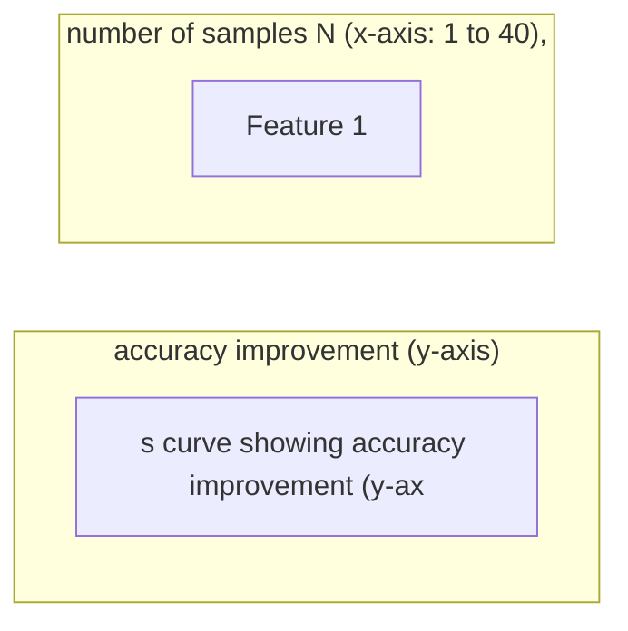

# Self-Consistency

**One-Line Summary**: Self-consistency improves chain-of-thought reasoning by sampling multiple reasoning paths at non-zero temperature and selecting the most common final answer through majority voting.
**Prerequisites**: `03-reasoning-elicitation/chain-of-thought-prompting.md`, `01-foundations/temperature-and-sampling.md`

## What Is Self-Consistency?

Imagine you are lost in an unfamiliar city and you ask five different strangers for directions to the train station. Each person might suggest a slightly different route, but if four out of five point you east, you should go east. The one outlier who pointed west probably misunderstood your question or was confused. Self-consistency applies the same intuition to LLM reasoning: instead of relying on a single chain-of-thought trace (which might take a wrong turn), you generate multiple independent reasoning paths and take the majority vote on the final answer.

Introduced by Wang et al. (2023), self-consistency addresses a fundamental limitation of chain-of-thought prompting: any single reasoning trace is stochastic and can contain errors. A model might make an arithmetic mistake in step 3, misinterpret a condition in step 5, or simply wander off track. By sampling multiple traces at temperature > 0, self-consistency exploits the fact that correct reasoning paths tend to converge on the same answer while incorrect paths diverge randomly. The technique improved GSM8K accuracy from 58% (single CoT) to 74.4% with PaLM 540B using 40 samples -- a 16.4 percentage point gain from pure inference-time computation.

Self-consistency is notable because it is one of the few techniques that trades compute for accuracy with a clear, predictable return. It requires no prompt engineering beyond the original CoT prompt, no fine-tuning, and no architectural changes. It is purely an inference-time strategy.

*Source: Adapted from Wang et al., "Self-Consistency Improves Chain of Thought Reasoning in Language Models," ICLR 2023.*

*Source: Adapted from Wang et al., 2023.*

## How It Works

### Sampling Multiple Reasoning Paths

The process begins with a standard chain-of-thought prompt (either few-shot or zero-shot). Instead of generating a single response at temperature 0 (greedy decoding), the prompt is sent N times with temperature > 0 (typically 0.5-0.7).

Each call produces a different reasoning trace because the sampling introduces randomness in token selection. The key insight is that the reasoning paths will vary -- different intermediate steps, different phrasings, sometimes different approaches entirely -- but if the model has learned the correct reasoning pattern, most paths will converge on the correct final answer.

### Majority Voting (Marginalizing Over Reasoning Paths)

After collecting N responses, the final answer is extracted from each response and a simple majority vote is taken. The most frequently occurring answer is selected as the output.

This is formally described as marginalizing over reasoning paths: P(answer) = sum of P(answer, reasoning_path) over all reasoning paths. The mathematical intuition is that correct answers are attractors in the reasoning distribution while incorrect answers are scattered across the error space.

This property holds when errors are independent and random. When the model has a systematic bias (e.g., always misapplying a formula), majority voting amplifies rather than corrects the error.

### Cost-Accuracy Trade-off

The central engineering decision is how many samples (N) to use. Empirical results show diminishing returns:
- 1 sample: baseline CoT performance.
- 3 samples: captures most of the low-hanging fruit; typically 3-7% improvement.
- 5 samples: the most common practical choice; typically 5-10% improvement.
- 10 samples: strong results; typically 8-15% improvement.
- 40 samples: near-maximum benefit; used in the original paper for benchmark results.

Each sample requires a full API call, so cost and latency scale linearly with N. At 5 samples, you are paying 5x the cost of a single call. The sweet spot for most production applications is 3-5 samples, which captures the majority of the accuracy gain at manageable cost.

### Answer Extraction and Aggregation

Reliable self-consistency requires robust answer extraction. Each response must be parsed to extract a clean final answer. For math problems, this means extracting the numerical result. For multiple-choice, extracting the letter. For free-form text, this is harder and may require semantic similarity clustering rather than exact string matching.

Inconsistent answer extraction will corrupt the voting process. Using structured output formats or explicit answer delimiters ("The answer is:") significantly improves extraction reliability. When answers can vary in format (e.g., "42" vs. "$42" vs. "forty-two"), normalization before voting is essential.

## Why It Matters

### Reliable Accuracy Gains

Self-consistency provides one of the most reliable accuracy improvements available in prompt engineering. Unlike techniques that depend on prompt wording or example quality, self-consistency works mechanically: more samples, more accuracy, with predictable diminishing returns. This predictability makes it attractive for production systems where reliability matters more than prompt cleverness.

### Complementary to Other Techniques

Self-consistency is orthogonal to prompt quality improvements. Better CoT examples improve the base accuracy of each sample, and self-consistency improves accuracy on top of that. The two approaches are multiplicative, not substitutive. This means self-consistency can be layered on top of any CoT-based technique -- few-shot CoT, zero-shot CoT, step-back prompting, or structured reasoning formats.

### Inference-Time Scaling

Self-consistency was an early demonstration of inference-time compute scaling: the idea that you can improve model performance by spending more compute at inference time rather than during training. This concept has since been formalized in extended thinking, reasoning tokens, and search-based inference methods. Self-consistency is the simplest and most accessible version of this paradigm.

### Confidence Estimation as a Side Effect

Beyond improving accuracy, self-consistency provides a natural confidence signal. The degree of agreement among samples indicates how confident the system should be in the answer. If all 5 samples agree, confidence is high. If the vote is 3-2, the answer is uncertain and might warrant human review. This confidence signal is valuable for production routing and escalation decisions, effectively providing calibration for free.

## Key Technical Details

- **Benchmark result**: GSM8K accuracy improved from 58% (single CoT) to 74.4% (40-sample self-consistency) with PaLM 540B, a 16.4 percentage point gain.
- **Optimal temperature**: 0.5-0.7 provides good diversity without excessive incoherence; temperature 0 defeats the purpose (identical outputs), temperature 1.0+ introduces too much noise.
- **Practical sweet spot**: 3-5 samples capture 60-80% of the maximum accuracy gain at 3-5x cost.
- **Diminishing returns**: Going from 1 to 5 samples yields roughly 2x the improvement of going from 5 to 40 samples.
- **Cost scaling**: Linear in N -- 5 samples costs 5x a single call in both tokens and latency (though samples can be parallelized).
- **Answer format dependency**: Works best when answers are discrete (numbers, categories, yes/no); less effective for open-ended text generation where answers cannot be easily compared.
- **Parallelization**: All N samples are independent and can be sent concurrently, so wall-clock latency equals a single call if parallelized.
- **Weighted voting**: Assigning higher weight to samples with more confident or coherent reasoning traces can improve upon simple majority voting by 1-3%.
- **Answer clustering**: For non-exact-match answers (e.g., numerical answers with rounding differences), clustering similar answers before voting avoids splitting votes across equivalent responses.

## Common Misconceptions

- **"Self-consistency requires different prompts for each sample."** All samples use the identical prompt. Diversity comes solely from temperature-based sampling during generation, not from prompt variation.

- **"More samples is always worth the cost."** The diminishing returns curve means that doubling from 5 to 10 samples might yield only a 2-3% accuracy gain while doubling cost. For most applications, 3-5 samples hit the optimal cost-accuracy trade-off.

- **"Self-consistency works for any task."** It works best on tasks with discrete, verifiable answers (math, classification, multiple-choice). For open-ended generation (essay writing, creative tasks), there is no clear notion of "majority vote" and the technique does not directly apply.

- **"Self-consistency fixes fundamentally flawed prompts."** If the base CoT prompt leads to systematically wrong reasoning (e.g., all paths make the same conceptual error), majority voting will amplify the error rather than correct it. Self-consistency corrects random errors, not systematic ones.

- **"You need exactly the same temperature for all samples."** While consistent temperature is standard practice, the technique works as long as there is sufficient output diversity. Some practitioners use a mix of temperatures (e.g., some at 0.5, some at 0.8) to increase path diversity.

## Connections to Other Concepts

- `03-reasoning-elicitation/chain-of-thought-prompting.md` -- Self-consistency is built on top of CoT; it requires a CoT prompt as its foundation and improves upon single-sample CoT.
- `03-reasoning-elicitation/tree-of-thought-prompting.md` -- ToT can be seen as a structured, guided version of the multi-path exploration that self-consistency does via random sampling.
- `01-foundations/temperature-and-sampling.md` -- Understanding temperature and sampling is essential since self-consistency depends on temperature > 0 to generate diverse reasoning paths.
- `03-reasoning-elicitation/extended-thinking-and-thinking-budgets.md` -- Extended thinking internalizes multi-path reasoning within a single call, potentially reducing the need for explicit self-consistency.
- `03-reasoning-elicitation/zero-shot-chain-of-thought.md` -- Self-consistency can be applied to zero-shot-CoT traces, not just few-shot CoT, making it a versatile add-on.

## Further Reading

- Wang, X., Wei, J., Schuurmans, D., et al. (2023). "Self-Consistency Improves Chain of Thought Reasoning in Language Models." ICLR 2023. The foundational paper introducing self-consistency and demonstrating its effectiveness across multiple benchmarks.
- Wei, J., Wang, X., Schuurmans, D., et al. (2022). "Chain-of-Thought Prompting Elicits Reasoning in Large Language Models." NeurIPS 2022. The CoT paper that self-consistency builds upon.
- Li, Y., Lin, Z., Zhang, S., et al. (2023). "Making Language Models Better Reasoners with Step-Aware Verifier." Extends self-consistency with step-level verification rather than answer-level voting.
- Brown, B., Juravsky, J., Ehrlich, R., et al. (2024). "Large Language Monkeys: Scaling Inference Compute with Repeated Sampling." Systematic study of how repeated sampling (the self-consistency paradigm) scales with compute across diverse tasks.
