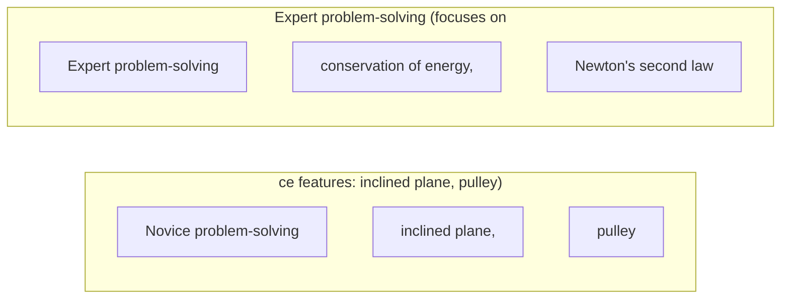

# Step-Back Prompting

**One-Line Summary**: Step-back prompting improves reasoning by first asking the model to identify the relevant high-level principle or concept before attempting to solve the specific problem.
**Prerequisites**: `03-reasoning-elicitation/chain-of-thought-prompting.md`, `02-core-prompting-techniques/few-shot-prompting.md`

## What Is Step-Back Prompting?

Imagine a doctor examining a patient with a complex set of symptoms. Rather than jumping straight to a diagnosis, an experienced physician first asks: "What organ system is most likely involved here?" This abstraction step narrows the diagnostic space from thousands of possible conditions to a manageable set, and it ensures the reasoning that follows is grounded in the right domain. Step-back prompting applies this same principle to LLMs: before solving a specific problem, the model is first prompted to "step back" and identify the underlying principle, concept, or abstraction that governs the problem.

Introduced by Zheng et al. (2023) at Google DeepMind, step-back prompting is a two-step technique. In the first step, the model is asked a "step-back question" that abstracts away from the specifics of the problem to the general principle. In the second step, the model uses that principle to solve the original problem. On physics problems from the MMLU benchmark, step-back prompting improved PaLM 2L accuracy by 7% over standard chain-of-thought. On TimeQA (a temporal knowledge benchmark), it improved accuracy by 11%.

The technique is grounded in the cognitive science observation that experts solve problems differently from novices. Experts first categorize a problem by its deep structure (what type of problem is this?) while novices focus on surface features. Step-back prompting teaches the model to reason like an expert by forcing categorization before solution.

*Source: Adapted from Zheng et al., "Take a Step Back: Evoking Reasoning via Abstraction in Large Language Models," Google DeepMind, 2023.*

*Source: Adapted from Chi, Feltovich, and Glaser, "Categorization and Representation of Physics Problems by Experts and Novices," Cognitive Science, 1981.*

## How It Works

### The Two-Step Process

Step-back prompting consists of two sequential LLM calls.

In the first call, the model receives the original question along with an instruction to identify the relevant high-level concept. For example, given "What happens to the pressure of an ideal gas if the temperature is doubled and the volume is halved?", the step-back question would be "What are the relevant physics principles for this problem?" The model responds with something like "This involves the ideal gas law, PV = nRT."

In the second call, the model receives both the original question and the abstracted principle, and is asked to solve the problem using that principle as a guide. The principle serves as an anchor that keeps the reasoning on track throughout the solution process.

### Designing Step-Back Questions

The step-back question must be calibrated to the right level of abstraction. Too specific ("What equation should I use?") and it does not provide the broad grounding benefit. Too abstract ("What area of knowledge does this relate to?") and it does not sufficiently narrow the reasoning space.

Effective step-back questions ask about: the governing principle or law, the category of problem, the key concepts involved, or the general method for solving this type of problem.

Domain-specific step-back templates can be designed: for law ("What legal doctrine applies?"), for chemistry ("What reaction mechanism is involved?"), for debugging ("What system component is most likely responsible?"), for finance ("What valuation principle governs this scenario?").

### Few-Shot Step-Back Examples

Like standard CoT, step-back prompting benefits from few-shot examples that demonstrate the abstraction-then-solve pattern. Each example shows three elements: (1) a specific question, (2) the step-back question and its answer, (3) the solution guided by the principle.

These examples teach the model the appropriate level of abstraction and the pattern of connecting abstract principles to concrete solutions. The examples are crucial for calibrating what counts as a "principle" in the target domain.

Zheng et al. found that 2-4 step-back examples were sufficient to establish the pattern reliably.

### Integration with Chain-of-Thought

Step-back prompting is not a replacement for chain-of-thought but a complement. The second step (solving the problem using the identified principle) should itself use chain-of-thought reasoning.

The step-back question provides the conceptual framework, and CoT provides the step-by-step execution within that framework. This combination ensures both that the model is reasoning about the right thing (step-back) and that it is reasoning correctly (CoT).

In practice, the second call often includes an instruction like "Using the principle identified above, solve this problem step by step," combining both techniques naturally.

## Why It Matters

### Reducing Conceptual Errors

Many LLM errors are not computational mistakes but conceptual ones: the model applies the wrong principle, confuses related concepts, or fails to recognize the type of problem. Step-back prompting directly addresses these errors by forcing explicit principle identification before solution. This is particularly valuable in domains with many similar-looking but fundamentally different problem types (physics, law, medicine).

### Expert-Like Reasoning Patterns

Step-back prompting aligns LLM behavior with expert cognitive patterns documented in the problem-solving literature. Experts in physics, for example, categorize problems by deep structure (conservation of energy, Newton's laws) while novices categorize by surface features (inclined planes, pulleys). By forcing this categorization step, step-back prompting shifts the model toward expert-like reasoning.

### Improved Grounding for Complex Problems

For problems that require integrating multiple pieces of knowledge, the step-back phase ensures the model retrieves the right conceptual framework before attempting integration. Without this grounding, the model may generate a plausible-sounding but fundamentally misframed solution. The abstraction step acts as a checkpoint that catches framing errors before they propagate through the entire reasoning chain.

### Cost-Effective Two-Call Investment

At only 2x the cost of a single call, step-back prompting offers one of the best cost-to-accuracy ratios among multi-call techniques. Compared to self-consistency (3-5x cost) or tree-of-thought (10-100x cost), step-back provides meaningful accuracy improvement at minimal additional expense.

## Key Technical Details

- **Physics (MMLU)**: Step-back prompting improved PaLM 2L accuracy by 7% over chain-of-thought baseline.
- **Chemistry (MMLU)**: Improvement of approximately 5% over standard CoT on chemistry reasoning questions.
- **TimeQA**: 11% accuracy improvement on temporal knowledge questions, where identifying the relevant time period is the key abstraction.
- **Two API calls required**: Step-back always requires at least two sequential LLM calls (abstraction + solution), doubling minimum latency compared to single-call CoT.
- **Step-back examples**: 2-4 few-shot examples demonstrating the abstraction pattern are typically sufficient.
- **Abstraction granularity**: The step-back question should target the level of a "principle" or "concept," not a "field" or "equation" -- mid-level abstraction works best.
- **Domain sensitivity**: Gains are largest in domains with clear hierarchical knowledge structures (sciences, law, medicine) and smallest in domains without them (creative writing, open-ended generation).
- **Combination with self-consistency**: Sampling multiple step-back abstractions and multiple solutions per abstraction captures both conceptual and computational variance, though at 4-10x single-call cost.
- **Single-call approximation**: Embedding the step-back pattern in a single prompt ("First identify the relevant principle, then solve the problem") captures some of the benefit at lower cost but with less reliability than the two-call version.

## Common Misconceptions

- **"Step-back is just asking 'what kind of problem is this?'"** While problem categorization is one form of step-back, the technique is broader. It can ask about relevant principles, applicable methods, key constraints, or necessary background knowledge. The step-back question should be tailored to the domain and problem type.

- **"Step-back replaces chain-of-thought."** Step-back is a preprocessing step that improves the starting point for CoT, not a substitute. The actual problem-solving still benefits from step-by-step reasoning. The two techniques are complementary.

- **"Step-back always helps."** On simple problems where the relevant principle is obvious from the question itself, step-back adds latency and cost without benefit. It is most valuable when the correct conceptual framework is non-obvious.

- **"The model's step-back answer is always correct."** The model can identify the wrong principle, which then leads to confidently wrong solutions. Step-back reduces conceptual errors but does not eliminate them. Combining step-back with self-consistency (sampling multiple abstraction-solution pairs) can mitigate this risk.

- **"Step-back is redundant with modern reasoning models."** Extended thinking models (o1, Claude with thinking) may perform implicit abstraction as part of their reasoning. However, explicit step-back prompting still provides value by making the abstraction visible and auditable, and it remains useful with non-thinking models.

## Connections to Other Concepts

- `03-reasoning-elicitation/chain-of-thought-prompting.md` -- Step-back prompting is designed to be combined with CoT; the step-back provides the conceptual framework and CoT provides the execution.
- `03-reasoning-elicitation/self-ask-and-decomposition.md` -- Self-ask decomposes problems into sub-questions; step-back identifies the governing principle. Both are "think before solving" techniques but operate on different dimensions (decomposition vs. abstraction).
- `03-reasoning-elicitation/metacognitive-prompting.md` -- Step-back can be seen as a form of metacognition: thinking about what kind of thinking is needed before doing the thinking.
- `02-core-prompting-techniques/few-shot-prompting.md` -- Step-back prompting relies on few-shot examples to demonstrate the abstraction pattern, making example design skills critical.
- `03-reasoning-elicitation/structured-reasoning-formats.md` -- Structured formats like Given-Find-Solution naturally incorporate a step-back phase where the solver identifies what is given and what is being sought.

## Further Reading

- Zheng, H. S., Mishra, S., Chen, X., et al. (2023). "Take a Step Back: Evoking Reasoning via Abstraction in Large Language Models." Google DeepMind. The foundational paper introducing step-back prompting with results across physics, chemistry, and temporal reasoning.
- Chi, M. T. H., Feltovich, P. J., & Glaser, R. (1981). "Categorization and Representation of Physics Problems by Experts and Novices." Cognitive Science. Classic cognitive science paper on expert vs. novice problem categorization that motivates the step-back approach.
- Wei, J., Wang, X., Schuurmans, D., et al. (2022). "Chain-of-Thought Prompting Elicits Reasoning in Large Language Models." The CoT paper that step-back builds upon and complements.
- Wang, L., Xu, W., Lan, Y., et al. (2023). "Plan-and-Solve Prompting." A related technique that asks the model to devise a plan before solving, sharing the "think before acting" philosophy with step-back.
