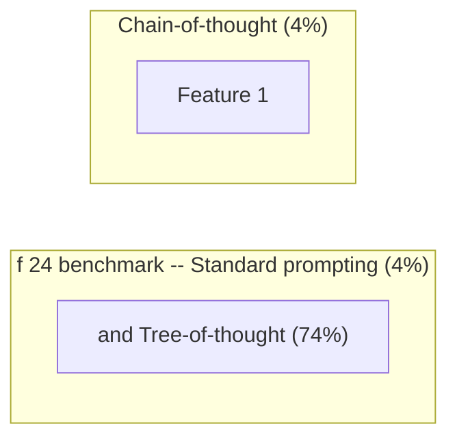

# Tree-of-Thought Prompting

**One-Line Summary**: Tree-of-thought prompting extends chain-of-thought from a single linear reasoning path to a branching search tree, enabling the model to explore, evaluate, and backtrack through multiple reasoning strategies.
**Prerequisites**: `03-reasoning-elicitation/chain-of-thought-prompting.md`, `03-reasoning-elicitation/self-consistency.md`

## What Is Tree-of-Thought Prompting?

Imagine a chess player considering their next move. They do not commit to the first idea that comes to mind. Instead, they consider several candidate moves, mentally play out each one a few turns ahead, evaluate the resulting positions, prune the unpromising lines, and explore the most promising ones more deeply. If a line of play leads to a dead end, they backtrack and try a different branch. Tree-of-thought (ToT) prompting brings this deliberate, exploratory reasoning strategy to LLMs, replacing the single linear chain-of-thought with a branching tree of reasoning paths that can be searched systematically.

Introduced by Yao et al. (2023), ToT demonstrated dramatic improvements on tasks that require exploration and planning. On the "Game of 24" (combining four numbers with arithmetic to reach 24), standard prompting achieved only 4% success and chain-of-thought reached 4% as well, since the task requires exploring combinatorial possibilities rather than following a single reasoning path. ToT achieved 74% -- an 18.5x improvement -- by systematically exploring different number combinations and operations, evaluating intermediate progress, and backtracking from dead ends.

The key insight behind ToT is that some problems are fundamentally tree-search problems, not single-path problems. When the solution requires exploring multiple alternatives and making non-obvious choices, a linear chain-of-thought fails because it commits to a single path that may be a dead end. ToT allows the model to maintain and explore multiple possibilities concurrently.

The distinction between exploration and execution is central: CoT excels at executing a known type of reasoning, while ToT excels at discovering which reasoning approach to use when the right approach is not immediately apparent.

*Source: Lilian Weng, "Prompt Engineering," lilianweng.github.io, 2023. Shows how ToT explores multiple reasoning branches with evaluation and backtracking.*

*Source: Adapted from Yao et al., "Tree of Thoughts: Deliberate Problem Solving with Large Language Models," NeurIPS 2023.*

## How It Works

### The Tree Structure

In ToT, each node in the tree represents a partial solution or intermediate reasoning state. From each node, the model generates multiple candidate next steps (branches). Each candidate is evaluated for promise, and the search continues from the most promising nodes. The tree has a configurable depth (how many steps ahead to explore) and branching factor (how many candidates to generate at each step). A typical configuration uses a branching factor of 3-5 and a depth of 3-5 levels.

### Search Strategies: BFS vs. DFS

ToT supports two primary search strategies.

Breadth-first search (BFS) explores all candidates at each level before moving deeper, maintaining a "frontier" of the k most promising partial solutions. This is best when the quality of intermediate steps can be reliably evaluated.

Depth-first search (DFS) follows a single path to completion, backtracks on failure, and tries alternatives. This is best when evaluation is difficult until a complete solution is reached.

The choice depends on the task: BFS works well for creative writing (where partial quality is assessable) while DFS works well for puzzles with clear success/failure conditions.

### Evaluation and Pruning

At each node, the model evaluates whether the partial solution is promising. This evaluation can be done by the same LLM through a separate prompt ("Given this partial solution, rate its promise on a scale of 1-10 and explain why") or through a programmatic check (e.g., verifying mathematical constraints).

Evaluation is critical: without it, ToT degenerates into exhaustive search, which is computationally infeasible. Good evaluation prompts must be task-specific and calibrated to reliably distinguish promising from unpromising paths. The quality of the evaluation function is often the single largest determinant of ToT effectiveness.

### The Prompting Version vs. the Algorithmic Version

There are two distinct implementations of ToT.

The algorithmic version (Yao et al.) uses an external program to manage the tree, make API calls for generation and evaluation at each node, and implement the search algorithm. This is more powerful but requires engineering infrastructure.

The prompting version encodes the entire tree exploration into a single prompt or a small number of prompts, asking the model to "consider multiple approaches, evaluate each, and select the best." The prompting version is simpler to deploy but less effective because the model must manage the tree structure within its own context, which limits the depth and branching factor it can handle.

In practice, the prompting version is a useful starting point for experimentation, while the algorithmic version is necessary for production deployment on complex problems.

## Why It Matters

### Solving Exploration-Dependent Tasks

Some tasks are fundamentally unsolvable by linear reasoning. Puzzles, planning problems, creative tasks requiring multiple iterations, and optimization problems all benefit from the ability to explore and backtrack. ToT makes these tasks accessible to LLMs without task-specific training.

### Demonstrating Inference-Time Compute Scaling

ToT is a powerful example of trading inference-time compute for accuracy. While it costs 10-100x more than a single prompt, it can solve problems that are impossible with any amount of prompt engineering on a single call. This makes it a tool for maximizing capability rather than minimizing cost.

### Bridging Prompting and Agent Systems

ToT sits at the boundary between prompt engineering and agent systems. The algorithmic version is essentially a simple agent that uses an LLM as a subroutine within a search algorithm. Understanding ToT is a conceptual bridge to understanding more complex agent architectures that use LLMs for planning, evaluation, and execution.

### Solving Problems Beyond Single-Path Capability

Some problems have a structure where the correct first step is not identifiable without exploring multiple possibilities. In these cases, no amount of single-path prompting (CoT, step-back, self-ask) can reliably find the solution because committing to any single path at the first step has a high probability of failure. ToT is the appropriate technique for these fundamentally exploration-dependent problems, providing a capability that no other prompting technique offers.

## Key Technical Details

- **Game of 24 benchmark**: Standard prompting 4%, CoT 4%, ToT 74% -- demonstrating that some tasks fundamentally require exploration.
- **Creative writing benchmark**: ToT achieved coherence scores 2-3x higher than CoT on a constrained creative writing task requiring satisfying multiple criteria simultaneously.
- **Cost**: 10-100x a single API call, depending on branching factor and depth. A tree with branching factor 5 and depth 3 requires up to 5^3 = 125 evaluation calls plus generation calls.
- **Branching factor**: Typically 3-5 candidates per node; higher values increase exploration but cost scales multiplicatively.
- **Search depth**: Typically 3-5 levels; deeper trees are more expensive and harder to manage but can solve more complex problems.
- **Evaluation accuracy**: The quality of the evaluation/pruning step determines ToT effectiveness; poor evaluation leads to wasted compute on unpromising branches.
- **Latency**: Sequential tree exploration cannot be fully parallelized (deeper levels depend on earlier evaluations), so wall-clock time is significantly longer than a single call.
- **Prompting version cost**: The single-prompt version costs 1-3x a standard call but has limited tree depth and branching; it is a low-cost approximation of full ToT.
- **Task suitability heuristic**: If the problem has multiple valid starting approaches and the correct one is not obvious, ToT is likely beneficial. If the problem has a clear, natural starting point, CoT or self-consistency is more cost-effective.

## Common Misconceptions

- **"ToT is just self-consistency with more samples."** Self-consistency samples complete, independent reasoning paths and votes on final answers. ToT generates partial reasoning steps, evaluates them, and uses evaluation to guide further exploration. The key difference is that ToT uses intermediate evaluation to prune and focus, while self-consistency only compares final answers.

- **"You can do ToT in a single prompt."** The prompting version of ToT can approximate tree exploration in a single prompt, but it is severely limited by the model's ability to maintain and navigate a complex tree structure within its context. The full algorithmic version requires multiple API calls orchestrated by external code.

- **"ToT is always better than CoT."** ToT is dramatically better on exploration-dependent tasks but is overkill for tasks where linear reasoning suffices. Using ToT on a straightforward math word problem wastes 10-100x compute for marginal or no improvement.

- **"The model is actually doing tree search internally."** The model generates text that follows a tree-search pattern, but the actual search is orchestrated by external code (algorithmic version) or approximated through prompting (prompting version). The model itself does not have a built-in tree search mechanism.

## Connections to Other Concepts

- `03-reasoning-elicitation/chain-of-thought-prompting.md` -- ToT extends CoT from a single linear trace to a branching exploration; CoT is a degenerate case of ToT with branching factor 1.
- `03-reasoning-elicitation/self-consistency.md` -- Self-consistency samples multiple complete paths and votes; ToT uses intermediate evaluation to guide exploration, making it more efficient for complex search problems.
- `03-reasoning-elicitation/self-ask-and-decomposition.md` -- Self-ask decomposes problems into sub-questions, which can be viewed as a linear decomposition; ToT explores multiple decompositions in parallel.
- `03-reasoning-elicitation/extended-thinking-and-thinking-budgets.md` -- Extended thinking models may internalize some form of tree search within their reasoning token budget, potentially reducing the need for explicit ToT orchestration.
- `03-reasoning-elicitation/step-back-prompting.md` -- Step-back prompting can inform the evaluation step in ToT by providing higher-level principles for judging partial solutions.

## Further Reading

- Yao, S., Yu, D., Zhao, J., et al. (2023). "Tree of Thoughts: Deliberate Problem Solving with Large Language Models." NeurIPS 2023. The foundational paper introducing ToT with BFS and DFS search strategies.
- Long, J. (2023). "Large Language Model Guided Tree-of-Thought." Proposes a variant where the LLM itself guides the tree exploration without an external search algorithm.
- Hao, S., Gu, Y., Ma, H., et al. (2023). "Reasoning with Language Model is Planning with World Model." Connects ToT-style reasoning to planning algorithms from classical AI, including MCTS (Monte Carlo Tree Search).
- Besta, M., Blach, N., Kubicek, A., et al. (2024). "Graph of Thoughts: Solving Elaborate Problems with Large Language Models." Extends ToT from trees to general graphs, allowing reasoning paths to merge and form more complex reasoning topologies.
