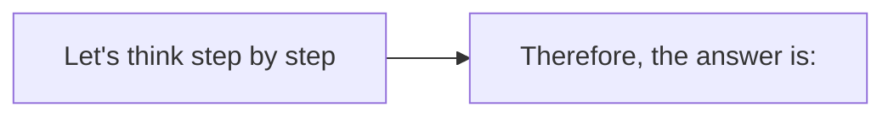
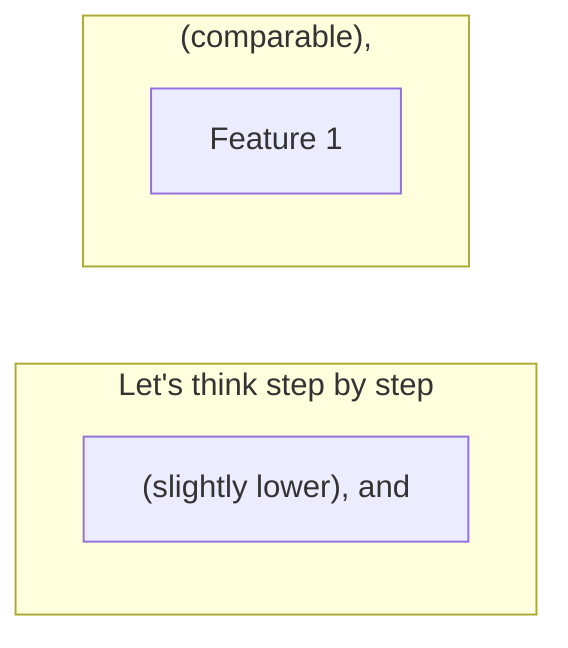

# Zero-Shot Chain-of-Thought

**One-Line Summary**: Adding "Let's think step by step" to a prompt -- with no examples at all -- can dramatically improve reasoning performance by triggering the model's latent step-by-step generation capabilities.
**Prerequisites**: `03-reasoning-elicitation/chain-of-thought-prompting.md`, `01-foundations/how-llms-process-prompts.md`

## What Is Zero-Shot Chain-of-Thought?

Imagine you are in a job interview and the interviewer asks you a complex brainteaser. If they simply say "What's your answer?", you might blurt out something hasty. But if they say "Walk me through your reasoning," you naturally slow down, structure your thoughts, and work through the problem piece by piece. Zero-shot chain-of-thought (zero-shot-CoT) works the same way: a simple trigger phrase like "Let's think step by step" appended to a prompt causes the model to generate intermediate reasoning steps before producing a final answer, without requiring any hand-crafted examples.

Introduced by Kojima et al. (2022), zero-shot-CoT was a surprising finding. The original chain-of-thought work by Wei et al. required carefully constructed few-shot examples with reasoning traces -- a labor-intensive process. Kojima et al. discovered that a single sentence could achieve a substantial fraction of that benefit. On the MultiArith benchmark, zero-shot-CoT improved accuracy from 17.7% to 78.7% with the InstructGPT model, demonstrating that the reasoning capability was latent in the model and could be activated by a simple instruction rather than elaborate examples.

The discovery has profound practical implications: it means that any practitioner, without domain expertise or time to craft examples, can improve reasoning performance on complex tasks by appending a short trigger phrase. It is the lowest-effort, highest-impact reasoning elicitation technique available.

*Source: Adapted from Kojima et al., "Large Language Models are Zero-Shot Reasoners," NeurIPS 2022.*

*Source: Adapted from Kojima et al., 2022.*

## How It Works

### The Two-Stage Process

Zero-shot-CoT typically operates in two stages. In the first stage, the original question is augmented with the trigger phrase "Let's think step by step" and the model generates a reasoning trace. In the second stage, the reasoning trace is concatenated with a follow-up prompt like "Therefore, the answer is:" to extract the final answer.

This two-stage approach is important because the model's reasoning trace often wanders or does not terminate with a clean answer. The extraction prompt focuses the model on committing to a specific conclusion. Without the second stage, programmatic answer extraction becomes unreliable because the reasoning may end mid-thought or with an ambiguous statement.

### Trigger Phrase Variations

Not all trigger phrases are equally effective. Kojima et al. tested multiple variations and found significant performance differences. "Let's think step by step" was the best-performing phrase across benchmarks.

Other variations and their relative effectiveness include: "Let's think about this logically" (slightly worse), "Let's solve this problem by splitting it into steps" (comparable), "First, let's think step by step" (comparable), and "Think carefully before answering" (notably worse).

The phrase needs to signal both decomposition (breaking the problem into steps) and sequential processing (working through them in order). Phrases that are too vague ("think carefully") do not trigger the same structured generation pattern.

### Zero-Shot-CoT vs. Few-Shot-CoT Trade-offs

Zero-shot-CoT is faster to deploy and requires no example engineering, but few-shot-CoT generally achieves higher accuracy. On GSM8K, few-shot-CoT with PaLM 540B reached 58% while zero-shot-CoT reached approximately 43% -- a meaningful gap.

However, zero-shot-CoT has distinct advantages: it requires zero prompt engineering time, uses fewer input tokens (no examples consuming context window), generalizes across tasks without task-specific example sets, and avoids the risk of poorly constructed examples teaching bad reasoning patterns.

In practice, zero-shot-CoT is the right starting point when you need a quick improvement or are working across diverse task types, while few-shot-CoT is preferred when you have a narrow, well-defined task and can invest in crafting high-quality examples.

### Interaction with Modern Instruction-Tuned Models

Modern instruction-tuned models (GPT-4, Claude 3.5+, Gemini 1.5+) have been trained to follow instructions more reliably, which means zero-shot-CoT is more effective and more consistent with these models than with the base or early instruct models used in the original paper.

In many cases, the gap between zero-shot-CoT and few-shot-CoT has narrowed significantly with frontier models. Some practitioners report that a well-phrased zero-shot-CoT instruction with a modern model matches or exceeds few-shot-CoT performance from 2022-era models.

This has practical implications for prompt engineering workflows: start with zero-shot-CoT on a modern model, and only invest in few-shot example crafting if the zero-shot results are insufficient. The bar for "needing few-shot examples" has risen considerably with each model generation.

## Why It Matters

### Accessibility and Speed

Zero-shot-CoT removes the most significant barrier to using chain-of-thought: the need to construct high-quality worked examples. This makes reasoning elicitation accessible to non-experts, enables rapid prototyping, and allows CoT to be applied across diverse tasks without per-task example engineering. It is the fastest path from "the model is getting this wrong" to "the model is getting this right."

### Baseline for Reasoning Improvement

In any prompt engineering workflow, zero-shot-CoT should be the first reasoning technique attempted. If appending "Let's think step by step" (or a variant) solves the problem, there is no need to invest in more complex techniques like few-shot-CoT, self-consistency, or tree-of-thought. It establishes a baseline: if zero-shot-CoT is insufficient, you know the task requires more sophisticated approaches.

### Composability

Zero-shot-CoT composes well with other techniques. It can be combined with role prompting ("You are a math tutor. Let's think step by step"), output formatting instructions ("Think step by step, then provide your answer in JSON"), and system prompt constraints. This composability makes it a versatile building block in production prompt design.

### Cost Efficiency

Because zero-shot-CoT adds only a short trigger phrase to the input (rather than consuming hundreds of tokens on few-shot examples), it preserves context window space for other content. In applications where the context window is already under pressure from long documents, conversation history, or retrieved passages, zero-shot-CoT provides reasoning improvement without the token tax of few-shot examples. The cost is entirely on the output side (longer generated reasoning), which is more controllable through max-token limits.

## Key Technical Details

- **Benchmark improvement**: MultiArith accuracy went from 17.7% to 78.7% with zero-shot-CoT using InstructGPT (text-davinci-002).
- **Best trigger phrase**: "Let's think step by step" consistently outperformed alternatives across 12 benchmarks in the original study.
- **Performance gap vs. few-shot-CoT**: Zero-shot-CoT typically achieves 70-90% of few-shot-CoT performance, depending on task complexity and model capability.
- **Token overhead**: Zero-shot-CoT increases output length by 3-8x compared to direct answering, similar to few-shot-CoT but without the input token cost of examples.
- **Two-stage extraction**: Using a follow-up extraction prompt ("Therefore, the answer is:") improves answer accuracy by 5-10% compared to trying to parse the answer from the reasoning trace alone.
- **Model size sensitivity**: Like few-shot-CoT, zero-shot-CoT requires models of sufficient scale (~60B+ parameters for older models; modern 7B+ instruction-tuned models can benefit).
- **Task applicability**: Most effective on arithmetic, symbolic reasoning, and multi-hop QA; minimal benefit on simple classification or factual recall.
- **Prompt position**: The trigger phrase works when appended to the end of the question; placing it before the question is less effective because the model has not yet processed the problem when encountering the instruction.
- **Combination with formatting**: "Think step by step, then provide your final answer on a new line starting with 'ANSWER:'" combines reasoning elicitation with structured extraction.

## Common Misconceptions

- **"Zero-shot-CoT is always worse than few-shot-CoT."** With modern frontier models and well-phrased instructions, zero-shot-CoT frequently closes the gap to within 1-3% of few-shot-CoT, especially on tasks where the model has strong pretraining coverage.

- **"Any instruction to 'think' triggers CoT."** Vague phrases like "think carefully" or "be thorough" do not reliably activate step-by-step reasoning generation. The trigger phrase must signal decomposition and sequential processing to be effective.

- **"Zero-shot-CoT eliminates the need for prompt engineering."** It eliminates the need for example engineering, but the surrounding prompt still matters. Role assignment, output format specification, and constraint setting all interact with and modulate the effectiveness of zero-shot-CoT.

- **"The model generates a single fixed reasoning path."** At temperature > 0, each call produces a different reasoning trace, which can lead to different answers. This variance is both a weakness (inconsistency) and an opportunity (self-consistency sampling).

## Connections to Other Concepts

- `03-reasoning-elicitation/chain-of-thought-prompting.md` -- The few-shot predecessor that requires manually crafted reasoning examples; zero-shot-CoT is the low-effort alternative.
- `03-reasoning-elicitation/self-consistency.md` -- Sampling multiple zero-shot-CoT traces and majority-voting addresses the variance inherent in any single trace.
- `03-reasoning-elicitation/structured-reasoning-formats.md` -- Structured formats (OTA, Given-Find-Solution) can enhance zero-shot-CoT by providing a more specific template than "step by step."
- `04-system-prompts-and-instruction-design/instruction-following-and-compliance.md` -- Understanding why certain phrasings trigger compliance helps explain why some trigger phrases work better than others.
- `03-reasoning-elicitation/extended-thinking-and-thinking-budgets.md` -- Extended thinking can be viewed as a model-native evolution of zero-shot-CoT with dedicated hidden reasoning capacity.

## Further Reading

- Kojima, T., Gu, S. S., Reid, M., Matsuo, Y., & Iwasawa, Y. (2022). "Large Language Models are Zero-Shot Reasoners." NeurIPS 2022. The foundational paper introducing zero-shot-CoT and the "Let's think step by step" trigger phrase.
- Wei, J., Wang, X., Schuurmans, D., et al. (2022). "Chain-of-Thought Prompting Elicits Reasoning in Large Language Models." NeurIPS 2022. The few-shot CoT paper that zero-shot-CoT builds upon and simplifies.
- Yang, C., Wang, X., Lu, Y., et al. (2023). "Large Language Models as Optimizers." Explores automated discovery of effective prompting phrases, including reasoning triggers, through optimization.
- Ye, X. & Durrett, G. (2023). "Explanation Selection and Chain-of-Thought Prompting." Analyzes what makes reasoning traces effective, relevant to understanding why certain trigger phrases work.
- Wang, L., Xu, W., Lan, Y., et al. (2023). "Plan-and-Solve Prompting: Improving Zero-Shot Chain-of-Thought Reasoning by Large Language Models." Proposes enhanced zero-shot trigger phrases that include explicit planning steps, improving upon the basic "think step by step" approach.
