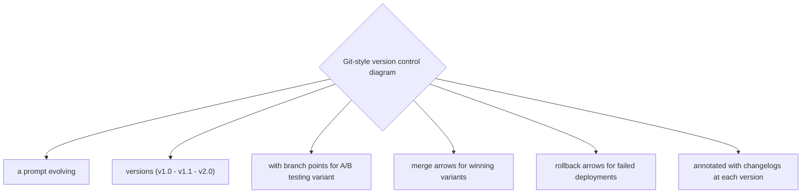
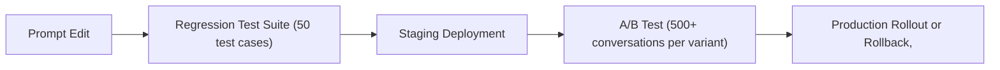

# Prompt Versioning and Management

**One-Line Summary**: Production prompts should be treated as code artifacts with version control, changelogs, regression testing, A/B testing infrastructure, and rollback procedures to ensure reliable, measurable, and reversible prompt evolution.
**Prerequisites**: `04-system-prompts-and-instruction-design/system-prompt-anatomy.md`, `04-system-prompts-and-instruction-design/dynamic-system-prompts.md`

## What Is Prompt Versioning and Management?

Think about how software releases are managed. No serious engineering team deploys code by editing files on a production server and hoping for the best. They use version control (Git), write changelogs, run automated tests, deploy through staging environments, monitor for regressions, and have rollback procedures when something goes wrong. Prompt versioning and management applies these same engineering practices to prompts. A prompt is a production artifact that directly affects application behavior, and it deserves the same rigor applied to any other production code.

In practice, most teams manage prompts far less carefully than their code. Prompts live in config files, database rows, or hard-coded strings, with changes tracked informally in Slack messages or not tracked at all. When a prompt change causes a regression -- user satisfaction drops, accuracy decreases, or a safety constraint is violated -- there is no clear way to identify what changed, when it changed, or how to revert. The cost of this informality grows with the number of prompts, the size of the team, and the criticality of the application.

Prompt management is an emerging discipline that sits at the intersection of software engineering, machine learning operations (MLOps), and content management. As LLM applications mature from prototypes to production systems serving millions of users, the need for systematic prompt management becomes non-negotiable.

*Source: Adapted from Arawjo et al., "ChainForge" (2024) and DSPy prompt management patterns*

*Source: Adapted from Shankar et al., "Who Validates the Validators?" (2024)*

## How It Works

### Version Control for Prompts

Prompts should be stored in version control (Git) alongside the application code, or in a dedicated prompt registry that provides versioning functionality.

Each prompt version should have a unique identifier, a timestamp, an author, and a description of changes. The version history should be queryable: "What was the system prompt for the customer service bot on January 15th?"

This enables temporal debugging (correlating behavior changes with prompt changes) and compliance auditing (proving what instructions were active at any point in time).

### Changelogs and Documentation

Every prompt change should be accompanied by a changelog entry that describes: what changed, why it changed, what problem it addresses, and what the expected impact is.

Good changelogs enable team communication, onboarding of new team members, and retrospective analysis. They also serve as a knowledge base of what has been tried before, preventing teams from re-introducing previously reverted changes.

Example: "v2.3: Added explicit instruction to include citations when discussing medical topics. Motivation: user feedback indicated unsourced medical claims in 15% of responses. Expected impact: citation rate increase from 60% to 85%."

### Regression Testing

A prompt regression test suite is a set of test cases (input-expected output pairs) that are run against each prompt version before deployment. These test cases capture known failure modes, edge cases, and critical behaviors.

A test might verify: "When asked about competitors, the model redirects to our product" or "Medical responses include a disclaimer." Regression tests catch unintended side effects of prompt changes -- a modification that fixes one behavior might break another.

Automated regression testing enables confident iteration: developers can change prompts knowing that critical behaviors will be verified automatically. Tests can use exact match, regex, LLM-as-judge, or custom evaluation functions depending on the nature of the expected behavior.

### A/B Testing Infrastructure

A/B testing for prompts requires: traffic splitting (routing a percentage of users to each prompt version), metric collection (measuring relevant outcomes per version), statistical analysis (determining if differences are significant), and decision criteria (when to declare a winner).

Key metrics typically include: task completion rate, user satisfaction scores, error/hallucination rate, constraint violation rate, and response latency.

A/B tests should run until statistical significance is achieved, typically requiring 500-1,000+ conversations per variant. Due to the stochastic nature of LLM outputs, prompt A/B tests generally require larger sample sizes than traditional UI A/B tests to achieve the same statistical confidence.

## Why It Matters

### Preventing Silent Regressions

Without regression testing, prompt changes can introduce subtle regressions that go undetected for days or weeks. A prompt edit that improves formatting might inadvertently relax a safety constraint. A tone adjustment might reduce task completion rates. Regression testing catches these side effects before they reach production.

### Enabling Confident Iteration

Teams that cannot safely iterate on prompts stop iterating. Fear of breaking production behavior leads to prompt stagnation, where known problems are not fixed because the risk of change is perceived as too high. Versioning, testing, and rollback procedures remove this fear, enabling rapid prompt improvement.

### Compliance and Auditability

In regulated industries, organizations must demonstrate what instructions were given to the model at any point in time. Version-controlled prompts with timestamps and changelogs provide the audit trail necessary for compliance reviews, incident investigations, and regulatory inquiries.

### Team Collaboration

When multiple team members edit prompts without version control, conflicts arise, changes are lost, and no one knows why the prompt looks the way it does. Versioning enables parallel work (branching), review processes (pull requests for prompt changes), and knowledge preservation (the full history of design decisions is captured in the version log).

## Key Technical Details

- **Version identifier format**: Use semantic versioning (e.g., v2.3.1) or date-based versioning (e.g., 2024-01-15-a) to clearly identify prompt versions. Include a hash for exact match verification.
- **Regression test suite size**: 20-50 test cases per prompt is a practical starting point; critical applications may require 100-200+. Tests should cover both positive cases (correct behavior) and negative cases (constraint adherence).
- **Test execution cost**: Running a 50-test regression suite against a prompt costs 50 API calls. At $0.01-0.10 per call (depending on model and prompt length), a full regression run costs $0.50-5.00, cheap enough to run on every prompt change.
- **A/B test duration**: Typical prompt A/B tests require 1-4 weeks to reach statistical significance, depending on traffic volume. Minimum 500 conversations per variant for most metrics.
- **Rollback time**: With a prompt registry, rollback is effectively instant (change the active version pointer). Without one, rollback requires a code deployment, taking minutes to hours.
- **Prompt registry features**: A production prompt registry should support: versioning, access control, deployment status tracking, A/B test assignment, metric tagging, and integration with CI/CD pipelines.
- **Change frequency**: Production prompts typically change 2-10 times per month during active development, stabilizing to 1-2 times per month in mature applications.
- **Multi-prompt coordination**: Applications with multiple prompts (e.g., system prompt + tool-use prompts + evaluation prompts) need coordinated versioning to ensure compatibility between prompt versions.

## Common Misconceptions

- **"Prompts are too simple to need version control."** Production prompts are often 500-5,000 tokens long, contain complex logic, and directly determine application behavior. They are as complex as many source code files and have the same (or greater) impact on user experience.

- **"Git is sufficient for prompt management."** Git provides version control but lacks prompt-specific features: A/B testing, deployment management, metric association, and registry functionality. Git is a necessary foundation but not a complete solution. Dedicated prompt management tools or custom infrastructure built on Git address these gaps.

- **"You can evaluate prompt changes by reading the prompt."** Reading a prompt change can identify obvious problems but cannot predict subtle behavioral impacts. Automated regression testing and A/B testing are necessary for reliable evaluation because prompts interact with model behavior in non-obvious ways.

- **"A/B testing prompts works just like A/B testing UI changes."** Prompt A/B tests are more complex because: (1) outputs are stochastic (the same prompt produces different outputs), (2) evaluation often requires LLM-based judging rather than simple click metrics, and (3) confounding variables (user intent, conversation complexity) are harder to control.

- **"Once a prompt is working, you never need to change it."** Model updates (new versions from the provider), user population shifts, product changes, and newly discovered edge cases all necessitate ongoing prompt maintenance. A "working" prompt gradually becomes a "legacy" prompt without active management.

## Connections to Other Concepts

- `04-system-prompts-and-instruction-design/system-prompt-anatomy.md` -- Each component of the system prompt anatomy can be versioned independently when using modular prompt design.
- `04-system-prompts-and-instruction-design/dynamic-system-prompts.md` -- Dynamic prompts add versioning complexity because both individual components and assembly logic must be tracked.
- `04-system-prompts-and-instruction-design/meta-prompting.md` -- Meta-prompting generates new prompt versions that enter the versioning pipeline for testing and deployment.
- `04-system-prompts-and-instruction-design/behavioral-constraints-and-rules.md` -- Constraint changes are the highest-risk prompt modifications and should receive the most thorough regression testing.
- `04-system-prompts-and-instruction-design/instruction-following-and-compliance.md` -- Regression tests should measure compliance with critical instructions to ensure prompt changes do not degrade adherence.

## Further Reading

- Khattab, O., Santhanam, K., Li, X. D., et al. (2023). "DSPy: Compiling Declarative Language Model Calls into Self-Improving Pipelines." Provides a framework for programmatic prompt management including versioning, optimization, and evaluation integration.
- Shankar, S., Zamfirescu-Pereira, J. D., Hartmann, B., et al. (2024). "Who Validates the Validators? Aligning LLM-Assisted Evaluation of LLM Outputs with Human Preferences." Addresses the challenge of building reliable evaluation for prompt testing, including LLM-as-judge approaches and their calibration.
- Arawjo, I., Peng, C., Grunde-McLaughlin, M., et al. (2024). "ChainForge: A Visual Toolkit for Prompt Engineering and LLM Hypothesis Testing." Open-source tool for systematic prompt evaluation across model configurations, supporting the regression testing and comparison workflow.
- Perez, E., Ringer, S., Lukosiute, K., et al. (2023). "Discovering Language Model Behaviors with Model-Written Evaluations." Demonstrates automated generation of test cases for LLM evaluation, relevant to building regression test suites for prompts.
