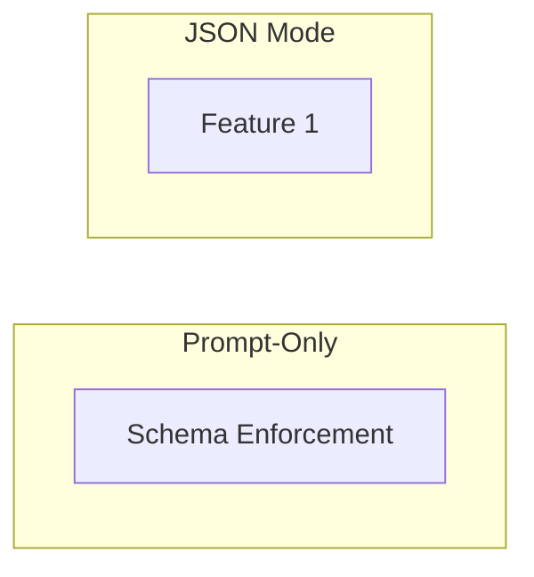
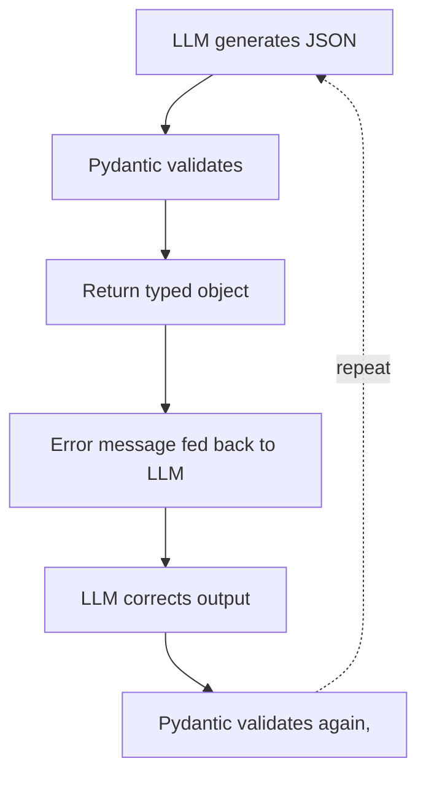

# JSON Mode and Schema Enforcement

**One-Line Summary**: JSON mode and schema enforcement ensure LLM outputs conform to machine-parseable JSON structures through API-level constraints, prompt design, and external validation.
**Prerequisites**: None.

## What Is JSON Mode and Schema Enforcement?

Think of the difference between writing a free-form essay and filling out a structured form. The essay lets you say anything in any order, but a form has labeled fields, dropdown menus, and checkboxes that constrain your response into a predictable shape. JSON mode and schema enforcement do exactly this for LLM outputs — they force the model to produce valid, structured data instead of free-flowing text.

When you ask an LLM to "return JSON," you are making a request that the model may or may not honor. The model might wrap the JSON in markdown code fences, include a preamble like "Here is the JSON:", or produce syntactically broken output. JSON mode — available as an API parameter in OpenAI, Anthropic, and Google — guarantees that the raw output is valid JSON. Schema enforcement goes further: it ensures the JSON conforms to a specific structure with required fields, correct types, and valid enum values.

This distinction matters enormously in production systems. A downstream parser does not care about helpful commentary — it needs predictable, machine-readable data. Without enforcement, prompt-only approaches to JSON generation fail 5-15% of the time depending on output complexity, model, and temperature. That failure rate is unacceptable for any system processing thousands of requests daily.


*Source: Adapted from Willard & Louf, "Efficient Guided Generation for Large Language Models" (2023)*


*Source: Adapted from Jason Liu, "Instructor: Structured LLM Outputs" (2023)*

## How It Works

### API-Level JSON Mode

OpenAI's `response_format: { type: "json_object" }` guarantees syntactically valid JSON output. Anthropic achieves similar results through tool use with defined schemas. Google's Gemini offers `response_mime_type: "application/json"`. Each provider implements this differently at the decoding level — typically by masking tokens that would produce invalid JSON syntax during generation.

When JSON mode is enabled, the model's token sampling is constrained so that only tokens producing valid JSON can be selected at each step. This eliminates syntax errors like missing commas, unmatched brackets, or trailing text. However, basic JSON mode only guarantees syntax, not structure.

### Schema-Constrained Generation

Structured outputs with schema enforcement go beyond syntax. OpenAI's structured outputs accept a JSON Schema definition and guarantee the output matches it exactly — correct field names, types, required properties, and enum values. You define a schema like `{"type": "object", "properties": {"sentiment": {"type": "string", "enum": ["positive", "negative", "neutral"]}}, "required": ["sentiment"]}` and the model is physically prevented from producing anything else.

This works by converting the JSON Schema into a context-free grammar and using that grammar to constrain the decoding process at every token. The model can only "choose" from tokens that keep the output on a valid path through the grammar.

### External Validation with Pydantic and Zod

When API-level schema enforcement is unavailable, external validation libraries fill the gap. Pydantic (Python) and Zod (TypeScript) let you define data models, parse the LLM's raw JSON output, and get typed, validated objects or clear error messages. A typical pattern is: prompt the model for JSON, parse with Pydantic, and if validation fails, send the error message back to the model for correction.

This retry-with-error-feedback loop typically succeeds within 1-2 retries. Libraries like Instructor (Python) and Marvin automate this pattern, wrapping the LLM call in a validation loop that handles retries transparently.

### Prompt-Based JSON vs Constrained Decoding

Relying solely on prompts like "Return valid JSON with fields: name, age, city" works most of the time but is fundamentally unreliable. Prompt-only JSON fails 5-15% of the time, with failure rates increasing for complex schemas, higher temperatures, and smaller models. Common failure modes include: extra text outside the JSON, missing required fields, wrong types (string instead of number), and hallucinated additional fields.

Constrained decoding eliminates these failures at the cost of slightly reduced generation flexibility. The model cannot "think out loud" before producing the JSON, which can sometimes reduce quality for complex reasoning tasks. A practical compromise is to use a two-phase approach: first let the model reason freely, then constrain the final output to JSON.

### The Two-Phase Reasoning-Then-Structure Pattern

For tasks requiring genuine reasoning before producing structured output, the two-phase pattern is the standard production approach. In phase one, prompt the model to think through the problem in natural language — analyzing input, weighing options, and reaching conclusions. In phase two, instruct it to encode the conclusions into a JSON structure. This can happen in a single prompt with a clear delimiter:

```
Analyze the customer review below. First, think through your analysis in a <reasoning> block. Then, output your final assessment as JSON matching the schema.

<reasoning>Think step by step about sentiment, key topics, and urgency.</reasoning>

Output JSON:
{"sentiment": "positive|negative|mixed", "topics": ["..."], "urgency": "low|medium|high"}
```

This pattern preserves reasoning quality while still producing structured output. When combined with API-level JSON mode or schema enforcement applied only to the final output portion, it achieves both high accuracy and guaranteed structure. Some frameworks, including OpenAI's structured outputs with chain-of-thought, explicitly support this pattern by allowing a free-text reasoning field within the JSON schema itself.

## Why It Matters

### Production Reliability

Any system that processes LLM output programmatically needs predictable structure. A 5% JSON failure rate means 50 broken requests per 1,000 — each requiring error handling, retries, or human intervention. Schema enforcement reduces this to effectively 0%, enabling truly autonomous pipelines.

### Type Safety Across the Stack

When LLM outputs conform to defined schemas, they integrate cleanly with typed programming languages. A Pydantic model or Zod schema serves as both the LLM's output specification and the application's type definition, eliminating an entire class of runtime errors.

### Cost and Latency Implications

JSON output is approximately 30% more tokens than equivalent natural language due to structural characters (braces, brackets, quotes, colons, commas) and quoted string values. For a response that would be 100 tokens in natural language, expect roughly 130 tokens in JSON. This directly impacts cost and latency, making it important to only use JSON when structured output is genuinely needed.

## Key Technical Details

- **Prompt-only JSON generation fails 5-15% of the time** depending on schema complexity and model capability.
- **JSON output uses roughly 30% more tokens** than equivalent natural language due to structural overhead.
- **OpenAI structured outputs support a subset of JSON Schema**: `type`, `properties`, `required`, `enum`, `anyOf`, `$ref`, and recursive schemas. Not all JSON Schema features are supported.
- **Anthropic's tool use** effectively provides schema enforcement by defining tool input schemas — the model must call the tool with valid arguments matching the schema.
- **Pydantic validation with retry loops** typically succeeds within 1-2 attempts, adding 2-5 seconds of latency per retry.
- **Nested schemas increase failure rates**: each level of nesting roughly doubles the prompt-only failure rate.
- **Temperature 0 reduces but does not eliminate** prompt-only JSON failures — structural errors still occur at ~2-5% for complex schemas.
- **Token healing** in some constrained decoding implementations prevents partial-token issues at JSON boundaries.

## Common Misconceptions

- **"JSON mode guarantees the schema I want."** JSON mode only guarantees syntactically valid JSON — it does not enforce specific fields, types, or structure. You still need schema enforcement or validation for structural guarantees.
- **"I should always use JSON for LLM outputs."** JSON is for machine consumption. If a human will read the output, markdown or natural language is more appropriate and 30% cheaper in tokens.
- **"Constrained decoding reduces output quality."** For simple extraction and classification tasks, quality is identical. For complex reasoning, constrained decoding can reduce quality because the model cannot produce intermediate reasoning tokens. The fix is to allow reasoning before the constrained portion.
- **"If the JSON is valid, the data is correct."** Schema enforcement guarantees structure, not semantic correctness. A model can produce perfectly valid JSON with completely hallucinated values. Validation handles syntax; evaluation handles correctness.
- **"Retry loops are too slow for production."** With structured outputs or constrained decoding, retries are rarely needed. Even with prompt-only approaches, the 1-2 retry overhead (2-5 seconds) is acceptable for most non-real-time applications.

## Connections to Other Concepts

- `constrained-decoding-from-prompt-perspective.md` — Explores the decoding-level mechanisms that make JSON mode and schema enforcement possible.
- `extraction-and-parsing-prompts.md` — JSON schema enforcement is the output format for most extraction tasks.
- `multi-step-output-pipelines.md` — JSON is the default intermediate format when pipeline steps are consumed by code.
- `classification-and-labeling-output.md` — Classification outputs are typically enforced as JSON with enum-constrained label fields.
- `xml-and-tag-based-output.md` — The primary alternative structured format when JSON is not ideal.

## Further Reading

- Willard & Louf, "Efficient Guided Generation for Large Language Models" (2023) — Foundational paper on grammar-constrained decoding that underlies most JSON enforcement implementations.
- OpenAI, "Structured Outputs" documentation (2024) — Official guide to JSON Schema-based output enforcement in the OpenAI API.
- Jason Liu, "Instructor: Structured LLM Outputs" (2023) — Library and methodology for Pydantic-validated LLM outputs with automatic retries.
- Beurer-Kellner et al., "Prompting Is Programming: A Query Language for Large Language Models" (2023) — LMQL paper introducing programmatic constraints on LLM output.
