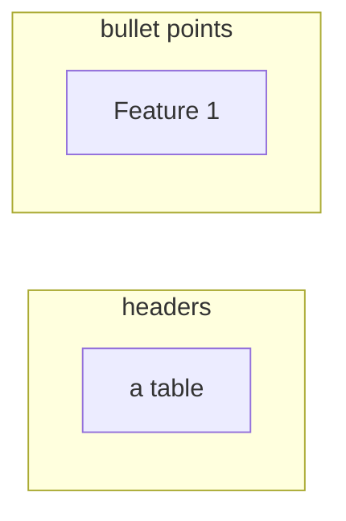

# Markdown and Rich Text Output

**One-Line Summary**: Markdown output prompting controls how LLMs format responses with headers, tables, lists, and code blocks, enabling consistent, readable, and structured human-facing content.
**Prerequisites**: None.

## What Is Markdown and Rich Text Output?

Imagine giving typesetting instructions to a newspaper layout editor. You specify "this is a headline," "this is a bulleted list," "this goes in a two-column table," and "this is a pull quote." The editor follows your instructions to produce a visually structured page. Prompting LLMs for markdown output works the same way — you are giving formatting directives that control the visual and structural organization of the response.

LLMs naturally produce markdown because their training data is saturated with it — GitHub READMEs, Stack Overflow answers, documentation sites, and blog posts all use markdown extensively. This means models are remarkably good at markdown formatting when given clear guidance, but they also have strong default habits that can be hard to override. Without explicit formatting instructions, models tend toward their own preferences: often verbose paragraphs with occasional bold text and bullet points.

Controlling markdown output matters because the format directly affects usability. A well-structured response with clear headers, concise tables, and organized lists communicates information faster than a wall of text. For applications rendering LLM output in web interfaces, consistent markdown ensures predictable rendering and a polished user experience.


*Source: Adapted from Nielsen, "How Users Read on the Web" (1997) and OpenAI formatting best practices (2024)*


*Source: Derived from empirical observations across GPT-4, Claude 3.5, and Gemini model families*

## How It Works

### Section-Level Format Control

The most reliable approach to markdown formatting is specifying the exact section structure in your prompt. Rather than asking the model to "format nicely," define the skeleton:

```
Structure your response with these exact sections:
## Overview (2-3 sentences)
## Key Findings (bulleted list, max 5 items)
## Detailed Analysis (2-3 paragraphs)
## Recommendations (numbered list)
```

This explicit scaffolding achieves 90-95% structural compliance across major models. The model fills in the content while respecting the format blueprint. For even higher reliability, include a complete example showing the exact formatting expected.

### Table Formatting Challenges

Tables are the most challenging markdown format for LLMs. Common failure modes include: inconsistent column counts across rows, misaligned pipes, missing header separators, excessively wide columns that break rendering, and content that should be in separate cells merged into one.

To improve table output, specify the exact columns, provide a header example, and constrain cell content length. For tables with more than 5 columns or complex data, consider requesting JSON output and rendering the table client-side. Models handle 3-4 column tables reliably; reliability drops noticeably beyond 6 columns.

### Code Block Consistency

LLMs generally handle code blocks well, but inconsistencies arise with language identifiers (```python vs ```py vs plain ```), mixing inline code with block code, and nested code within lists. Specify the language identifier convention explicitly and demonstrate it. For multi-language outputs, be explicit: "Use ```python for Python code and ```sql for SQL queries."

### Maintaining Consistency Across Long Outputs

For responses exceeding 500 tokens, formatting consistency degrades. The model may start with well-structured headers and lists but drift into unstructured paragraphs toward the end. Mitigation strategies include: reinforcing format instructions at the end of the prompt ("Remember to maintain the header/list structure throughout"), breaking long responses into multiple calls with consistent format instructions, and using system prompts for persistent formatting rules.

### Suppressing Unwanted Markdown

Sometimes the problem is not getting markdown but preventing it. When LLM output feeds into a system that does not render markdown — a plain-text email, a terminal log, or a voice synthesis pipeline — stray asterisks, pound signs, and backticks become noise. Suppression requires explicit negative instructions: "Do not use any markdown formatting. No headers, no bold, no bullet points. Write in plain prose paragraphs only." Even with explicit instructions, models occasionally produce bold text or bullet lists out of habit. Combining negative instructions with a plain-text example demonstrating the expected style raises compliance to roughly 90-95%. For absolute certainty, post-process the output by stripping markdown characters programmatically — a regex that removes `#`, `*`, `` ` ``, and `- ` at line beginnings handles the most common cases.

## Why It Matters

### User Interface Integration

Most LLM-powered applications render responses in web interfaces that support markdown. Consistent markdown output means predictable rendering — headers become the right size, lists render with proper indentation, code gets syntax highlighting, and tables display in aligned columns. Inconsistent formatting creates a jarring user experience.

### Information Density and Scanability

A well-formatted markdown response communicates more information per screen than unstructured text. Users can scan headers to find relevant sections, read bullet points for key facts, and reference tables for comparative data. Studies on document usability consistently show that structured formatting improves comprehension speed by 25-40% compared to dense paragraphs.

### Downstream Processing

Markdown output enables lightweight programmatic processing. Heading structure can be parsed into tables of contents, bullet points extracted as discrete items, and code blocks isolated for execution or syntax checking. This lightweight structure sits between fully unstructured text and rigid JSON, offering both human readability and basic parseability.

## Key Technical Details

- **LLMs produce markdown with ~95% structural compliance** when given explicit section templates in the prompt.
- **Table formatting reliability drops significantly beyond 6 columns** — consider JSON for complex tabular data rendered client-side.
- **Markdown overhead is minimal**: approximately 5-10% more tokens than plain text, compared to 30% for JSON.
- **Format drift in long outputs** (500+ tokens) can be mitigated by repeating format instructions at the end of the prompt.
- **Nested lists beyond 3 levels** are unreliably formatted across models — flatten complex hierarchies into separate sections.
- **System prompts are more effective than user prompts** for persistent formatting rules across a conversation.
- **Bold and italic emphasis** are reliably produced when demonstrated in examples but inconsistently applied when only described verbally.
- **Heading levels** should be specified explicitly (## for main sections, ### for subsections); models sometimes use inconsistent levels without guidance.
- **Horizontal rules** (`---`) are reliably produced but rarely used by models unless explicitly requested. They are useful for visually separating major sections in long outputs.
- **Link formatting** (`[text](url)`) is reliably produced when the model has URLs in context, but models will occasionally fabricate plausible-looking URLs. Always validate generated links in production.
- **Blockquotes** (`>`) are well-supported and useful for distinguishing quoted source material from the model's own analysis, reducing ambiguity about what is original vs. cited content.
- **Mixed formatting within a single response** (e.g., prose paragraphs followed by a table followed by a code block) requires explicit sequencing instructions; without them, models may inconsistently switch between formats.

## Common Misconceptions

- **"Models naturally produce well-formatted markdown."** Models produce markdown, but not necessarily consistent or optimal markdown. Without explicit formatting instructions, output structure varies significantly between responses and tends toward verbose prose.
- **"Just say 'format as a table' and you'll get a good table."** Table quality depends heavily on specifying columns, demonstrating the header format, and constraining cell content. Vague table requests produce unreliable results.
- **"Markdown formatting doesn't affect response quality."** Format constraints interact with content quality. Extremely rigid formatting (like forcing all content into bullet points) can reduce nuance and completeness. The format should match the content type.
- **"All markdown renderers handle LLM output the same way."** Different renderers (GitHub, VS Code, web libraries like marked.js or react-markdown) handle edge cases differently. Test your specific renderer with actual LLM output, especially for tables and nested structures.
- **"Bullet points and numbered lists are interchangeable."** Models treat these as distinct formatting signals. Numbered lists imply sequential order or ranked priority, while bullet points imply unordered items of equal weight. Using numbered lists for non-sequential content (or bullets for step-by-step instructions) creates a mismatch between format and meaning that can confuse both readers and downstream parsers. Be deliberate: specify "bulleted list (unordered)" or "numbered list (sequential steps)" in your prompt.
- **"You can control markdown formatting with a single instruction."** Reliable formatting typically requires three reinforcing signals: an explicit instruction ("use ## headers for each section"), a structural template showing the expected skeleton, and ideally a complete example of the desired output format. Relying on a single instruction yields roughly 70-80% compliance; combining all three approaches raises it to 90-95%.

## Connections to Other Concepts

- `xml-and-tag-based-output.md` — XML tags can be combined with markdown: tags for machine-parseable structure, markdown for human-readable formatting within tagged sections.
- `output-length-control.md` — Format choice directly affects output length; bullet points are more concise than paragraphs.
- `json-mode-and-schema-enforcement.md` — JSON is for machine consumption; markdown is for human consumption. Choose based on the consumer.
- `multi-step-output-pipelines.md` — Markdown is the preferred intermediate format when humans review pipeline outputs.
- `classification-and-labeling-output.md` — Classification results can be formatted as markdown tables for human review.

## Further Reading

- OpenAI, "Prompt Engineering Guide: Formatting" (2024) — Official guidance on controlling output format, including markdown conventions.
- Gruber, "Markdown: Syntax" (2004) — The original markdown specification, useful for understanding what LLMs were trained on.
- Anthropic, "Prompt Engineering: Be Specific About Output Format" (2024) — Anthropic's recommendations for format control, including markdown patterns.
- Nielsen, "How Users Read on the Web" (1997) — Foundational usability research showing that structured, scannable content dramatically improves comprehension.
