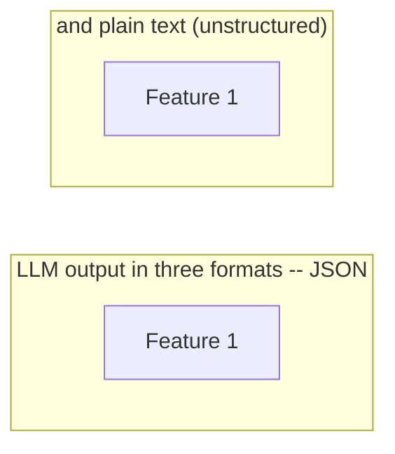

# XML and Tag-Based Output

**One-Line Summary**: XML and tag-based output uses labeled opening and closing tags to structure LLM responses, excelling at nested mixed content, human readability, and seamless integration with Anthropic's Claude models.
**Prerequisites**: None.

## What Is XML and Tag-Based Output?

Think of how HTML gives structure to web pages. A `<h1>` tag tells the browser "this is a heading," a `<p>` tag marks a paragraph, and `` embeds an image. The content itself flows naturally between the tags, but the tags provide machine-readable structure. XML and tag-based LLM output works the same way — you wrap model responses in meaningful tags like `<answer>`, `<reasoning>`, and `<source>` to create structured output that is both human-readable and programmatically parseable.

Unlike JSON, which forces all content into key-value pairs and requires escaping special characters, XML gracefully handles mixed content — a `<response>` tag can contain paragraphs of natural language, nested `<citation>` tags, and even embedded code without escaping issues. This makes XML particularly well-suited for outputs that blend structure with prose.

Anthropic's Claude models show a strong affinity for XML-based formatting, likely due to training data distribution and instruction tuning. When you prompt Claude with XML tags in the input, it naturally mirrors that structure in the output. This makes XML a first-class citizen in the Anthropic ecosystem, though it works well across all major models.


*Source: Adapted from Anthropic, "Prompt Engineering Guide: Use XML Tags" (2024)*


*Source: Lilian Weng, "Prompt Engineering," lilianweng.github.io (2023) -- illustrates how structured formatting (including XML tags) enables organized reasoning output with distinct sections for thinking, analysis, and final answers*

## How It Works

### Tag Design Principles

Effective tag-based output starts with meaningful tag names. Use descriptive, self-documenting names: `<reasoning>` instead of `<r>`, `<final_answer>` instead of `<a>`. Keep nesting shallow — typically 2-3 levels maximum. Define a consistent vocabulary of tags for your application and reuse them across prompts.

A common tag vocabulary for reasoning tasks includes: `<thinking>` for intermediate reasoning, `<answer>` for the final response, `<confidence>` for self-assessed certainty, `<sources>` for references, and `<caveats>` for limitations. For extraction tasks: `<entity>`, `<field>`, `<value>`, `<evidence>`.

### When XML Beats JSON

XML outperforms JSON in several specific scenarios. First, nested mixed content: when the output contains paragraphs of text with inline annotations, XML handles this naturally while JSON requires awkward arrays of text fragments. Second, human readability: XML output is immediately scannable by developers during debugging, while deeply nested JSON requires formatting tools. Third, content with special characters: XML needs minimal escaping compared to JSON's requirement to escape quotes, newlines, and backslashes within strings.

JSON wins when the output is purely structured data (numbers, enums, boolean flags) consumed by typed programming languages. The choice is practical, not ideological: use JSON for data, XML for annotated content.

### Prompting for Tag-Based Output

The most reliable technique is to demonstrate the tag structure in the prompt itself. Include the tags in your system prompt or examples:

```
Analyze the following text. Structure your response as:
<reasoning>Your step-by-step analysis</reasoning>
<answer>Your final classification</answer>
<confidence>high/medium/low</confidence>
```

When using Claude, wrapping your input in tags like `<document>` and `<instructions>` further reinforces the XML convention. Claude will naturally produce XML-tagged output when the input uses XML structure, achieving near-100% format compliance without explicit enforcement.

### Parsing Strategies

XML-tagged LLM output is not always strictly valid XML (missing declarations, occasional unclosed tags), so use tolerant parsers. Python's `re` module with patterns like `<tag>(.*?)</tag>` (with `re.DOTALL`) handles most cases. For more robust parsing, BeautifulSoup with the `lxml` or `html.parser` backend tolerates malformed XML gracefully.

For production systems, implement a parsing hierarchy: try strict XML parsing first, fall back to regex extraction, and finally fall back to the raw text. This layered approach handles the full spectrum from perfectly formatted to slightly malformed output.

## Why It Matters

### Anthropic Ecosystem Alignment

Claude's training creates a natural affinity for XML tags. Using XML-structured prompts and expecting XML-structured outputs with Claude produces the most reliable formatting behavior across the Anthropic model family. Teams building on Claude should consider XML as their default structured format.

### Debugging and Development Velocity

During development, engineers spend significant time reading LLM outputs. XML-tagged output is immediately scannable — you can visually locate the `<answer>` section without a JSON formatter. This reduces debugging time and makes prompt iteration faster. The tags serve as section headers that organize the output for human consumption while remaining machine-parseable.

### Graceful Handling of Complex Content

Real-world LLM applications often produce outputs that mix structure with natural language — an analysis with citations, a summary with confidence annotations, a response with embedded reasoning. XML handles this gracefully because tags annotate content rather than containing it in rigid structures. A `<reasoning>` block can contain paragraphs, bullet points, and sub-arguments without any structural gymnastics.

### Cross-Model Portability

Unlike JSON mode, which requires provider-specific API parameters, XML tag conventions are purely prompt-based and work across all LLM providers without API changes. A prompt requesting `<answer>` and `<reasoning>` tags produces usable output from GPT-4, Claude, Gemini, and open-source models alike. This makes XML a pragmatic default for teams that need to support multiple model backends or anticipate switching providers. The parsing code remains the same regardless of which model generated the output.

## Key Technical Details

- **Anthropic's Claude models achieve near-100% XML format compliance** when the prompt itself uses XML tags to structure instructions.
- **XML token overhead is approximately 15-25% more than plain text**, compared to JSON's 30% overhead — XML tags are generally shorter than JSON's structural syntax.
- **Regex parsing handles 90-95% of XML-tagged LLM output** correctly; the remaining cases typically involve unclosed tags or nested content matching.
- **BeautifulSoup with `html.parser`** is the recommended tolerant parser for Python, handling malformed XML without raising exceptions.
- **Tag nesting beyond 3 levels** significantly increases format compliance failures across all models.
- **Self-closing tags** (like `<source url="..." />`) are less reliably produced by LLMs; prefer open-close pairs with content between them.
- **Combining XML and JSON** is viable: use XML tags to section the output and JSON within specific tags for structured data fields.
- **Tag naming conventions matter for compliance**: snake_case tags (`<final_answer>`) are more reliably reproduced than camelCase (`<finalAnswer>`) or hyphenated (`<final-answer>`) tags across most models, likely reflecting training data distributions from HTML and XML corpora.
- **Empty tags** (`<sources></sources>` with no content) are produced when the model has nothing to include in a section. Parsers should handle empty tags gracefully rather than treating them as errors — they carry semantic meaning (the model explicitly found nothing) distinct from a missing tag (the model forgot or skipped the section).
- **Attribute-based data within tags** (e.g., `<source url="https://..." confidence="high">`) is supported but less reliable than nested child tags. For critical metadata, prefer child elements: `<source><url>https://...</url><confidence>high</confidence></source>` produces more consistent results across models.
- **XML output pairs naturally with streaming parsers**: because tags are opened and closed sequentially, a streaming client can begin processing the `<reasoning>` section as soon as it receives the closing `</reasoning>` tag, without waiting for the entire response. This makes XML well-suited for progressive rendering in user-facing applications.

## Common Misconceptions

- **"XML is outdated and should never be used."** XML fell out of favor for web APIs, but its mixed-content capabilities make it ideal for LLM output. The use case is fundamentally different from data interchange between services.
- **"LLM XML output is valid XML."** LLM output almost never includes XML declarations, may use unquoted attributes, and occasionally produces unclosed tags. Treat it as "XML-like tagged text" and parse accordingly.
- **"JSON is always better for structured output."** JSON excels at pure data structures. XML excels at annotated content, nested prose, and human-readable formatted output. The best format depends on the content type and consumer.
- **"You need an XML schema to use XML output."** Unlike JSON Schema enforcement, XML-tagged output works well with simple tag conventions and regex parsing. Formal XML schemas (XSD) are unnecessary for LLM applications.
- **"XML tags confuse the model."** Well-designed XML tags actually help models organize their output. The explicit structure reduces formatting errors and improves content organization, particularly for complex multi-part responses.
- **"You need the same tags in input and output."** While mirroring input tags in the output improves consistency (especially with Claude), the input and output tag vocabularies can differ. You might use `<document>` and `<instructions>` tags to structure the input while requesting `<summary>`, `<key_findings>`, and `<recommendations>` tags in the output. The model understands that input structure and output structure serve different purposes — what matters is that the expected output tags are clearly demonstrated or described in the prompt.

## Connections to Other Concepts

- `json-mode-and-schema-enforcement.md` — The primary alternative for structured output; JSON for data, XML for annotated content.
- `extraction-and-parsing-prompts.md` — XML tags naturally structure extraction output with `<entity>`, `<value>`, and `<evidence>` tags.
- `multi-step-output-pipelines.md` — XML sections can serve as parseable intermediate outputs between pipeline steps.
- `markdown-and-rich-text-output.md` — Markdown and XML can be combined: XML tags for structure, markdown for formatting within tagged sections.
- `constrained-decoding-from-prompt-perspective.md` — XML tag enforcement can be implemented through grammar-based constrained decoding.
- `prefilling-and-output-priming.md` — Assistant prefill with an opening XML tag (e.g., starting the response with `<response>`) guarantees the output begins in the expected tag structure.

## Further Reading

- Anthropic, "Prompt Engineering Guide: Use XML Tags" (2024) — Official Anthropic documentation on XML-based prompting and output structuring.
- Wei et al., "Chain-of-Thought Prompting Elicits Reasoning in Large Language Models" (2022) — While focused on CoT, demonstrates how structural tags improve reasoning output organization.
- Khattab et al., "DSPy: Compiling Declarative Language Model Calls into Self-Improving Pipelines" (2023) — Uses structured output conventions including XML-like signatures for reliable LLM pipelines.
- Chase, "LangChain Output Parsers" documentation (2023) — Practical implementations of XML and tag-based output parsing in production LLM applications.
