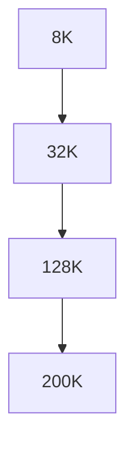
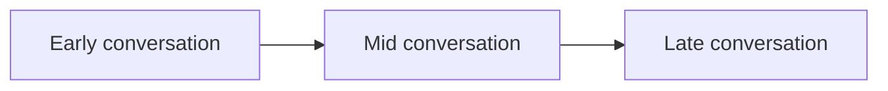

# Context Budget Allocation

**One-Line Summary**: Context budget allocation divides the context window into purposeful zones — system prompt, conversation history, retrieved knowledge, tool results, and safety buffer — with specific token budgets that adapt to window size and task requirements.
**Prerequisites**: `what-is-context-engineering.md`.

## What Is Context Budget Allocation?

Imagine packing a suitcase with a strict weight limit. You need clothes, toiletries, electronics, documents, and maybe a book. Each category gets a share of the weight budget based on trip requirements — a business trip allocates more to formal wear; a beach vacation allocates more to casual clothes. You cannot take everything, so you budget strategically: essentials get guaranteed space, nice-to-haves fill remaining capacity, and you always leave a small margin for souvenirs.

Context budget allocation applies this same thinking to the LLM context window. The window has a fixed token capacity, and every component — system instructions, conversation turns, retrieved documents, tool outputs — competes for that capacity. Without intentional budgeting, the most voluminous component (usually conversation history) expands to consume the entire window, crowding out critical instructions and retrieved knowledge.

A context budget is a design artifact that specifies how many tokens each component category is allowed to consume. It prevents any single component from dominating, ensures critical information always has space, and provides clear guidelines for compression or truncation when content exceeds its allocated budget.


*Source: Adapted from LangChain, "Context Window Management" (2024) and Anthropic system prompt sizing guidelines*


*Source: Adapted from Liu et al., "Lost in the Middle" (2023) and Xu et al., "Retrieval Meets Long Context" (2024)*

## How It Works

### Zone Definitions

A typical context budget divides the window into five zones:

**System Prompt Zone (10-20% of window)**: Contains persistent instructions, persona definitions, tool descriptions, output format specifications, and safety guidelines. This zone is stable across turns — its content rarely changes during a conversation. Stability makes it ideal for prefix caching.

**Conversation History Zone (30-40%)**: Contains previous user messages and assistant responses. This is the most dynamic zone, growing with every turn. It requires active management: summarization, truncation, or selective retention to stay within budget.

**Retrieved Knowledge Zone (20-30%)**: Contains documents, passages, or data retrieved via RAG or search. The size depends on query complexity — simple factual questions need one passage; complex analysis questions need multiple documents. Relevance scoring determines what fills this zone.

**Tool Results Zone (10-20%)**: Contains outputs from tool calls — API responses, database query results, calculation outputs, web search results. Tool outputs can be unpredictably large (a database query returning 50 rows), requiring truncation or summarization strategies.

**Safety Buffer (5-10%)**: Reserved capacity that is never intentionally filled. This buffer absorbs token count estimation errors, handles unexpectedly long tool outputs, and ensures the model always has space for output generation. Running out of context window mid-response is a hard failure.

### Budget Tables by Window Size

| Zone | 8K Window | 32K Window | 128K Window | 200K Window |
|------|-----------|------------|-------------|-------------|
| System Prompt | 800-1,600 | 3,200-6,400 | 12,800-25,600 | 20,000-40,000 |
| Conversation History | 2,400-3,200 | 9,600-12,800 | 38,400-51,200 | 60,000-80,000 |
| Retrieved Knowledge | 1,600-2,400 | 6,400-9,600 | 25,600-38,400 | 40,000-60,000 |
| Tool Results | 800-1,600 | 3,200-6,400 | 12,800-25,600 | 20,000-40,000 |
| Safety Buffer | 400-800 | 1,600-3,200 | 6,400-12,800 | 10,000-20,000 |

These are starting points, not fixed rules. A RAG-heavy application might allocate 40% to retrieved knowledge and only 20% to conversation history. A tool-using agent might allocate 30% to tool results.

### Dynamic Reallocation Strategies

Static budgets break down when real usage patterns do not match initial assumptions. Dynamic reallocation adjusts zone sizes based on runtime conditions:

**Demand-based reallocation**: If the current query retrieves highly relevant documents that exceed the knowledge zone budget, temporarily borrow from the conversation history zone by summarizing older turns. The total budget remains constant; the allocation shifts.

**Priority-based overflow**: Define a priority order for zones. When total content exceeds the window, the lowest-priority zone is compressed first. A typical priority order: system prompt (highest) > retrieved knowledge > recent conversation > tool results > old conversation (lowest).

**Turn-aware budgeting**: Early in a conversation, conversation history is small, leaving more room for retrieved knowledge and tool results. As the conversation grows, history management becomes more aggressive to maintain space for other zones.

### Implementation Patterns

Implement context budgets as explicit configuration objects in your application code:

```python
context_budget = {
    "system_prompt": {"max_tokens": 4000, "priority": 1},
    "conversation": {"max_tokens": 12000, "priority": 3},
    "retrieved_docs": {"max_tokens": 10000, "priority": 2},
    "tool_results": {"max_tokens": 5000, "priority": 4},
    "buffer": {"max_tokens": 1000, "priority": 0}
}
```

Token counting functions (using tiktoken or model-specific tokenizers) verify that each zone stays within budget. When a zone overflows, the system triggers the appropriate compression strategy: summarization for conversation history, re-ranking and truncation for retrieved documents, or result trimming for tool outputs.

## Why It Matters

### Preventing Context Window Failures

Without budgeting, context windows fail in predictable ways. Conversation history grows until it pushes out system instructions, causing the model to "forget" its persona and constraints. Retrieved documents fill the window, leaving no room for the conversation. These failures are silent — the model does not error out; it simply degrades.

### Optimizing Information Density

A budgeted context window is an information-dense context window. Every token earns its place because each zone has a cap that forces prioritization. This information density directly correlates with output quality — models perform better with 30K tokens of high-relevance content than 100K tokens of mixed relevance.

### Predictable Cost and Latency

Context window size directly determines API cost and inference latency. A context budget provides predictable upper bounds on both. When you know the maximum context size, you can accurately forecast costs and latency for capacity planning.

## Key Technical Details

- **System prompts should be 10-20% of the context window**, with the exact allocation depending on the complexity of instructions and number of tool definitions.
- **Conversation history is the most aggressive consumer** of context and requires active management (summarization or truncation) in any conversation exceeding 5-10 turns.
- **A 5-10% safety buffer** prevents hard failures from token count estimation errors and unexpectedly large tool outputs.
- **Token counting accuracy matters**: tiktoken (for OpenAI models) and model-specific tokenizers provide exact counts. Approximate methods (word count / 0.75) can be off by 10-20%.
- **Dynamic reallocation typically triggers every 3-5 turns** in active conversations as conversation history grows.
- **Prefix caching benefits** are maximized when the system prompt zone is stable (unchanged across requests), enabling 30-50% latency reduction on cached prefixes.
- **Retrieved knowledge compression** (summarizing passages instead of including full text) can reduce the knowledge zone budget by 50-70% with 10-15% information loss.

## Common Misconceptions

- **"Just use the biggest context window available."** Larger windows cost more per request, have higher latency, and do not automatically improve quality. Budget allocation is about using the right amount of context, not the maximum amount.
- **"The system prompt should be as short as possible."** Comprehensive system prompts with clear instructions, examples, and tool definitions improve output quality enough to justify their token cost. Under-investing in the system prompt to "save tokens" is a false economy.
- **"Conversation history should always be preserved in full."** Full history preservation is the primary cause of context window exhaustion. Summarization and selective retention maintain conversational coherence at a fraction of the token cost.
- **"Budget percentages are universal."** The right allocation depends entirely on the application. A search-augmented Q&A system needs a large knowledge zone; a creative writing assistant needs a large history zone. There is no one-size-fits-all budget.

## Connections to Other Concepts

- `what-is-context-engineering.md` — Context budget allocation is the practical implementation of context engineering's selection principles.
- `conversation-history-management.md` — Strategies for managing the conversation history zone within its allocated budget.
- `context-compression-techniques.md` — Compression techniques for keeping each zone within its budget while preserving information.
- `context-caching-and-prefix-reuse.md` — Stable system prompt zones enable prefix caching for cost and latency savings.
- `information-priority-and-ordering.md` — Within each zone, information must be ordered by priority for maximum model attention.

## Further Reading

- Anthropic, "Prompt Engineering Guide: System Prompts" (2024) — Guidance on system prompt design and sizing within the context window.
- Liu et al., "Lost in the Middle" (2023) — Empirical evidence for attention degradation in long contexts, motivating careful budget allocation.
- Xu et al., "Retrieval Meets Long Context" (2024) — Analysis of how RAG context allocation interacts with long context windows.
- LangChain, "Context Window Management" documentation (2024) — Practical implementation patterns for dynamic context budgeting in production applications.
