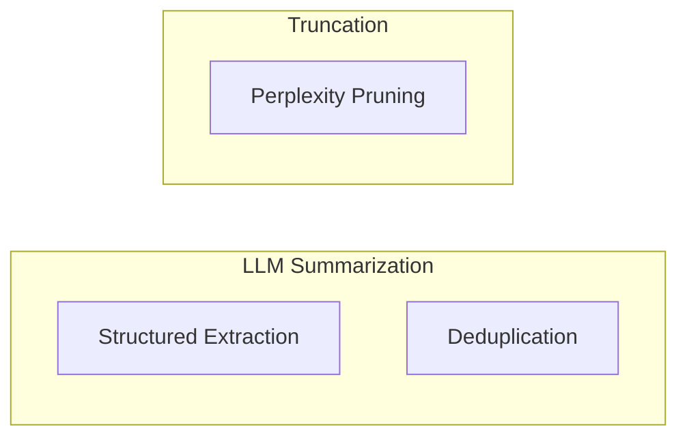

# Context Compression Techniques

**One-Line Summary**: Context compression techniques — including summarization, truncation, structured extraction, deduplication, and perplexity-based pruning — reduce token usage by 50-75% while preserving the information models need to generate accurate responses.
**Prerequisites**: `what-is-context-engineering.md`, `context-budget-allocation.md`.

## What Is Context Compression?

Think of packing cubes that compress clothes to fit more in a suitcase. Without compression, you might fit five outfits. With compression, the same suitcase holds eight outfits — the clothes are the same, they just take up less space. Context compression applies the same logic to the context window: reduce the token footprint of information while preserving its usefulness to the model.

Context compression is not about removing information — it is about representing the same information more efficiently. A 2,000-token document that answers a question in one paragraph contains 1,800 tokens of setup, context, and tangential detail. Compressing that document to the relevant 200 tokens preserves the answer while freeing 1,800 tokens for other context components.

The need for compression arises whenever context demand exceeds context supply. A RAG system that retrieves 10 relevant documents at 1,000 tokens each needs 10,000 tokens for knowledge alone — potentially half the context window. Compression techniques let you include the information from all 10 documents in a fraction of the space, or include the same number of documents while leaving more room for instructions, history, and tool results.


*Source: Adapted from Jiang et al., "LLMLingua" (2023) and Xu et al., "RECOMP" (2023)*


*Source: Lilian Weng, "Prompt Engineering," lilianweng.github.io (2023) -- illustrates how structured decomposition principles apply to context compression, where information is systematically distilled while preserving key reasoning paths*

## How It Works

### LLM-Based Summarization

The most flexible compression technique uses an LLM to summarize content. Feed the full text to a model with instructions like "Summarize the following document, preserving key facts, figures, and conclusions. Target length: 200 words." The summary replaces the original text in the context.

**Compression ratio**: Typically 3:1 to 5:1 (a 1,000-token document becomes 200-300 tokens).

**Information preservation**: 80-90% of key facts are preserved in a well-prompted summary. Losses concentrate in nuances, exact quotes, supporting evidence, and structural details.

**Cost trade-off**: Summarization requires an additional LLM call per document. For a cheaper model (GPT-4o-mini, Claude Haiku), the cost is minimal — typically $0.001-0.005 per document. The token savings in the primary context window usually outweigh the summarization cost by 5-10x.

### Truncation

The simplest compression technique: cut content at a token limit. Remove the end of a document, the oldest conversation turns, or the bottom of a long tool output.

**Strategies**: Head truncation (keep the first N tokens) works for documents where key information is front-loaded. Tail truncation (keep the last N tokens) works for content where recent information matters most. Section-aware truncation identifies section boundaries and removes complete sections rather than cutting mid-sentence.

**Compression ratio**: Configurable — set any target length.

**Information preservation**: No processing overhead, but information loss is arbitrary rather than intelligent. Truncation works when the cut content is genuinely less important (old conversation turns, verbose log output) and fails when important information is distributed throughout the text.

### Structured Extraction

Convert prose into structured key-value pairs, tables, or bullet points. A 500-word paragraph about a product review becomes:

```
- Rating: 4/5
- Pros: battery life, camera quality
- Cons: price, weight
- Recommendation: Buy for photography enthusiasts
```

**Compression ratio**: 5:1 to 10:1 — the highest compression ratio of any technique.

**Information preservation**: Excellent for factual content with clear data points. Poor for nuanced, argumentative, or narrative content where meaning depends on context and flow.

**Best for**: Tool outputs (API responses, database results), factual documents (product specs, financial reports), and reference material (documentation, FAQs).

### Deduplication

When multiple retrieved documents contain overlapping information, deduplication identifies and removes redundant passages. In a RAG system retrieving 10 passages about "Python list comprehension," substantial overlap is likely — multiple sources define the same syntax, give similar examples, and explain the same concepts.

**Implementation**: Compare passages pairwise using semantic similarity (embedding cosine distance). When two passages have >0.85 similarity, keep the higher-relevance one and drop or merge the other.

**Compression ratio**: Highly variable — depends on redundancy in the retrieval set. Typical reduction is 20-40% of retrieved content.

**Information preservation**: High — by definition, removed content is redundant with retained content.

### Perplexity-Based Token Pruning (LLMLingua)

LLMLingua and its successors use a small language model to estimate each token's importance via perplexity (how surprised the model is by the token). High-perplexity tokens carry more information; low-perplexity tokens are predictable and removable. Articles ("the," "a"), filler phrases ("in order to," "it is important to note that"), and predictable continuations are pruned while key terms, numbers, and names are preserved.

**Compression ratio**: Up to 75% reduction (removing 3 out of 4 tokens) while maintaining 80-90% task performance.

**Information preservation**: Superior to truncation because removal is informed by information content. The remaining tokens form a "telegraphic" version of the text that LLMs can still interpret accurately.

**Cost**: Requires running a small model (GPT-2 or similar) over the text to compute perplexity scores. This adds 10-50ms of latency per passage — negligible compared to LLM inference.

## Why It Matters

### Fitting More Knowledge in the Window

Compression directly translates to more information per context window. A system that compresses retrieved documents 3:1 can include 3x more knowledge for the same token budget. This is especially valuable for knowledge-intensive tasks where answer quality correlates with the breadth of relevant information available.

### Cost Reduction

Input tokens are billed per token. A 50% compression ratio halves the input token cost. For applications processing thousands of requests daily with substantial retrieved content, compression savings compound to significant cost reductions.

### Enabling Smaller Context Windows

Not all models or API tiers offer large context windows. Compression techniques let applications that require broad knowledge operate within smaller, cheaper context windows. A well-compressed 8K context can match the performance of an uncompressed 32K context for many tasks.

## Key Technical Details

- **LLMLingua achieves up to 75% token reduction** while maintaining 80-90% task performance on downstream question-answering and summarization tasks.
- **LLM-based summarization preserves 80-90% of key facts** at a 3:1 to 5:1 compression ratio.
- **Structured extraction achieves 5:1 to 10:1 compression** but is only suitable for factual, data-oriented content.
- **Deduplication reduces retrieved content by 20-40%** in typical RAG systems with overlapping source documents.
- **Compression technique selection** should match the content type: summarization for prose, extraction for data, truncation for logs, deduplication for RAG passages.
- **Cascading compression** (applying multiple techniques sequentially) can achieve 80-90% total reduction but risks significant information loss. Limit to two compression stages.
- **The compressed context should be evaluated** against the uncompressed version on representative tasks to verify that compression does not degrade output quality below acceptable thresholds.

## Common Misconceptions

- **"Compression always degrades quality."** Properly applied compression often improves quality by removing noise and irrelevant content, concentrating the model's attention on information that matters. Quality degradation occurs when compression is too aggressive or poorly targeted.
- **"Truncation is too simple to be useful."** For many content types — log files, verbose API responses, older conversation turns — truncation is perfectly appropriate. The lost content is genuinely low-value. Reserve sophisticated techniques for content where information is distributed throughout.
- **"Summarization is always the best compression technique."** Summarization excels at prose but adds latency, cost, and potential summarization errors. Structured extraction is better for data, deduplication for redundant passages, and truncation for low-value content. Match the technique to the content.
- **"Perplexity-based pruning produces unreadable text."** The pruned text looks odd to humans (missing articles, condensed phrasing) but is highly readable to LLMs, which reconstruct meaning from key tokens. Evaluate compressed text with the LLM, not human readability.
- **"You should compress everything equally."** Different context zones deserve different compression levels. System prompts should rarely be compressed. Retrieved documents can be heavily compressed. Tool results should be selectively compressed based on relevance.

## Connections to Other Concepts

- `what-is-context-engineering.md` — Compression is one of the core techniques for managing context window resources.
- `context-budget-allocation.md` — Compression techniques keep each context zone within its allocated token budget.
- `conversation-history-management.md` — History summarization is a specific application of LLM-based compression to conversation turns.
- `context-caching-and-prefix-reuse.md` — Compression reduces the variable portion of the context, increasing the relative weight of cacheable prefixes.
- `long-context-design-patterns.md` — Even with 128K+ windows, compression improves performance by increasing information density.

## Further Reading

- Jiang et al., "LLMLingua: Compressing Prompts for Accelerated Inference of Large Language Models" (2023) — Foundational paper on perplexity-based token pruning for context compression.
- Jiang et al., "LongLLMLingua: Accelerating and Enhancing LLMs in Long Context Scenarios via Prompt Compression" (2024) — Extension of LLMLingua optimized for long-context scenarios with question-aware compression.
- Xu et al., "RECOMP: Improving Retrieval-Augmented LMs with Compression and Selective Augmentation" (2023) — Trainable compression for RAG contexts that learns to extract query-relevant information.
- Chevalier et al., "Adapting Language Models to Compress Contexts" (2023) — Explores training models specifically for context compression.
