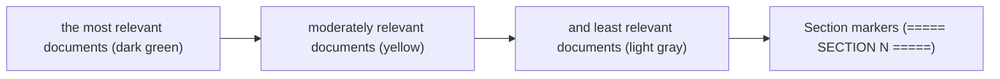

# Long-Context Design Patterns

**One-Line Summary**: Long-context design patterns address the unique challenges of working with 100K+ token context windows, where effective capacity falls below nominal capacity and explicit organization strategies become essential for maintaining model performance.
**Prerequisites**: `what-is-context-engineering.md`, `information-priority-and-ordering.md`.

## What Is Long-Context Design?

Think of organizing a filing cabinet. A small filing cabinet with two drawers works intuitively — you can find anything quickly because there is not much to search through. But a room-sized filing system with 50 cabinets and hundreds of drawers requires an entirely different organizational strategy. You need an index, section dividers, color-coded folders, and a labeling system. Without this infrastructure, having more storage space actually makes finding things harder, not easier.

Long-context LLM design faces the same paradox. Models now support 128K, 200K, and even 1M+ token context windows, allowing entire codebases, book-length documents, and extensive knowledge bases to be included. But more context does not automatically mean better performance. Without deliberate organization, long contexts dilute the model's attention, increase the probability that critical information is overlooked, and create a false sense of comprehensiveness.

The core insight of long-context design is that effective context length is shorter than nominal context length. A model with a 128K token window might only reliably use 80-100K tokens worth of information. Beyond that, performance degrades — not through hard failure, but through subtle quality erosion: answers become less precise, instructions are followed less consistently, and retrieval within the context becomes less reliable.


*Source: Adapted from Liu et al., "Lost in the Middle" (2023) and Kamradt, "Needle In A Haystack" (2023)*


*Source: Lilian Weng, "LLM Powered Autonomous Agents," lilianweng.github.io (2023) -- illustrates how long-context design requires coordinating multiple information sources (memory, tools, planning) within the constraints of the context window*

## How It Works

### Document Ordering for 100K+ Contexts

When placing many documents in a long context, ordering strategy becomes critical. The lost-in-the-middle effect is amplified in long contexts — documents placed in the 40K-80K token range of a 128K context receive significantly less attention than those at the beginning or end.

**Practical ordering strategy**:
1. Place the most critical documents in the first 10% of the document section.
2. Place the second-most-critical documents in the last 10%.
3. Place supporting documents in the middle, ordered by decreasing relevance from the edges inward.
4. Place the user's query and instructions after all documents, at the end.

This "reverse-relevance middle" strategy ensures that the highest-value documents occupy the positions where the model's attention is strongest.

### Section Markers and Anchors

In long contexts, section markers serve as navigational infrastructure that helps the model locate information:

```
===== SECTION 1: PRODUCT SPECIFICATIONS =====
[content]
===== END SECTION 1 =====

===== SECTION 2: CUSTOMER REVIEWS =====
[content]
===== END SECTION 2 =====
```

Markers work because they create distinctive token patterns that the attention mechanism can latch onto, functioning as landmarks in the token stream. Effective markers are:

- **Visually distinctive**: Use symbols (=====, ------, ######) that are uncommon in normal text.
- **Semantically labeled**: Include descriptive section names, not just numbers.
- **Consistently formatted**: Use the same marker format throughout so the model learns the pattern.
- **Paired**: Include both start and end markers so the model can identify section boundaries.

For very long contexts (50K+ tokens of documents), add a table of contents at the beginning:

```
This context contains the following sections:
1. Product Specifications (tokens ~1-5000)
2. Customer Reviews (tokens ~5001-15000)
3. Competitor Analysis (tokens ~15001-25000)
Refer to the relevant section when answering.
```

### Retrieval Within Long Context

An emerging pattern is "search before answering" — instructing the model to first locate relevant information within the long context before generating a response. Rather than relying on the model to attend to all 128K tokens simultaneously:

```
The context below contains multiple documents. Before answering the question:
1. Identify which document(s) are most relevant to the question.
2. Quote the specific passages that inform your answer.
3. Then provide your answer based on those passages.
```

This explicit retrieval step forces the model to actively search rather than passively attending. It improves accuracy significantly — by 10-20% on long-context QA tasks — because the model concentrates its processing on the relevant subset rather than diffusing attention across the entire context.

### Quality Degradation Awareness

Practitioners must internalize that performance degrades before the context window fills:

| Nominal Window | Effective Reliable Range | Degradation Zone |
|---------------|------------------------|------------------|
| 32K tokens | 0-25K | 25K-32K |
| 128K tokens | 0-80K | 80K-128K |
| 200K tokens | 0-120K | 120K-200K |

These ranges are approximate and task-dependent. Simple factual retrieval degrades less than complex multi-hop reasoning. Instruction following degrades more than information retrieval. The degradation is not cliff-like — it is gradual, making it hard to detect without systematic evaluation.

### Needle-in-a-Haystack Performance

The "needle in a haystack" (NIAH) test places a specific fact at various positions within a long context and tests whether the model can retrieve it. NIAH performance reveals:

- Most current frontier models achieve 90-99% NIAH accuracy across their full context window under ideal conditions.
- Performance drops when the "needle" is surrounded by semantically similar content (making it harder to distinguish from the "haystack").
- Multi-needle tasks (finding and synthesizing multiple facts) are significantly harder than single-needle tasks, with accuracy dropping 10-30%.
- Real-world tasks are harder than NIAH benchmarks because they require not just finding information but reasoning about it.

## Why It Matters

### Enabling Whole-Document Processing

Long-context windows enable processing entire documents, codebases, or conversation histories without chunking. This eliminates information loss at chunk boundaries — a persistent problem in RAG systems where the answer spans two chunks. For tasks like legal document review, codebase analysis, and book summarization, whole-document processing is transformative.

### Reducing RAG Complexity

Some tasks that previously required RAG pipelines (embedding, indexing, retrieval) can now be handled by simply putting the entire knowledge base in the context window. This eliminates the engineering complexity and retrieval errors of RAG, trading them for the simpler (but not free) challenges of long-context organization.

### Supporting Complex Multi-Step Reasoning

Long contexts allow models to maintain extensive state across complex reasoning tasks. A model analyzing a 50-page financial report can cross-reference data from different sections, identify trends across time periods, and synthesize conclusions — all within a single inference call, without losing information to chunking or summarization.

## Key Technical Details

- **Effective context is 60-80% of nominal context** for most tasks — plan context budgets accordingly, not at the nominal maximum.
- **Section markers improve information retrieval accuracy by 10-15%** in contexts exceeding 50K tokens.
- **"Search before answering" instructions improve long-context QA accuracy by 10-20%** by focusing attention on relevant passages.
- **Frontier models achieve 90-99% on single-needle NIAH tests** but 70-90% on multi-needle tasks requiring synthesis across passages.
- **Long-context inference costs scale linearly** with context length — a 128K context costs roughly 16x more than an 8K context at the same per-token pricing.
- **Time-to-first-token scales quadratically** with context length in standard attention implementations, though optimizations (Flash Attention, KV caching) reduce this in practice.
- **Combining long context with RAG** (retrieve and place in context, rather than relying on attention alone) often outperforms either approach in isolation.

## Common Misconceptions

- **"Longer context windows solve all information access problems."** Longer windows enable more information but do not ensure the model uses it effectively. Organizational patterns are required to make long contexts useful.
- **"NIAH benchmark results mean the model can handle any long-context task."** NIAH tests simple factual retrieval under ideal conditions. Real tasks involve reasoning, synthesis, and ambiguous queries against noisy documents — significantly harder than finding a planted needle.
- **"Just put everything in the context and the model will figure it out."** This "kitchen sink" approach degrades quality because irrelevant content dilutes attention on relevant content. Curation remains essential even with very large windows.
- **"Long context eliminates the need for RAG."** For static, bounded knowledge bases that fit in the context window, long context can replace RAG. For dynamic, large-scale, or frequently updated knowledge, RAG remains necessary. Many production systems benefit from combining both.
- **"Quality is constant up to the context limit."** Quality degrades gradually, not at a cliff. The degradation begins well before the nominal limit and varies by task type.

## Connections to Other Concepts

- `what-is-context-engineering.md` — Long-context design is context engineering applied to large windows where organizational challenges are amplified.
- `information-priority-and-ordering.md` — The lost-in-the-middle effect is more severe in long contexts, making ordering strategies more critical.
- `context-caching-and-prefix-reuse.md` — Long contexts benefit disproportionately from caching because prefix processing is the dominant cost.
- `context-compression-techniques.md` — Compression can bring content within the effective range even when it exceeds the nominal window.
- `context-budget-allocation.md` — Budget allocation for 128K+ windows requires different zone proportions than for 8K-32K windows.

## Further Reading

- Liu et al., "Lost in the Middle: How Language Models Use Long Contexts" (2023) — The definitive study on position-dependent performance in long contexts.
- Kamradt, "Needle In A Haystack - Pressure Testing LLMs" (2023) — The original NIAH benchmark methodology and results across models.
- Google, "Gemini 1.5: Unlocking Multimodal Understanding Across Millions of Tokens of Context" (2024) — Technical report on long-context capabilities and evaluation.
- Xu et al., "Retrieval Meets Long Context Large Language Models" (2024) — Systematic comparison of RAG versus long-context approaches for knowledge-intensive tasks.
