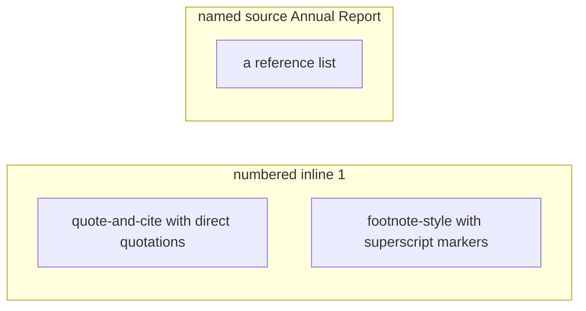
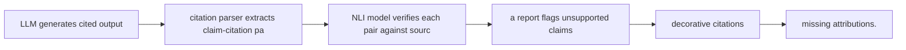

# Citation and Attribution Prompting

**One-Line Summary**: Designing citation instructions that models follow consistently transforms RAG outputs from unverifiable text into auditable, trust-building responses with traceable claims.
**Prerequisites**: `grounding-and-faithfulness.md`, `rag-prompt-design.md`

## What Is Citation and Attribution Prompting?

Think of citation prompting like academic footnotes in a research paper. A well-cited paper allows the reader to trace any claim back to its original source, verify the interpretation, and assess the strength of the evidence. Without footnotes, the reader must trust the author's claims entirely. Citation prompting applies the same principle to language model outputs — every factual claim should include a reference to the specific source passage that supports it.

Attribution prompting is the practice of designing instructions that cause language models to systematically cite their sources when generating answers from retrieved context. This goes beyond simply asking the model to "cite sources" — it involves specifying citation formats, providing examples of correctly cited outputs, defining what counts as a citable claim, and handling edge cases like claims supported by multiple sources or claims requiring inference across sources.

The distinction between verifiable and decorative citations is critical. Verifiable citations point to specific passages that actually support the claim. Decorative citations are source references that the model adds to appear authoritative but that do not accurately correspond to the claim they accompany. Well-designed citation instructions reduce decorative citations from 30-40% to under 10%.

*Source: Adapted from Gao et al., "Enabling Large Language Models to Generate Text with Citations," 2023.*

*Source: Adapted from Rashkin et al., "Measuring Attribution in Natural Language Generation Models," 2023.*

## How It Works

### Citation Format Design

The citation format must be unambiguous, parseable, and consistent. Common formats include:

**Numbered inline citations**: Each source document is assigned a number, and claims are followed by the number in brackets. Example: "Revenue increased by 15% year-over-year [1], driven primarily by expansion into Asian markets [2]." This is the most common and most reliably followed format.

**Named source citations**: Sources are referenced by descriptive labels. Example: "The policy was enacted in 2023 [Annual Report], with implementation beginning in Q2 [Board Minutes]." This is more readable but harder for models to follow consistently.

**Quote-and-cite**: The model quotes a specific passage, then cites its source. Example: "According to Source 2: 'Revenue grew 15% YoY,' which indicates strong financial performance." This is the most verifiable format because the quoted text can be directly checked against the source.

**Footnote-style**: Claims are marked with superscript numbers, and a reference list appears at the end. This mimics academic citation style and works well for longer-form outputs.

For most RAG applications, numbered inline citations [1] strike the best balance between model compliance, parseability, and readability.

### Instruction Design for Consistent Citations

Vague instructions produce inconsistent citations. Specific, structured instructions produce reliable ones:

**Weak instruction**: "Please cite your sources."
Result: Inconsistent citation format, missing citations for many claims, occasional fabricated citations.

**Strong instruction**: "After each factual claim in your response, add the source number in brackets [1]. Every factual statement must include at least one citation. If a claim is supported by multiple sources, include all relevant citations [1][3]. Do not make claims that are not supported by the provided sources. End your response with a numbered reference list matching the source numbers used."

**With few-shot examples**: Providing 2-3 examples of correctly cited answers in the prompt improves citation consistency by 25-35%. The examples should demonstrate inline citations, multi-source citations, and the reference list format.

### Citation Verification

Production systems should verify citations programmatically:

1. **Parse citations**: Extract all citation markers and their associated claims from the generated text
2. **Match to sources**: Map each citation number to the corresponding source document
3. **Verify support**: Use an NLI model or LLM to check whether the cited source actually supports the claim
4. **Flag violations**: Identify unsupported claims, missing citations, and fabricated citations

Automated verification catches 70-80% of citation errors. For high-stakes applications, a secondary LLM pass can verify the remaining cases, achieving 90-95% citation accuracy.

### Handling Citation Edge Cases

Real-world citation scenarios include complexities that instructions must address:

- **Claims from multiple sources**: "If a claim is supported by multiple sources, cite all of them: [1][3]"
- **Inferred claims**: "If your answer requires inference from the sources (combining information from multiple passages), cite all contributing sources and note that this is an inference"
- **No supporting source**: "If you cannot find support for a claim in the provided sources, do not include it in your answer"
- **Contradicting sources**: "If sources disagree, present both positions with their respective citations: Source [1] states X, while Source [3] states Y"
- **Direct quotes vs paraphrases**: "Use quotation marks for direct quotes and cite the source. For paraphrased information, cite without quotation marks"

## Why It Matters

### Trust and Verifiability

Citations transform the user's cognitive task from "Is this claim true?" to "Does this citation check out?" The first question requires domain expertise; the second requires only the ability to compare two passages. This democratizes verification and builds justified trust in the system.

### Accountability in Enterprise and Regulated Settings

Organizations deploying RAG systems in regulated industries need audit trails. Citations create a documented chain from generated claims to source documents, enabling compliance review and accountability. Without citations, a generated answer is a black box that cannot be audited.

### Feedback Loop for System Improvement

When citations are verifiable, incorrect citations become a measurable signal for system improvement. If a RAG system consistently miscites a particular type of claim, this reveals retrieval or generation issues that can be diagnosed and fixed. Without citations, errors are invisible.

## Key Technical Details

- Numbered inline citations [1] are followed most consistently by language models, with 85-90% compliance rates compared to 60-70% for named source citations.
- Few-shot citation examples (2-3 examples in the prompt) improve citation consistency by 25-35% over zero-shot citation instructions.
- Decorative citations (citations that do not accurately support the adjacent claim) constitute 30-40% of citations without verification instructions, reducible to under 10% with explicit verification prompts.
- Automated citation verification using NLI models catches 70-80% of citation errors; adding a secondary LLM verification pass achieves 90-95% accuracy.
- Quote-and-cite patterns produce the most verifiable outputs but increase token usage by 40-60% compared to inline citation patterns.
- Citation placement at the sentence level (citing after each sentence) produces more granular attribution than paragraph-level citation, at a cost of 10-15% more tokens.
- Models are more likely to cite sources that appear earlier in the context, consistent with the primacy bias in attention mechanisms; reordering sources can mitigate this.

## Common Misconceptions

- **"Asking the model to 'cite sources' is sufficient."** Generic citation instructions produce wildly inconsistent results. Models may cite randomly, cite once at the end, or invent citation formats. Specific format instructions with examples are necessary for reliable citation behavior.

- **"If the model includes a citation, it must be accurate."** Models frequently produce decorative citations — references that look correct but do not actually support the adjacent claim. Without automated verification, 30-40% of citations may be inaccurate.

- **"Citations slow down the response too much."** Citation tokens add 5-15% to output length for inline citations. The verification and trust benefits far outweigh this marginal cost increase, especially in applications where users would otherwise need to independently verify claims.

- **"Citation is only useful for academic or research contexts."** Any application where users need to trust and verify generated information benefits from citations. Customer support, internal knowledge bases, legal research, and medical information systems all benefit from traceable claims.

## Connections to Other Concepts

- `grounding-and-faithfulness.md` — Citations are the visible mechanism through which grounding becomes verifiable; citation instructions complement faithfulness instructions.
- `rag-prompt-design.md` — Citation format and instructions are key components of the RAG prompt template design.
- `knowledge-conflicts-and-resolution.md` — When sources conflict, citation patterns must support presenting both positions with clear attribution.
- `04-system-prompts-and-instruction-design/json-mode-and-schema-enforcement.md` — Citation formatting is a specialized output format constraint that requires careful specification.
- `05-structured-output-and-format-control/json-mode-and-schema-enforcement.md` — Structured output formats (JSON with citation fields) enable programmatic citation verification.

## Further Reading

- Gao, T., Yen, H., Yu, J., & Chen, D. (2023). "Enabling Large Language Models to Generate Text with Citations." Systematic study of citation generation and verification in LLMs.
- Liu, N. F., Zhang, T., & Liang, P. (2023). "Evaluating Verifiability in Generative Search Engines." Analysis of citation quality in search-augmented generation systems.
- Rashkin, H., Nikolaev, V., Lamm, M., Aroyo, L., Collins, M., Das, D., ... & Tomar, G. S. (2023). "Measuring Attribution in Natural Language Generation Models." The Attributable to Identified Sources (AIS) framework for evaluating attribution.
- Bohnet, B., Tran, V. Q., Verber, P., Maynez, J., Sedghi, H., Sellam, T., ... & Schuster, T. (2022). "Attributed Question Answering: Evaluation and Modeling for Attributed Large Language Models." Attribution evaluation frameworks.
