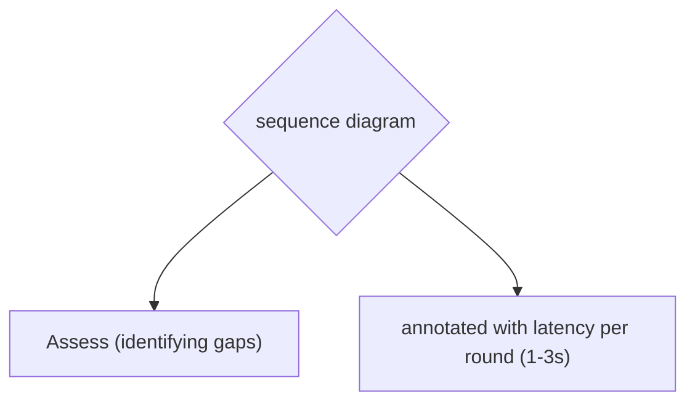

# Dynamic Context Augmentation

**One-Line Summary**: Rather than retrieving all context upfront, dynamic augmentation makes runtime decisions to fetch additional information based on confidence levels, identified gaps, and intermediate reasoning results.
**Prerequisites**: `retrieval-query-design.md`, `reranking-and-context-selection.md`, `grounding-and-faithfulness.md`

## What Is Dynamic Context Augmentation?

Think of dynamic context augmentation like a student who looks things up as they study rather than gathering all materials upfront. Instead of photocopying every potentially relevant chapter before sitting down to write an essay, the student reads the assignment, starts researching, realizes they need more detail on a specific point, looks that up, encounters a reference they want to follow, retrieves that too, and iteratively builds understanding. The research process is driven by what they learn along the way, not by a single upfront query.

Dynamic context augmentation is the runtime process of deciding when, what, and how much additional context to fetch during generation. Unlike static RAG (retrieve once, generate once), dynamic augmentation treats retrieval as an iterative, adaptive process. The model can request more information when it detects gaps in the initial context, follow references to related documents, or refine its retrieval queries based on what it has learned from the first round of results.

This approach is essential for complex questions that cannot be anticipated by a single retrieval query. A question like "Compare the environmental policies of the EU and US over the past decade" requires iterative retrieval: first understanding the broad landscape, then drilling into specific policy areas, then finding comparative data points. No single upfront query can retrieve all the needed context.

*Source: Lilian Weng, "LLM Powered Autonomous Agents," 2023. This agent architecture diagram illustrates the iterative planning-action loop that underpins dynamic context augmentation, where the agent decides when and what additional context to retrieve at runtime.*

*Source: Adapted from Asai et al., "Self-RAG," 2024, and Jiang et al., "Active Retrieval Augmented Generation (FLARE)," 2023.*

## How It Works

### Confidence-Based Triggers

The model evaluates its confidence in answering based on available context and triggers additional retrieval when confidence is low:

**Explicit confidence assessment**: The prompt instructs the model to assess whether it has sufficient information before generating a final answer. Example: "Before answering, assess whether the provided context is sufficient. If critical information is missing, respond with: NEED_MORE_INFO: [specific query for additional retrieval]. If context is sufficient, proceed with your answer."

**Uncertainty signals**: The model is trained or prompted to recognize when it would need to speculate or fill gaps. Phrases like "I don't have enough information about X" or "The context doesn't address Y" become triggers for additional retrieval.

**Confidence thresholds**: In agentic systems, the model generates a confidence score (e.g., 0-1) alongside its draft answer. If confidence falls below a threshold (typically 0.6-0.7), the system automatically triggers additional retrieval before returning the response to the user.

### Iterative Retrieval (Search-Read-Search)

The iterative retrieval loop follows a pattern:

1. **Initial retrieval**: Execute the first query, retrieve top-K documents
2. **Read and assess**: The model reads the retrieved context, identifies the question aspects covered and gaps remaining
3. **Refined retrieval**: Generate new queries targeting the identified gaps, execute additional retrieval
4. **Merge and generate**: Combine context from all retrieval rounds, deduplicate, and generate the final answer

This loop can execute 2-4 iterations before hitting diminishing returns. Each iteration adds 1-3 seconds of latency but can improve answer completeness by 20-40% on complex questions compared to single-round retrieval.

**Query refinement between rounds**: The model uses information from the first retrieval to generate better follow-up queries. If the initial query about "EU carbon policy" retrieves documents mentioning the "EU ETS" and "Carbon Border Adjustment Mechanism," the second round queries can target those specific mechanisms for detail.

### Just-in-Time Context Injection

In multi-step reasoning or long-form generation, context can be injected at the point of need rather than all at the beginning:

**Section-by-section retrieval**: For a long report, retrieve context relevant to each section as the model reaches it, rather than pre-loading all context. The model generating a section on "Market Competition" gets competition-relevant context injected just before generating that section.

**Tool-call based retrieval**: In agentic systems, the model has access to a retrieval tool it can invoke at any point during generation. This gives the model full control over when and what to retrieve, treating retrieval as one of several available actions.

**Conditional branches**: "If the user's question involves a date range, retrieve documents from that specific period. If the question asks for comparison, retrieve documents about each entity being compared separately."

### Retrieval Budgets

Unconstrained dynamic retrieval can become expensive and slow. Retrieval budgets impose limits:

- **Maximum retrieval rounds**: Typically 2-4 rounds for interactive use cases, up to 8-10 for batch processing
- **Total token budget**: Cap the total tokens retrieved across all rounds (e.g., 8,000 tokens total)
- **Latency budget**: Set a maximum total retrieval time (e.g., 5 seconds for interactive, 30 seconds for batch)
- **Cost budget**: Cap the total embedding and LLM costs for query reformulation and confidence assessment

Budget allocation strategies include front-loading (larger first retrieval, smaller follow-ups), equal allocation (same budget per round), and adaptive allocation (allocate more budget to rounds that discover useful information).

## Why It Matters

### Complex Questions Require Multiple Perspectives

Single-round retrieval works for simple factual lookups ("What is the capital of France?") but fails for questions requiring synthesis, comparison, or multi-step reasoning. Research shows that 30-40% of real-world information-seeking questions benefit from iterative retrieval, and complex analytical questions benefit from 2-4 retrieval rounds.

### Efficiency Through Targeted Retrieval

Paradoxically, dynamic retrieval can be more efficient than aggressive upfront retrieval. Instead of retrieving 20 chunks and hoping the right ones are included, dynamic retrieval starts with 5 well-targeted chunks, assesses coverage, and fetches only the additional 2-3 chunks needed to fill specific gaps. Total tokens consumed may be lower while answer quality is higher.

### Enabling Agentic RAG

Dynamic context augmentation is the foundation of agentic RAG systems where the model actively drives the retrieval process rather than passively consuming pre-retrieved context. This paradigm shift — from model-as-consumer to model-as-researcher — enables more sophisticated information-seeking behaviors that mirror human research processes.

## Key Technical Details

- Iterative retrieval (2-4 rounds) improves answer completeness by 20-40% on complex questions compared to single-round retrieval (measured on HotpotQA, MuSiQue).
- Each retrieval round adds 1-3 seconds of latency; 3-round iterative retrieval typically completes within 5-8 seconds total.
- Confidence-based triggers with thresholds of 0.6-0.7 successfully identify 70-80% of cases where additional retrieval would improve the answer.
- Self-RAG (Asai et al., 2024) shows that models trained to decide when to retrieve outperform models that always retrieve by 5-10% on diverse benchmarks.
- Retrieval budgets of 3-4 rounds and 6,000-10,000 total tokens provide an effective default for most interactive RAG use cases.
- Query refinement between retrieval rounds (using first-round results to inform second-round queries) improves second-round retrieval precision by 15-25%.
- Just-in-time context injection for long-form generation reduces the effective context length per generation step by 40-60%, mitigating the lost-in-the-middle effect.
- Approximately 60% of information needs can be satisfied with a single retrieval round; the remaining 40% benefit from 2 or more rounds.

## Common Misconceptions

- **"Single-round retrieval is always sufficient if the retrieval quality is high enough."** Even perfect single-round retrieval cannot anticipate all the context needs for complex questions. The model discovers what it needs as it reasons, and some information needs only emerge during generation.

- **"Dynamic retrieval is too slow for interactive use."** With parallelized retrieval and efficient query generation, 2-3 round iterative retrieval adds 2-5 seconds total. For complex questions where the alternative is a poor answer, users accept this latency willingly.

- **"The model should always decide whether to retrieve more."** Giving the model unconstrained retrieval decisions can lead to infinite loops, unnecessary retrievals, or failure to recognize when it has enough information. Budget constraints and maximum round limits are essential.

- **"More retrieval rounds always improve quality."** Beyond 3-4 rounds, additional retrieval typically adds redundant context or introduces noise. The information gain per round follows a logarithmic curve with steep diminishing returns.

## Connections to Other Concepts

- `retrieval-query-design.md` — Dynamic augmentation relies heavily on query refinement; each retrieval round produces better queries informed by previous results.
- `reranking-and-context-selection.md` — Context selection operates within each retrieval round and across rounds, managing the growing pool of candidate documents.
- `knowledge-conflicts-and-resolution.md` — Additional retrieval rounds may surface conflicting information that requires resolution strategies.
- `hybrid-retrieval-context-patterns.md` — Different retrieval rounds may use different methods; initial broad retrieval via dense search followed by targeted keyword search for specific terms.
- `06-context-engineering-fundamentals/conversation-history-management.md` — Dynamic augmentation must work within the overall context window budget, balancing retrieved content against other context needs.

## Further Reading

- Asai, A., Wu, Z., Wang, Y., Sil, A., & Hajishirzi, H. (2024). "Self-RAG: Learning to Retrieve, Generate, and Critique through Self-Reflection." Models that learn when to retrieve and when to rely on existing context.
- Jiang, Z., Xu, F. F., Gao, L., Sun, Z., Liu, Q., Dwivedi-Yu, J., ... & Neubig, G. (2023). "Active Retrieval Augmented Generation." FLARE approach to iterative retrieval triggered by low-confidence tokens.
- Yao, S., Zhao, J., Yu, D., Du, N., Shafran, I., Narasimhan, K., & Cao, Y. (2023). "ReAct: Synergizing Reasoning and Acting in Language Models." The reasoning-acting paradigm that enables tool-use-based retrieval.
- Trivedi, H., Balasubramanian, N., Khot, T., & Sabharwal, A. (2023). "Interleaving Retrieval with Chain-of-Thought Reasoning for Knowledge-Intensive Multi-Step Questions." IRCoT approach to interleaved retrieval and reasoning.
