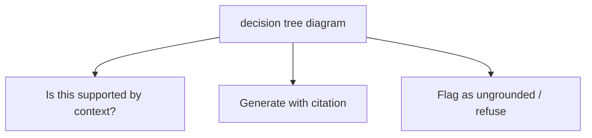
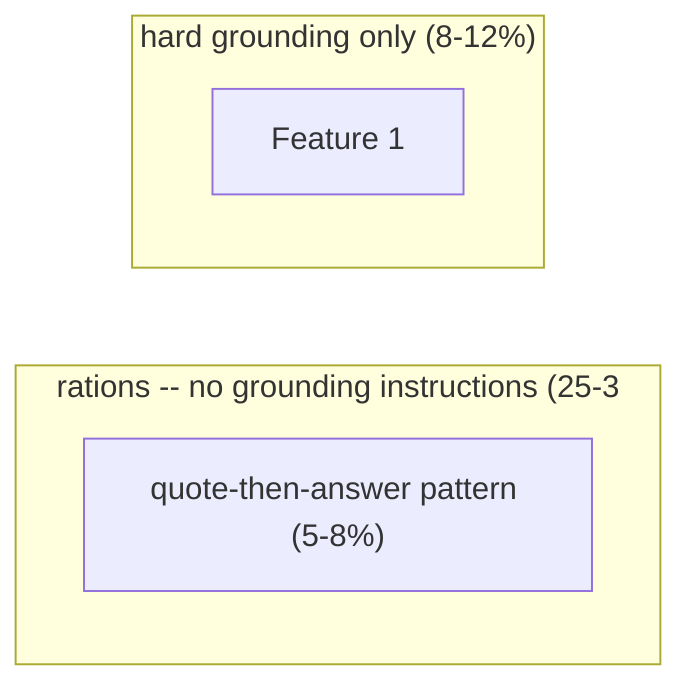

# Grounding and Faithfulness

**One-Line Summary**: Grounding techniques instruct the model to generate claims only from provided context, reducing RAG hallucination rates from 20-30% to 5-10% through structured prompting patterns.
**Prerequisites**: `rag-prompt-design.md`, `reranking-and-context-selection.md`

## What Is Grounding and Faithfulness?

Think of grounding like the editorial standards of a journalist who can only cite named sources. A responsible journalist does not insert personal speculation into a news article — every claim must trace back to an interview, a document, or an observation. When the journalist does not have a source for a claim, they either omit the claim or explicitly flag it as unconfirmed. Grounding prompts impose the same discipline on language models: every claim in the output must be traceable to a specific passage in the provided context.

Faithfulness in the RAG context means that the generated answer accurately represents the information in the retrieved documents — no additions, no contradictions, no unsupported inferences. This is distinct from factual accuracy (whether the answer is objectively true) because a faithful answer is faithful to its sources even if those sources happen to be wrong. The model's job is to accurately report what the context says, not to independently verify it.

Without explicit grounding instructions, language models blend retrieved context with parametric knowledge (information absorbed during training). This blending is invisible to users and produces answers that look authoritative but contain unverifiable claims. Research from multiple labs (2023-2024) consistently shows that RAG systems without grounding prompts hallucinate at rates of 20-30%, meaning one in four to one in three claims lacks support in the provided context.


*Source: Adapted from Es et al., "RAGAS: Automated Evaluation of Retrieval Augmented Generation," 2024, and Asai et al., "Self-RAG," 2024.*


*Source: Adapted from Min et al., "FActScore," 2023, and Maynez et al., "On Faithfulness and Factuality in Abstractive Summarization," 2020.*

## How It Works

### Explicit Grounding Instructions

The simplest grounding technique is adding explicit instructions to the prompt that constrain the model to use only provided context:

**Hard grounding**: "You must answer ONLY based on the information provided in the context below. If the context does not contain sufficient information to answer the question, respond with: 'The provided documents do not contain enough information to answer this question.'"

**Soft grounding with flagging**: "Prioritize information from the provided context. If you need to supplement with general knowledge, clearly prefix those statements with 'Based on general knowledge:' to distinguish them from context-supported claims."

Hard grounding reduces hallucination rates to 5-10% but increases refusal rates (saying "I don't know" when the answer is actually present) by 5-8%. Soft grounding maintains lower refusal rates but hallucination rates remain at 10-15%.

### Quote-Then-Answer Patterns

This technique forces the model to extract relevant quotes before generating its answer:

```
Step 1: Extract all relevant quotes from the provided context that relate to the question.
Step 2: Based ONLY on these extracted quotes, synthesize your answer.
Step 3: Cite the quote number after each claim in your answer.
```

By requiring explicit quote extraction as an intermediate step, the model must ground its reasoning in specific passages before generating. This creates a verifiable chain: answer claim -> synthesized from quote -> quote found in context. Quote-then-answer improves faithfulness by 15-20% over direct-answer approaches because it makes the grounding step explicit and auditable.

### Attribution Chains

Attribution chains extend quote-then-answer by requiring the model to show its reasoning path:

1. Identify relevant context passages
2. Extract specific claims from those passages
3. Connect extracted claims to the user's question
4. Generate the answer with explicit links to each supporting claim

This pattern is more verbose but produces outputs where every claim can be verified. It is particularly valuable in high-stakes domains (medical, legal, financial) where ungrounded claims have real consequences.

### Groundedness Metrics

Evaluating whether outputs are grounded requires automated metrics:

**RAGAS Faithfulness**: Decomposes the generated answer into individual claims, then checks each claim against the context using an NLI (natural language inference) model. Score = (number of supported claims) / (total claims). A score of 0.85 means 85% of claims are supported by context.

**Token-level attribution**: For each generated token, compute the attention weight distribution across context tokens. Tokens with low total attention to context tokens are potentially hallucinated.

**Claim extraction and verification**: Use an LLM to extract factual claims from the output, then use another LLM call or NLI model to verify each claim against the source passages. This is the most accurate but most expensive evaluation method.

Production RAG systems should target RAGAS faithfulness scores above 0.85, with critical applications targeting above 0.90.

## Why It Matters

### Hallucination Erodes Trust

A single hallucinated claim in an otherwise accurate response can destroy user trust in the entire system. In enterprise deployments, users who encounter one verifiably wrong answer often stop using the system entirely. Grounding is not a nice-to-have — it is a trust-critical requirement.

### Legal and Compliance Risk

In regulated industries (healthcare, finance, legal), generating claims not supported by source documents creates liability. A medical RAG system that supplements retrieved clinical guidelines with parametric knowledge could provide outdated or incorrect treatment recommendations. Grounding instructions create an auditable chain from output claims to source documents.

### Grounding Enables Verification

Without grounding, users must independently verify every claim in the output. With proper grounding and citation, users need only verify that the citations are accurate — a much lighter burden. This shifts the verification task from "Is this claim true?" to "Does this claim match the cited source?" which is faster and more reliable.

## Key Technical Details

- RAG systems without grounding instructions hallucinate at rates of 20-30%; proper grounding prompts reduce this to 5-10% (measured by RAGAS faithfulness and human evaluation).
- Quote-then-answer patterns improve faithfulness by 15-20% over direct-answer patterns, as measured on Natural Questions and HotpotQA with RAG.
- Hard grounding instructions ("only use provided context") increase refusal rates by 5-8% compared to no grounding, representing a precision-recall trade-off.
- RAGAS faithfulness scoring decomposes answers into atomic claims and verifies each against context; production systems should target scores above 0.85.
- Adding "If you don't know, say so" to grounding instructions reduces false-positive answers by 30-40% but increases false-negative rates by 5-10%.
- Combining grounding instructions with citation requirements produces synergistic improvements — the model is both more faithful and more verifiable.
- Chain-of-thought grounding (extract quotes, then reason, then answer) adds 30-50% more output tokens but improves faithfulness by 20-25% over single-step generation.
- Temperature settings below 0.3 improve faithfulness by 5-10% compared to temperature 0.7+ in RAG contexts, as lower temperature reduces creative elaboration.

## Common Misconceptions

- **"RAG systems don't hallucinate because they have the right context."** Having the right context is necessary but not sufficient. Without grounding instructions, models routinely ignore or supplement context with parametric knowledge, producing claims not in the retrieved documents.

- **"Grounding instructions eliminate all hallucination."** Grounding reduces but does not eliminate hallucination. Models can still misinterpret context, make unsupported inferences, or blend context passages incorrectly. The goal is to minimize, not eliminate, ungrounded claims.

- **"Faithfulness and accuracy are the same thing."** Faithfulness means the output reflects the provided context. Accuracy means the output reflects objective truth. A faithful answer to a question about outdated context will be faithfully wrong. Both properties matter, but they are measured differently.

- **"Users can tell when a model is hallucinating."** Research consistently shows that users cannot reliably distinguish hallucinated claims from grounded ones without explicit citations. Hallucinated text is generated with the same fluency and confidence as grounded text.

- **"More context reduces hallucination."** Beyond a threshold (typically 5-7 relevant chunks), additional context can actually increase hallucination by giving the model more material to misinterpret or conflate. Quality of context selection matters more than quantity.

## Connections to Other Concepts

- `citation-and-attribution-prompting.md` — Citations are the external expression of grounding; they make grounding visible and verifiable to users.
- `rag-prompt-design.md` — Grounding instructions are a core component of RAG prompt templates, determining the faithfulness behavior of the system.
- `knowledge-conflicts-and-resolution.md` — When context contradicts itself, grounding instructions must specify how to handle conflicts rather than letting the model silently resolve them.
- `reranking-and-context-selection.md` — Higher-quality context selection reduces the amount of irrelevant material the model might hallucinate from.
- `04-system-prompts-and-instruction-design/behavioral-constraints-and-rules.md` — Grounding is a specific type of behavioral constraint applied to RAG outputs.

## Further Reading

- Es, S., James, J., Espinosa-Anke, L., & Schockaert, S. (2024). "RAGAS: Automated Evaluation of Retrieval Augmented Generation." The RAGAS framework for measuring faithfulness, answer relevance, and context precision.
- Min, S., Krishna, K., Lyu, X., Lewis, M., Yih, W., Koh, P. W., ... & Hajishirzi, H. (2023). "FActScore: Fine-grained Atomic Evaluation of Factual Precision in Long Form Text Generation." Claim-level evaluation of factual grounding.
- Maynez, J., Narayan, S., Bohnet, B., & McDonald, R. (2020). "On Faithfulness and Factuality in Abstractive Summarization." Early systematic study of faithfulness in generation.
- Asai, A., Wu, Z., Wang, Y., Sil, A., & Hajishirzi, H. (2024). "Self-RAG: Learning to Retrieve, Generate, and Critique through Self-Reflection." Self-reflective grounding in RAG systems.
