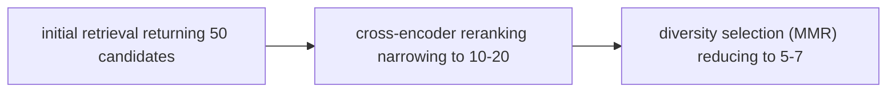
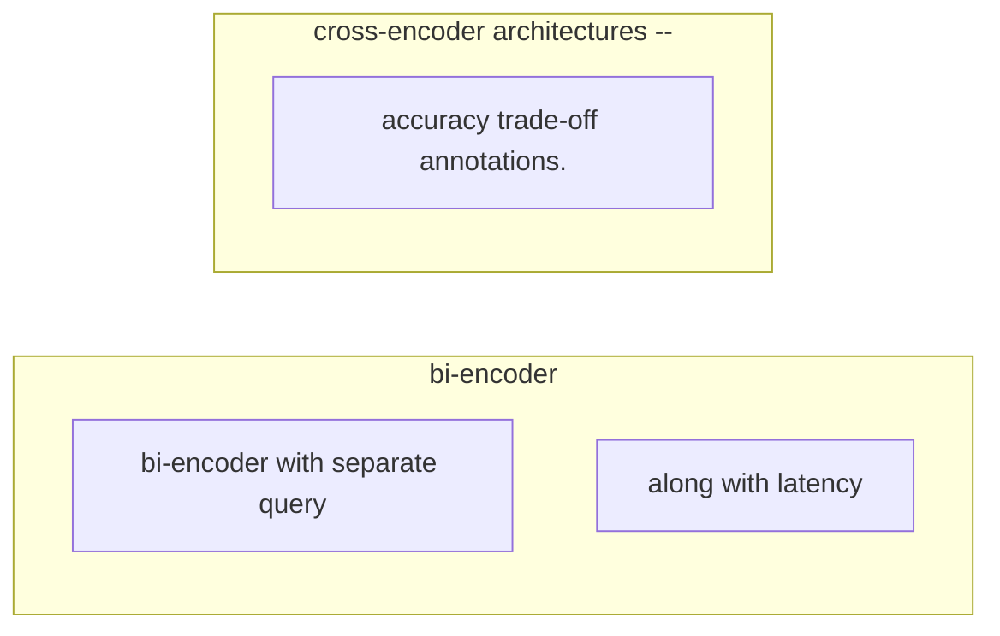

# Reranking and Context Selection

**One-Line Summary**: Initial retrieval casts a wide net returning 10-50 candidates, but only 3-5 chunks fit the context window — reranking and selection determine which make the cut.
**Prerequisites**: `retrieval-query-design.md`, `chunking-for-context-quality.md`

## What Is Reranking and Context Selection?

Think of reranking like shortlisting job candidates from a large applicant pool. The initial resume screen (retrieval) identifies 50 plausible candidates based on keyword matches and general qualifications. But you only have time to interview 5. A hiring manager (the reranker) reviews each candidate more carefully — reading cover letters, cross-referencing experience — to select the 5 most promising. The care you take in this shortlisting step determines whether you interview the best candidates or waste slots on mediocre ones.

In RAG systems, the initial retrieval step (whether dense, sparse, or hybrid) returns a ranked list of candidate chunks, typically 10-50. But the language model's context window has a limited budget for retrieved content, usually fitting 3-7 chunks depending on chunk size and window capacity. Reranking applies a more computationally expensive but more accurate scoring model to re-order these candidates, and context selection applies additional criteria — diversity, recency, source authority — to choose the final set.

The gap between initial retrieval ranking and optimal ranking is substantial. Bi-encoder retrieval (the standard approach) scores each document independently against the query, while cross-encoder reranking scores the query-document pair jointly, capturing fine-grained relevance signals. This joint scoring improves ranking precision by 15-30% at the top positions.

*Source: Adapted from Nogueira & Cho, "Passage Re-ranking with BERT," 2020, and Khattab & Zaharia, "ColBERT," 2020.*

*Source: Adapted from Nogueira & Cho, "Passage Re-ranking with BERT," 2020.*

## How It Works

### Cross-Encoder Reranking

Bi-encoder retrieval embeds queries and documents separately, then computes similarity via dot product or cosine distance. This is fast (milliseconds for millions of documents) but imprecise because the query and document never "see" each other during encoding.

Cross-encoder reranking concatenates the query and document into a single input and passes them through a transformer together. This allows full token-level attention between query and document terms, capturing nuanced relevance signals that bi-encoders miss. A cross-encoder can recognize that "Apple revenue Q3" is relevant to a passage about "the company's third-quarter financial results showed record income" even without keyword overlap.

The trade-off is computational cost: cross-encoders process each query-document pair independently, making them O(n) in the number of candidates. For 20-50 candidates, this takes 200-500ms, which is acceptable as a reranking step but prohibitive for full-corpus search.

Common cross-encoder models include Cohere Rerank, BGE-Reranker, and cross-encoder variants of BERT or T5 fine-tuned on MS MARCO passage ranking data.

### Reciprocal Rank Fusion (RRF)

When multiple retrieval methods or multiple queries produce separate ranked lists, reciprocal rank fusion merges them into a single ranking. The formula is:

RRF_score(d) = sum over all lists L of: 1 / (k + rank_L(d))

where k is a constant (typically 60) that controls how much weight is given to higher-ranked results. A document ranked #1 in one list and #10 in another gets a higher score than a document ranked #5 in both lists, appropriately rewarding strong signals from any individual source.

RRF is simple, parameter-free (aside from k), and consistently outperforms individual retrieval methods by 5-15%. It is the standard fusion method in hybrid retrieval systems.

### Diversity Selection

After relevance-based reranking, the top results often cluster around the same topic or even the same document. Selecting the top-5 by relevance score alone may retrieve 5 slightly different passages all covering the same aspect of the answer, missing other important aspects entirely.

Diversity selection algorithms address this by balancing relevance and coverage:

- **Maximal Marginal Relevance (MMR)**: Iteratively selects documents that are both relevant to the query and dissimilar to already-selected documents. The lambda parameter (0-1) controls the relevance-diversity trade-off.
- **Topic-based clustering**: Cluster retrieved documents by topic (via embedding similarity), then select the top document from each cluster.
- **Source diversity**: Ensure no single source document contributes more than N chunks to the final context, preventing over-reliance on a single source.

Diversity selection is particularly important for complex questions requiring synthesis from multiple perspectives or data sources.

### Context Window Packing

Once chunks are reranked and selected, they must be ordered and formatted within the context window. Key decisions include:

- **Relevance ordering**: Place highest-relevance chunks first (leverages primacy bias in attention) or last (leverages recency bias).
- **Logical ordering**: Arrange chunks in document order or chronological order to preserve narrative flow.
- **Deduplication**: Remove chunks with high token overlap (>60% shared tokens) that waste context space.
- **Truncation**: If the selected chunks exceed the context budget, truncate the least relevant chunk rather than dropping it entirely.

## Why It Matters

### The Top-K Gap

Initial retrieval's top-5 results overlap with the ideal top-5 results only 50-70% of the time. Reranking closes this gap to 70-85%. This 15-20 percentage point improvement in the precision of context selection translates directly to more accurate, more complete, and more faithful generated answers.

### Context Budget Is Scarce

With typical RAG configurations, the context window allocates 3,000-6,000 tokens for retrieved content. At 300-500 tokens per chunk, this fits 6-20 chunks at most — and often fewer when accounting for system instructions, few-shot examples, and output budget. Every chunk slot is valuable, and filling one with a marginally relevant passage displaces a highly relevant one.

### Diminishing Returns of Retrieval Without Reranking

Improving retrieval recall (finding more relevant documents in the initial candidate set) yields diminishing returns without reranking. Retrieving 50 candidates instead of 20 helps only if the reranker can identify the additional relevant documents that were missed in the top 20. Without reranking, expanding the candidate set simply adds noise.

## Key Technical Details

- Cross-encoder reranking improves top-5 precision by 15-30% over bi-encoder retrieval alone, at a cost of 200-500ms additional latency for 20-50 candidates.
- Reciprocal rank fusion with k=60 consistently outperforms individual retrieval methods by 5-15% on BEIR benchmarks.
- Maximal Marginal Relevance (MMR) with lambda=0.5-0.7 provides a good default relevance-diversity trade-off for most RAG use cases.
- Deduplication (removing chunks with >60% token overlap) reduces wasted context by 10-25% in typical document collections.
- The optimal number of chunks for RAG context is typically 3-7 for Q&A tasks and 5-10 for summarization tasks, beyond which answer quality plateaus or degrades.
- Cohere Rerank, BGE-Reranker-v2, and ColBERT-based rerankers achieve NDCG@10 scores of 0.50-0.55 on BEIR, compared to 0.40-0.45 for bi-encoder retrieval alone.
- Late interaction models (ColBERT) offer a middle ground: faster than cross-encoders but more accurate than bi-encoders, with precomputed token-level embeddings.
- Source diversity constraints (maximum 2-3 chunks from any single source document) improve answer completeness by 10-15% on multi-aspect questions.

## Common Misconceptions

- **"The retrieval model's ranking is good enough."** Bi-encoder retrieval optimizes for speed over precision. The top result from a bi-encoder is wrong 30-40% of the time when the correct answer exists in the top-20 candidates. Reranking recovers many of these misses.

- **"Reranking is too slow for production."** Cross-encoder reranking over 20-50 candidates adds 200-500ms — well within acceptable latency for most applications. Batch processing and GPU acceleration can reduce this to under 100ms.

- **"Just select the top-K by relevance score."** Pure relevance ranking often selects redundant chunks covering the same aspect. Diversity-aware selection produces more complete answers by covering multiple aspects of the question, even if individual chunks are slightly less relevant.

- **"More chunks in context is always better."** Beyond the optimal number (typically 5-7 for Q&A), additional chunks dilute the model's attention and introduce noise. There is a clear point of diminishing returns, and adding marginally relevant chunks actively hurts performance.

## Connections to Other Concepts

- `retrieval-query-design.md` — Multi-query retrieval produces multiple ranked lists that must be fused via RRF before reranking.
- `rag-prompt-design.md` — The reranked and selected chunks populate the context section of the RAG prompt template.
- `hybrid-retrieval-context-patterns.md` — Hybrid retrieval produces multiple ranked lists from different retrieval methods, making fusion and reranking essential.
- `chunking-for-context-quality.md` — Chunk size and quality determine the upper bound of what reranking can achieve; poor chunks cannot be rescued by good reranking.
- `grounding-and-faithfulness.md` — Higher-quality context selection (more relevant, less noisy chunks) directly improves grounding and reduces hallucination.

## Further Reading

- Nogueira, R. & Cho, K. (2020). "Passage Re-ranking with BERT." Foundational work on cross-encoder reranking for information retrieval.
- Cormack, G. V., Clarke, C. L., & Buettcher, S. (2009). "Reciprocal Rank Fusion outperforms Condorcet and Individual Rank Learning Methods." The original RRF paper with theoretical and empirical analysis.
- Carbonell, J. & Goldstein, J. (1998). "The Use of MMR, Diversity-Based Reranking for Reordering Documents and Producing Summaries." The original Maximal Marginal Relevance paper.
- Khattab, O. & Zaharia, M. (2020). "ColBERT: Efficient and Effective Passage Search via Contextualized Late Interaction over BERT." Late interaction as a middle ground between bi-encoder and cross-encoder approaches.
