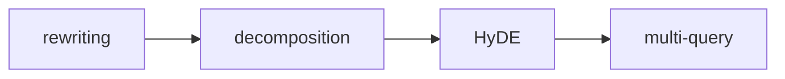

# Retrieval Query Design

**One-Line Summary**: The user's raw question is rarely the optimal retrieval query — transforming it through rewriting, decomposition, and hypothetical document generation dramatically improves what gets retrieved.
**Prerequisites**: `rag-prompt-design.md`, `chunking-for-context-quality.md`

## What Is Retrieval Query Design?

Think of retrieval query design like asking a librarian the right question. If you walk into a library and say "I'm confused about taxes," the librarian cannot help you very well. But if you say "I need the IRS guidelines for deducting home office expenses for self-employed individuals in 2024," the librarian knows exactly where to look. The difference between these two requests is retrieval query design — transforming vague, ambiguous, or poorly structured user inputs into queries that retrieve the most relevant documents.

In a RAG system, the user's natural language question is converted into a vector (via embedding) or keyword query (via BM25) and matched against a document index. The fundamental problem is that user questions and document passages are written in very different styles. Users ask "Why is my app crashing?" while the relevant documentation says "NullPointerException occurs when the database connection pool is exhausted." The semantic gap between question language and document language is the core challenge.

Retrieval query design bridges this gap through techniques like query rewriting, query decomposition, and hypothetical document embeddings. These transformations can improve retrieval recall by 20-40% and end-to-end answer quality by 15-25% compared to using the raw user query directly.

*Source: Adapted from Gao et al., "Precise Zero-Shot Dense Retrieval without Relevance Labels," 2023, and Ma et al., "Query Rewriting for Retrieval-Augmented Large Language Models," 2023.*

*Source: Lilian Weng, "LLM Powered Autonomous Agents," 2023. This memory architecture diagram illustrates how retrieval query design interacts with different memory and knowledge stores in agent-based RAG systems.*

## How It Works

### Query Rewriting

Query rewriting transforms the user's raw input into a more effective retrieval query. This can be done with simple rules or by prompting the LLM itself:

**Expansion**: Add synonyms, expand acronyms, and include domain context. "K8s OOM issues" becomes "Kubernetes out-of-memory errors container memory limits pod eviction." This improves recall for both keyword and embedding-based retrieval.

**Refinement**: Remove conversational filler, resolve pronouns, and clarify ambiguity. In a multi-turn conversation, "What about the other one?" becomes "What are the side effects of metformin?" by resolving references from conversation history.

**Step-back prompting for queries**: Ask the LLM to generate a more general version of the question. "What happens to the pressure in container B when gas is heated?" becomes "What are the principles of gas pressure and temperature relationships?" This retrieves foundational documents that support reasoning.

A typical rewriting prompt: "Given the user question and conversation history, rewrite the question to be a standalone, specific search query. Expand abbreviations, resolve pronouns, and add relevant context terms."

### Query Decomposition

Complex questions often require information from multiple documents. Query decomposition breaks a single complex question into multiple simpler sub-queries:

**Multi-hop decomposition**: "How did Company A's revenue compare to Company B's in the year they both entered the Asian market?" decomposes into: (1) "When did Company A enter the Asian market?" (2) "When did Company B enter the Asian market?" (3) "Company A revenue [year]" (4) "Company B revenue [year]."

**Aspect decomposition**: "Give me a comprehensive overview of GDPR compliance" decomposes into queries about scope, data subject rights, controller obligations, penalties, and cross-border transfer rules.

**Temporal decomposition**: "How has the policy changed over time?" generates separate queries for each relevant time period.

Decomposition typically generates 2-5 sub-queries per user question. Each sub-query retrieves independently, and results are merged before generation. This improves multi-hop question answering accuracy by 25-35% compared to single-query retrieval.

### Hypothetical Document Embeddings (HyDE)

HyDE is a counterintuitive but effective technique: instead of embedding the user's question, you first prompt the LLM to generate a hypothetical answer to the question, then embed that hypothetical answer and use it as the retrieval query.

The insight is that a hypothetical answer — even if factually incorrect — is linguistically closer to the actual document passages than the question is. A question like "What causes aurora borealis?" produces a hypothetical answer discussing solar wind, magnetosphere, and atmospheric gases, which embeds much closer to relevant scientific documents than the question itself.

HyDE improves retrieval recall by 10-20% on average, with larger gains on technical and scientific queries. The cost is one additional LLM call per query, adding 0.5-2 seconds of latency. It works best when the model has enough parametric knowledge to generate a plausible (if imperfect) answer in the relevant domain.

### Multi-Query Retrieval

Rather than betting on a single query formulation, multi-query retrieval generates multiple query variations and retrieves with all of them:

1. Generate 3-5 query variations using an LLM: different phrasings, perspectives, and specificity levels
2. Run retrieval for each query independently
3. Merge results using reciprocal rank fusion or union-with-deduplication
4. Pass the merged, deduplicated results to the generation step

This approach is more robust to any single query formulation being suboptimal. It increases retrieval recall by 15-30% at the cost of multiplied retrieval latency (which can be parallelized).

## Why It Matters

### The Query-Document Mismatch Problem

Users write questions; documents contain statements. This fundamental mismatch means that the raw user query frequently fails to retrieve the most relevant passages. Studies show that the top-1 retrieval accuracy for raw queries averages 40-60%, while properly rewritten queries achieve 60-80%. This 20-point gap directly translates to answer quality differences.

### Multi-Hop Questions Require Decomposition

Approximately 30-40% of real-world information-seeking questions require synthesizing information from multiple documents. Without decomposition, single-query retrieval retrieves passages relevant to only part of the question, producing incomplete or incorrect answers. Decomposition is not optional for complex question answering.

### Cost-Performance Trade-offs

Each query transformation adds latency and cost (LLM calls for rewriting, multiple retrieval calls for multi-query). The design decision is which techniques to apply and when. Simple factual lookups may need only basic rewriting, while complex analytical questions benefit from full decomposition and multi-query retrieval. Adaptive query design — selecting techniques based on query complexity — optimizes the cost-quality trade-off.

## Key Technical Details

- Query rewriting improves retrieval recall by 15-25% on average across standard benchmarks (Natural Questions, TriviaQA).
- HyDE (Hypothetical Document Embeddings) improves zero-shot retrieval by 10-20% but adds 0.5-2 seconds of latency per query for the generation step.
- Query decomposition generates 2-5 sub-queries per complex question and improves multi-hop QA accuracy by 25-35%.
- Multi-query retrieval with 3-5 query variations improves recall by 15-30% with parallelizable latency overhead.
- Reciprocal rank fusion (RRF) for merging multi-query results uses the formula: score = sum(1 / (k + rank_i)) with k typically set to 60.
- Step-back prompting for query generalization improves retrieval on questions requiring background knowledge by 15-20%.
- In multi-turn conversations, query rewriting that resolves coreferences improves retrieval accuracy by 20-30% compared to using only the latest user message.

## Common Misconceptions

- **"The user's question is the best retrieval query."** User questions contain conversational language, pronouns, ambiguity, and abbreviations that degrade retrieval. Even simple rewriting consistently improves results. The raw query is almost never optimal.

- **"HyDE requires the model to know the answer."** HyDE works even when the hypothetical answer is factually wrong. The technique exploits linguistic similarity, not factual accuracy. A wrong answer that uses the right terminology still embeds closer to relevant documents than the original question.

- **"Query decomposition is only for multi-hop questions."** Even single-hop questions benefit from aspect decomposition. "Tell me about Python asyncio" decomposes into queries about event loops, coroutines, and async/await syntax, retrieving more comprehensive context than a single broad query.

- **"More query variations always help."** Beyond 5-7 variations, additional queries tend to retrieve increasingly irrelevant results that dilute the merged result set. The optimal number of variations is typically 3-5.

## Connections to Other Concepts

- `rag-prompt-design.md` — Query design determines what context arrives in the prompt template; they must be co-designed for optimal results.
- `reranking-and-context-selection.md` — Reranking is applied after retrieval to filter results from potentially multiple query formulations.
- `hybrid-retrieval-context-patterns.md` — Different retrieval methods (dense, sparse) may benefit from different query formulations; dense retrieval benefits more from HyDE while sparse benefits more from keyword expansion.
- `dynamic-context-augmentation.md` — Dynamic retrieval uses iterative query refinement, building on initial retrieval results to formulate better follow-up queries.
- `03-reasoning-elicitation/step-back-prompting.md` — Step-back prompting applied to query design generates more general retrieval queries.

## Further Reading

- Gao, L., Ma, X., Lin, J., & Callan, J. (2023). "Precise Zero-Shot Dense Retrieval without Relevance Labels." The original HyDE paper demonstrating hypothetical document embeddings.
- Ma, X., Gong, Y., He, P., Zhao, H., & Duan, N. (2023). "Query Rewriting for Retrieval-Augmented Large Language Models." Systematic study of query rewriting strategies for RAG.
- Zheng, H. S., Mishra, S., Chen, X., Cheng, H. T., Chi, E. H., Le, Q. V., & Zhou, D. (2023). "Take a Step Back: Evoking Reasoning via Abstraction in Large Language Models." Step-back prompting applied to retrieval.
- Press, O., Zhang, M., Min, S., Schmidt, L., Smith, N. A., & Lewis, M. (2023). "Measuring and Narrowing the Compositionality Gap in Language Models." Analysis of multi-hop decomposition strategies.
