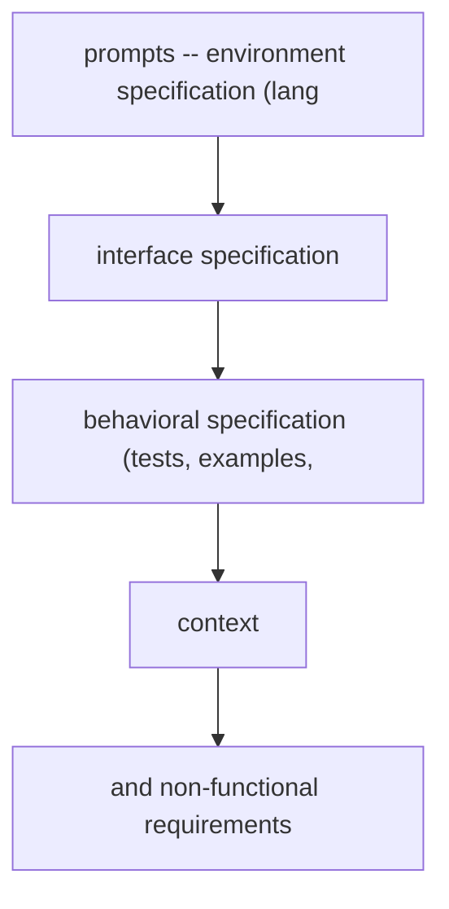
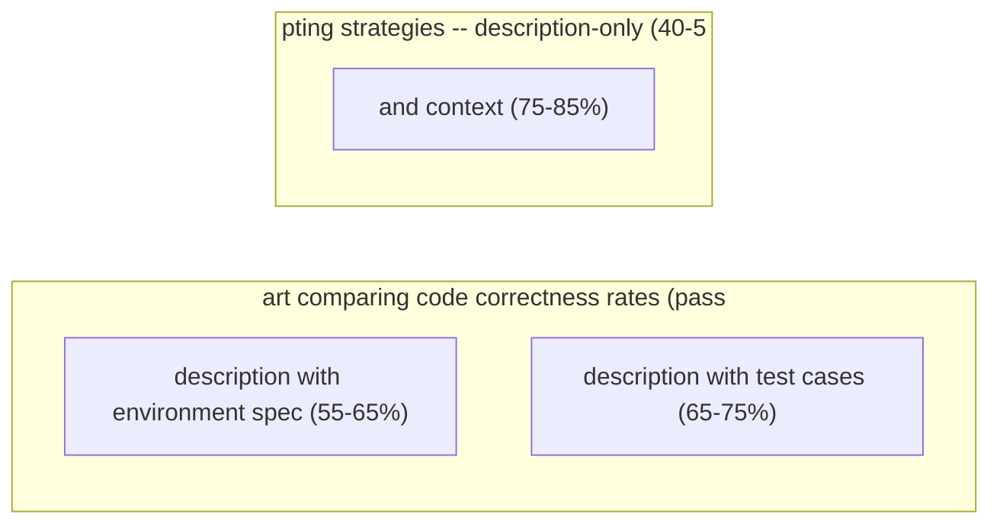

# Code Generation Prompting

**One-Line Summary**: Effective code generation requires specifying language, runtime environment, dependencies, and expected behavior with the same precision as giving an architect both blueprint requirements and building codes.
**Prerequisites**: `04-system-prompts-and-instruction-design/system-prompt-anatomy.md`, `05-structured-output-and-format-control/json-mode-and-schema-enforcement.md`

## What Is Code Generation Prompting?

Think of code generation prompting like giving an architect both the blueprint requirements AND the building codes. You would not just say "design me a house" — you would specify the number of rooms, the lot dimensions, the local building codes, the climate zone, seismic requirements, and the budget. Similarly, effective code generation requires specifying the programming language, the runtime version, the target framework, the coding style, error handling expectations, and the interface the code must satisfy.

Code generation prompting is the discipline of structuring instructions to produce working, maintainable, production-quality code. This is distinct from general text generation because code has an objective correctness standard: it either compiles and passes tests or it does not. A beautifully written explanation of an algorithm is worthless if the code fails at runtime. This binary feedback loop means that code generation prompts must be precise about technical constraints in ways that other prompting tasks do not require.

The quality gap between naive and well-crafted code generation prompts is substantial. Studies show that adding environment specifications, type signatures, and test cases to prompts improves code correctness rates from 40-50% to 70-85% on HumanEval-style benchmarks. The difference is not the model's capability — it is the information the model has to work with.


*Source: Adapted from Chen et al., "Evaluating Large Language Models Trained on Code" (Codex/HumanEval), 2021.*


*Source: Adapted from Ni et al., "L2CEval: Evaluating Language-to-Code Generation Capabilities of Large Language Models," 2024.*

## How It Works

### Language and Environment Specification

Precise environment specification eliminates an entire category of errors:

**Weak prompt**: "Write a function to parse JSON."
**Strong prompt**: "Write a Python 3.11 function using the standard library json module. The function should parse a JSON string and return a typed dictionary. Use type hints compatible with Python 3.11 (including union types using the | operator). The code will run on Ubuntu 22.04 with no additional packages installed."

Key specifications include:
- Language and version: "Python 3.11," "TypeScript 5.3," "Rust 1.75"
- Runtime: "Node.js 20 LTS," "JVM 17," "CPython (not PyPy)"
- Framework and version: "React 18 with hooks," "Django 5.0," "Spring Boot 3.2"
- Available dependencies: "You may use numpy, pandas, and scikit-learn. Do not use any other external packages."
- Target platform: "AWS Lambda with 256MB memory and 30-second timeout," "Browser with ES2020 support"

### Test-Driven Prompting

Providing tests before or alongside the code generation instruction dramatically improves correctness:

**Test-first pattern**: "Write a function that passes the following tests:" followed by the complete test suite. This gives the model a precise specification of expected behavior, including edge cases, error conditions, and the exact function signature.

**Docstring-first pattern**: Provide a detailed docstring including parameters, return types, exceptions, and examples, then ask the model to implement the function body. This pattern aligns with how many developers actually write code — specification before implementation.

**Example-driven**: "The function should behave as follows: input([1,2,3]) -> 6, input([]) -> 0, input([-1, 1]) -> 0." Concrete input-output examples serve as both specification and implicit tests.

Test-driven prompting improves correctness by 20-30% compared to description-only prompts because it disambiguates the specification. A description like "handle edge cases" is vague; a test like `assert process([]) == []` is precise.

### Type Signatures and Interface Specification

Providing type signatures or interfaces before asking for implementation constrains the model's output to the correct structure:

```
Implement this TypeScript interface:
interface UserService {
  getUser(id: string): Promise<User | null>;
  createUser(data: CreateUserInput): Promise<User>;
  updateUser(id: string, data: Partial<CreateUserInput>): Promise<User>;
  deleteUser(id: string): Promise<boolean>;
}
```

This pattern works because type signatures encode the most important structural decisions (parameter types, return types, async vs sync, error handling approach) without constraining the implementation details.

### Context Inclusion Strategies

Code generation benefits from relevant context that would normally be in the developer's working memory:

- **Existing code**: Include the file or class the new code must integrate with. "Here is the existing database module. Write a new function that uses this module's connection pool."
- **Import context**: List available imports and their APIs. "Available: `from utils import sanitize_input, validate_email`"
- **Error context**: When debugging, include the error message, stack trace, and the code that produced it
- **Schema context**: Database schemas, API response formats, or configuration structures the code must work with

### Incremental Generation

For complex implementations, break generation into stages:

1. First prompt: "Outline the approach — list the functions needed, their signatures, and their responsibilities."
2. Second prompt: "Implement function X using the approach outlined above."
3. Third prompt: "Now implement function Y, ensuring it integrates with function X."
4. Final prompt: "Write tests for all implemented functions."

Incremental generation produces more correct, more coherent code for complex tasks (>100 lines) than attempting to generate everything at once.

## Why It Matters

### Code Correctness Is Binary

Unlike text generation where quality is subjective, code either works or it does not. A response that is "pretty good" but has a subtle bug in error handling is still broken. This binary standard means that precision in prompting translates directly to usability of the output.

### Environment Mismatches Are Silent Failures

Code generated for Python 3.12 syntax running on Python 3.9 will fail with a cryptic SyntaxError. Code using React class components when the project uses hooks will not integrate. These failures are not bugs in the model's reasoning — they are failures of specification. Environment specification in the prompt prevents this entire category of error.

### Production Code Requires More Than Correctness

Working code is necessary but not sufficient. Production code must handle errors gracefully, log appropriately, be readable, follow project conventions, and be maintainable. Prompts that specify only functional requirements produce code that works in happy-path tests but fails in production. Including non-functional requirements (error handling, logging, naming conventions) in the prompt produces production-grade output.

## Key Technical Details

- Adding environment specification (language version, framework, dependencies) to prompts improves code correctness by 15-25% by eliminating version-specific errors.
- Test-driven prompting (providing tests before implementation) improves correctness by 20-30% on HumanEval-style benchmarks.
- Type signature-first prompting reduces type errors by 40-50% compared to description-only prompts in typed languages (TypeScript, Rust, Go).
- Including 50-200 lines of surrounding code context improves integration success from 45% to 75% for functions that must work within existing codebases.
- Incremental generation (outline, then implement piece by piece) improves correctness by 15-20% for implementations exceeding 100 lines.
- Docstring-first prompting (providing detailed docstring, then asking for implementation) aligns with natural development workflows and produces more maintainable code.
- Models generate significantly better code when the prompt includes the error message and stack trace (for debugging) versus just a description of the bug.
- Specifying "do not use external dependencies" or listing allowed dependencies prevents the common failure mode of generated code importing unavailable packages.

## Common Misconceptions

- **"Just describe what you want and the model will figure out the details."** Underspecified prompts produce code that works for the happy path but fails on edge cases, uses wrong API versions, or imports unavailable packages. Precision in technical specifications directly correlates with output quality.

- **"Code generation models understand your entire codebase."** Models can only work with the context provided in the prompt. Without the existing codebase context, generated code uses different naming conventions, incompatible patterns, or redundant implementations. Include relevant existing code.

- **"If the code runs, it's correct."** Code that passes basic tests may have subtle bugs (race conditions, memory leaks, security vulnerabilities) that only manifest under production conditions. Include non-functional requirements and edge case tests in the prompt.

- **"Longer, more detailed prompts always produce better code."** Beyond a point, additional instructions can confuse the model or create contradictory requirements. Focus on precise, non-redundant specifications. A 50-line prompt with clear specs outperforms a 200-line prompt with ambiguous requirements.

## Connections to Other Concepts

- `code-review-and-debugging-prompts.md` — Code review is the complement to code generation; review prompts evaluate code that generation prompts produced.
- `mathematical-and-logical-prompting.md` — Algorithmic code generation overlaps with mathematical prompting, especially for optimization and numerical methods.
- `05-structured-output-and-format-control/json-mode-and-schema-enforcement.md` — Code output formatting (extracting code blocks from responses) is a structured output challenge.
- `03-reasoning-elicitation/chain-of-thought-prompting.md` — Chain-of-thought prompting for code generation (plan before implementing) improves complex code quality.
- `02-core-prompting-techniques/few-shot-prompting.md` — Few-shot code examples establish coding style, conventions, and patterns for the model to follow.

## Further Reading

- Chen, M., Tworek, J., Jun, H., Yuan, Q., de Oliveira Pinto, H. P., Kaplan, J., ... & Zaremba, W. (2021). "Evaluating Large Language Models Trained on Code." The Codex/HumanEval paper establishing code generation evaluation.
- Austin, J., Odena, A., Nye, M., Bosma, M., Michalewski, H., Dohan, D., ... & Sutton, C. (2021). "Program Synthesis with Large Language Models." MBPP benchmark and analysis of prompt strategies for code generation.
- Li, R., Allal, L. B., Zi, Y., Muennighoff, N., Kocetkov, D., Mou, C., ... & von Werra, L. (2023). "StarCoder: May the Source Be with You!" Analysis of code generation quality across languages and prompt strategies.
- Ni, A., Yin, P., Zhao, Y., Potdar, S., Hui, H., Grady, R., ... & Ramanathan, V. (2024). "L2CEval: Evaluating Language-to-Code Generation Capabilities of Large Language Models." Comprehensive evaluation of prompt strategies for code generation.
