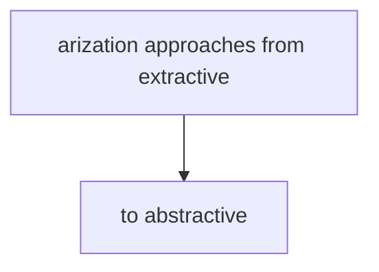

# Data Analysis and Summarization

**One-Line Summary**: Analytical prompting requires specifying the type of analysis (extractive vs abstractive, comparative, trend-based), the level of detail, and the analytical framework to produce actionable insights rather than vague summaries.
**Prerequisites**: `04-system-prompts-and-instruction-design/system-prompt-anatomy.md`, `05-structured-output-and-format-control/json-mode-and-schema-enforcement.md`

## What Is Data Analysis and Summarization Prompting?

Think of it like asking an analyst to prepare a brief versus a full report. If you say "summarize this data," you get something, but whether it is useful depends entirely on what you needed. A one-page executive brief for the board requires different content, structure, and emphasis than a 20-page technical analysis for the engineering team. The same underlying data supports both outputs — the prompt determines which one you get.

Data analysis and summarization prompting is the practice of structuring instructions for tasks that extract insights, condense information, identify patterns, and produce structured analytical outputs from source material. This spans a wide range of tasks: document summarization (long text to short text), comparative analysis (multiple sources to structured comparison), trend identification (time-series data to narrative), and framework-based analysis (applying structured analytical lenses like SWOT or pro/con to unstructured information).

The key challenge is controlling both what gets included (relevance) and how it is presented (format and depth). Without explicit guidance, models default to generic summaries that bury the most important insights in a sea of obvious observations. Effective analytical prompts specify the analytical lens, the audience, the output structure, and the level of detail expected.

*Source: Adapted from Adams et al., "From Sparse to Dense: GPT-4 Summarization with Chain of Density Prompting," 2023.*

*Source: Adapted from Goyal et al., "News Summarization and Evaluation in the Era of GPT-3," 2023.*

## How It Works

### Extractive vs Abstractive Summarization

These two approaches produce fundamentally different outputs:

**Extractive summarization** selects and arranges key sentences or passages from the source text. The output uses the source's own words. Prompt: "Identify the 5 most important sentences from this document. Present them in the order they appear, with their original paragraph numbers."

**Abstractive summarization** generates new text that captures the meaning of the source in different (often shorter, clearer) words. Prompt: "Summarize this document in 3-4 paragraphs using your own words. Focus on the main argument, key supporting evidence, and practical implications."

**Hybrid approach**: "First extract the 5 most important claims from the document (quote the original text). Then synthesize these into a 2-paragraph summary that connects them into a coherent narrative."

For high-stakes applications (legal, medical, financial), extractive approaches are preferred because they maintain traceability to the source text. For communication and reporting, abstractive approaches produce more readable output.

### Comparative Analysis Prompts

Comparing multiple documents or data sources requires explicit structure:

**Side-by-side comparison**: "Compare Document A and Document B across these dimensions: [list dimensions]. For each dimension, state what each document says, note agreements and disagreements, and assess the strength of evidence on each side. Present results in a table."

**Weighted comparison**: "Compare these three options using the following criteria, weighted by importance: Cost (30%), Feasibility (25%), Impact (25%), Timeline (20%). Score each option 1-5 on each criterion, provide a rationale for each score, and calculate weighted totals."

**Gap analysis**: "Compare the current state (Document A) with the target state (Document B). Identify the gaps between current and target. For each gap, assess severity (High/Medium/Low) and propose a mitigation approach."

Structured comparison prompts produce 2-3x more actionable output than "compare these documents" because they force systematic evaluation across specified dimensions.

### Controlling Summary Length and Detail

Length and detail control is critical for practical summarization:

**Token-level control**: "Summarize in exactly 100-150 words" or "Limit your summary to 3 sentences." Explicit word/sentence counts are followed with 80-90% compliance; vague instructions like "be brief" produce highly variable lengths.

**Detail-level specification**: "Executive summary: 3 bullet points, each one sentence, highlighting only the most critical findings." versus "Detailed analysis: address every section of the document, include relevant data points and statistics, and note any caveats or limitations."

**Progressive detail**: "Provide a summary at three levels of detail: (1) One-sentence headline, (2) Three-bullet executive summary, (3) One-page detailed analysis." This gives the reader the ability to engage at their preferred depth.

### Analytical Frameworks

Applying structured analytical frameworks produces more rigorous output:

**SWOT analysis**: "Analyze [subject] using the SWOT framework. For each quadrant (Strengths, Weaknesses, Opportunities, Threats), provide 3-5 specific points with supporting evidence from the source material. Conclude with strategic implications."

**Pro/con analysis**: "List the pros and cons of [proposal]. For each point, provide supporting evidence and rate the significance (High/Medium/Low). Conclude with a balanced assessment."

**Root cause analysis**: "Using the 5 Whys technique, analyze the root cause of [problem]. Start with the observed symptom and ask 'why' iteratively until you reach the fundamental cause. Show each step."

**Trend analysis**: "Identify the 3-5 most significant trends in this data. For each trend, state the direction (increasing/decreasing/stable), the magnitude, the time period, likely causes, and potential implications."

Framework-based analysis is particularly effective because it forces comprehensive coverage (every SWOT quadrant must be addressed) and prevents the model from focusing only on the most obvious observations.

## Why It Matters

### Generic Summaries Are Not Actionable

A summary that restates what the document says without highlighting what matters is not useful. Decision-makers need summaries that emphasize implications, flag risks, and surface non-obvious insights. Analytical prompts with explicit frameworks and audience specifications produce actionable output.

### Length and Detail Mismatches Waste Time

A 500-word summary when you needed 50 words wastes the reader's time. A 50-word summary when you needed 500 words omits critical detail. Length specification is not a cosmetic choice — it determines whether the output fits the reader's decision-making context.

### Comparative Analysis Requires Structure

Without explicit comparison dimensions and structure, comparative prompts produce narrative summaries of each item separately rather than true comparisons. The model describes A, then describes B, without directly comparing them point by point. Structured comparison prompts force cross-referencing.

## Key Technical Details

- Explicit word/sentence count targets are followed with 80-90% compliance; vague length instructions ("be brief") produce output lengths varying by 3-5x.
- Structured comparison prompts (specifying dimensions and format) produce 2-3x more actionable output than unstructured "compare these" prompts.
- Extractive summarization maintains higher faithfulness to source material (95%+ claim accuracy) compared to abstractive (85-90%), at the cost of readability.
- Framework-based analysis (SWOT, pro/con) produces more comprehensive coverage than open-ended analysis, with 20-30% more distinct insights per prompt.
- Progressive summarization (headline, bullets, detailed) adds 30-50% more tokens to the output but provides 3 engagement levels for different audiences.
- For documents over 10,000 tokens, hierarchical summarization (summarize sections, then summarize summaries) produces more accurate results than single-pass summarization.
- Models demonstrate a positional bias in summarization, over-representing content from the beginning and end of documents and under-representing the middle by 20-30%.
- Specifying the target audience (e.g., "for a CEO" vs "for a technical team") changes vocabulary complexity by 1-2 grade levels and emphasis patterns significantly.

## Common Misconceptions

- **"Summarization is a simple task that doesn't need complex prompts."** Generic summarization prompts produce generic summaries. The difference between "summarize this" and a well-structured analytical prompt with framework, audience, length, and focus specifications is the difference between a mediocre and excellent output.

- **"Longer documents need longer summaries."** Summary length should be determined by the reader's needs, not the source length. A 100-page report might need a 3-sentence executive summary or a 5-page analysis — the source length is irrelevant to the output length decision.

- **"The model will naturally focus on the most important points."** Models default to covering content roughly proportional to how much space the source document devotes to each topic. A topic that gets one paragraph in a 50-page document may be the most important insight, but the model will underweight it without explicit instructions to focus on importance over coverage.

- **"Extractive and abstractive summarization are interchangeable."** They serve different purposes. Extractive preserves source language (important for legal and compliance), while abstractive improves readability and synthesis (important for communication). Choose based on the use case.

## Connections to Other Concepts

- `classification-and-extraction-at-scale.md` — Batch summarization across large document sets uses consistency and scale patterns from classification prompting.
- `07-retrieval-and-knowledge-integration/rag-prompt-design.md` — RAG systems often use summarization prompts to generate answers from retrieved context.
- `mathematical-and-logical-prompting.md` — Quantitative data analysis overlaps with mathematical prompting for statistical interpretation.
- `05-structured-output-and-format-control/json-mode-and-schema-enforcement.md` — Structured analytical outputs (tables, scored frameworks) require output format control.
- `creative-writing-prompting.md` — Narrative summaries and report writing blend analytical precision with writing quality.

## Further Reading

- Goyal, T., Li, J. J., & Durrett, G. (2023). "News Summarization and Evaluation in the Era of GPT-3." Comprehensive evaluation of LLM summarization quality and common failure modes.
- Zhang, Y., Li, Y., Cui, L., Cai, D., Liu, L., Fu, T., ... & Shi, S. (2024). "Benchmarking Large Language Models for News Summarization." Analysis of summary quality across different prompting strategies.
- Adams, G., Zion Golumbic, L., Tsai, E., Bansal, S., & Elhadad, N. (2023). "From Sparse to Dense: GPT-4 Summarization with Chain of Density Prompting." Chain of density approach for controlling summary detail level.
- Chang, Y., Wang, X., Wang, J., Wu, Y., Yang, L., Zhu, K., ... & Xie, X. (2024). "A Survey on Evaluation of Large Language Models." Includes frameworks for evaluating analytical and summarization outputs.
