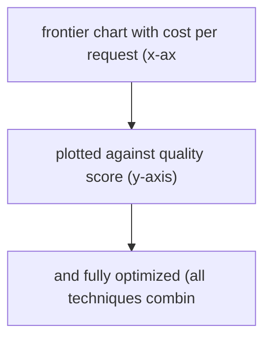
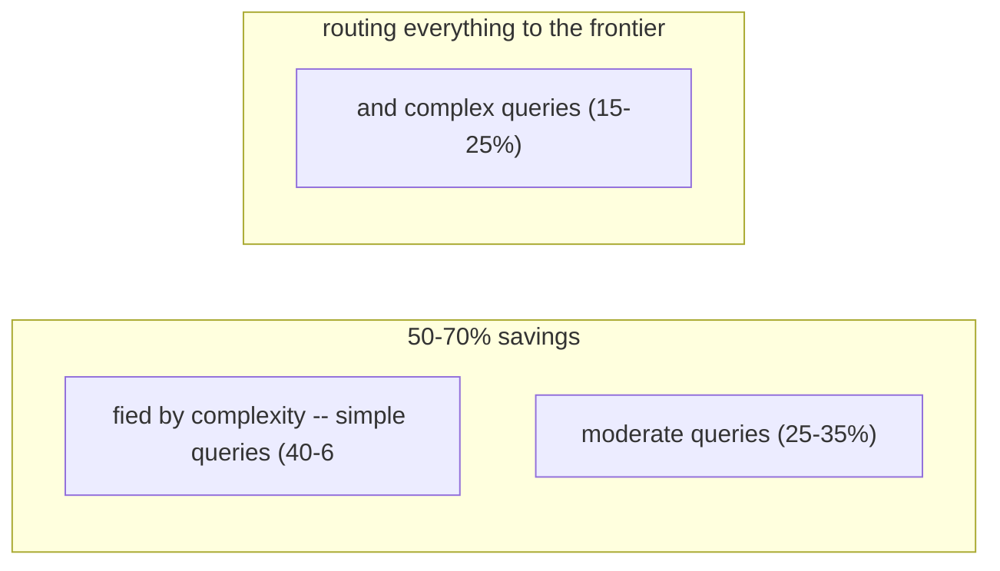

# Cost and Latency Optimization

**One-Line Summary**: Cost and latency optimization for LLM applications involves systematic techniques — prompt compression, caching, model routing, and batching — to find the best trade-off on the cost-quality Pareto frontier.
**Prerequisites**: `prompt-optimization-techniques.md`, `prompt-testing-and-evaluation.md`, `06-context-engineering-fundamentals/context-budget-allocation.md`.

## What Is Cost and Latency Optimization?

Think of optimizing an LLM application like planning a shipping route. You want packages delivered fast (low latency) and cheaply (low cost), but the fastest route is rarely the cheapest. A direct flight is fast but expensive; ground shipping is cheap but slow. The art is finding the right combination — maybe air freight for urgent packages and ground for everything else. LLM cost and latency optimization uses the same logic: route simple tasks to cheap, fast models; cache repeated computations; compress prompts to reduce token costs; and batch requests to improve throughput.

The economics of LLM applications are dominated by token costs. A production application serving 1 million requests per day with an average prompt of 2,000 tokens and 500 output tokens at GPT-4-class pricing ($10 per million input tokens, $30 per million output tokens) costs roughly $35,000 per month. Reducing the average prompt length by 30% through compression and caching saves over $6,000 monthly. At higher volumes, these savings compound into millions of dollars annually.

Latency matters because users have limited patience. Research on conversational AI shows user satisfaction drops significantly when response times exceed 2-3 seconds. Each optimization technique involves trade-offs: caching improves latency but may serve stale results; model routing reduces cost but may reduce quality for misrouted queries; prompt compression saves tokens but may lose context. The goal is to find the Pareto frontier — the set of configurations where you cannot improve cost without worsening quality, or vice versa.

*Source: Adapted from Chen et al., "FrugalGPT: How to Use Large Language Models While Reducing Cost and Improving Performance," 2023 (Stanford).*

*Source: Adapted from Chen et al., "FrugalGPT," 2023, and Jiang et al., "LLMLingua," 2023 (Microsoft Research).*

## How It Works

### Prompt Compression and Shortening

The simplest optimization is reducing prompt length. Ablation studies (see `prompt-optimization-techniques.md`) often reveal that 20-30% of prompt tokens contribute negligibly to output quality. Common targets for removal include: redundant instructions that restate the same requirement differently, overly detailed formatting specifications when a brief example suffices, verbose role definitions that can be compressed to a single sentence, and excessive few-shot examples when fewer achieve the same performance.

**LLMLingua** (Microsoft Research) is an automated prompt compression tool that uses a small language model to identify and remove tokens that contribute least to the output, achieving 2-10x compression ratios with less than 5% quality degradation on many tasks. It works by computing each token's perplexity contribution and removing low-information tokens while preserving the semantic structure.

Manual compression techniques include replacing natural language instructions with structured formats (tables, XML tags), using abbreviations and shorthand in few-shot examples, and referencing schemas by name rather than including full definitions. A practical heuristic: if you can remove a sentence from the prompt and the model still produces the same output on 95%+ of your eval suite, that sentence is a candidate for removal.

### Caching Strategies

**Prefix caching** (also called KV-cache reuse) stores the key-value attention states for the static portion of the prompt (system prompt, few-shot examples) and reuses them across requests. Since the system prompt and examples are identical for every request, computing their attention states once and reusing them saves 30-70% of compute time for the prompt processing phase. Anthropic, OpenAI, and other providers offer automatic prefix caching for prompts that share common prefixes.

**Semantic caching** stores complete responses for previously seen queries and returns cached results for semantically similar new queries. An embedding model computes the similarity between the new query and cached queries; if similarity exceeds a threshold (typically 0.95+ cosine similarity), the cached response is returned without calling the LLM. Semantic caching is most effective for applications with repetitive query patterns — customer support, FAQ systems, and standard information retrieval — where 20-40% of queries are semantically duplicated. Cache hit rates above 30% reduce average costs proportionally.

**Response caching with TTL** stores exact query-response pairs with a time-to-live expiration. This is simpler than semantic caching but only matches identical queries. It works well for structured inputs (API calls with fixed parameters) where exact repetition is common.

### Model Routing

Model routing directs requests to different models based on task complexity, reducing cost without sacrificing quality for hard tasks. The architecture uses a lightweight classifier (or a small LLM) to assess each request's complexity and route accordingly:

- **Simple queries** (factual lookups, simple formatting, classification): Route to small, cheap models (GPT-4o-mini, Claude Haiku, Gemini Flash) at 5-20x lower cost than frontier models.
- **Moderate queries** (summarization, standard generation, multi-step reasoning): Route to mid-tier models.
- **Complex queries** (nuanced reasoning, creative tasks, edge cases): Route to frontier models (GPT-4o, Claude Sonnet/Opus, Gemini Pro).

Effective routing typically sends 40-60% of traffic to small models, 25-35% to mid-tier, and 15-25% to frontier models, reducing average cost by 50-70% while maintaining 95-98% of frontier-model quality on aggregate metrics. The key challenge is routing accuracy: misrouting a complex query to a small model produces a poor response, while misrouting a simple query to a frontier model wastes money. Routing classifiers need 90%+ accuracy to be cost-effective.

A cascade variant of model routing tries the small model first and escalates to a larger model only if the small model's output fails a quality check (low confidence score, format violation, or flagged by a validator). Cascades are effective when 50-70% of queries are simple enough for the small model, as the quality check overhead is small relative to the cost savings.

### Batching and Parallelization

**Request batching** groups multiple independent requests into a single API call, reducing per-request overhead and sometimes qualifying for bulk pricing. Batching is most effective for offline processing tasks (document analysis, bulk classification, data enrichment) where real-time latency is not required. Batch APIs from providers like OpenAI offer 50% price discounts for asynchronous processing.

**Parallel execution** speeds up latency for tasks that require multiple LLM calls. Rather than chaining calls sequentially (call A, then call B using A's output, then call C), identify independent calls that can run simultaneously. A RAG system that needs to analyze 5 retrieved documents can run 5 analysis calls in parallel rather than sequentially, reducing latency from 5x to 1x the single-call time.

**Response streaming** is another latency optimization that does not affect cost or quality. By streaming tokens to the user as they are generated (rather than waiting for the complete response), perceived latency drops dramatically — users see the first token in 200-500ms rather than waiting 2-5 seconds for the full response. Most providers support streaming via Server-Sent Events (SSE), and it should be the default for any user-facing application.

## Why It Matters

### The Cost-Quality Pareto Frontier

Every LLM application operates on a trade-off curve between cost and quality. Without optimization, most applications sit far from the Pareto frontier — paying more than necessary for the quality they achieve. Systematic optimization moves the application toward the frontier, achieving either the same quality at lower cost or higher quality at the same cost. For high-volume applications, the savings are substantial: a 50% cost reduction on a $100,000/month LLM bill frees $600,000 annually for other investments.

### Latency and User Experience

Response latency directly affects user experience and engagement. Studies on conversational AI show that response times above 3 seconds reduce user satisfaction by 15-25%, and times above 5 seconds increase abandonment rates by 30-40%. Caching, model routing, and parallelization can reduce p95 latency from 5-8 seconds to 1-3 seconds, keeping the application within the user tolerance window.

### Scaling Feasibility

Some LLM applications are economically infeasible without optimization. A document processing pipeline that costs $0.50 per document using a frontier model might need to process 10 million documents — a $5 million cost. With model routing (70% to a small model at $0.02 per document), caching (30% cache hit rate), and prompt compression (40% token reduction), the effective cost drops to $0.08 per document, making the project feasible at $800,000.

### Prioritizing Optimization Efforts

Not all optimizations are equal. The highest-leverage optimizations to implement first are: (1) response streaming (zero quality cost, immediate latency improvement), (2) prefix caching (zero quality cost, significant latency improvement), (3) removing redundant prompt tokens identified through ablation (often improves both quality and cost), (4) model routing for clearly simple tasks. Only after these "free" or low-risk optimizations are deployed should teams explore higher-risk options like aggressive prompt compression or broader model routing.

## Key Technical Details

- LLMLingua achieves 2-10x prompt compression with less than 5% quality degradation on information extraction and QA tasks.
- Prefix caching reduces time-to-first-token by 30-70% for prompts with shared prefixes longer than 1,024 tokens.
- Semantic caching with 0.95+ cosine similarity threshold achieves cache hit rates of 20-40% for customer support applications, with less than 2% false positive (incorrect cache match) rates.
- Model routing reduces average cost by 50-70% when 40-60% of traffic is routable to small models; routing classifier accuracy must exceed 90% to be cost-effective.
- Batch API pricing is typically 50% of real-time pricing, making it the default choice for any non-latency-sensitive workload.
- Parallel execution of N independent LLM calls reduces wall-clock latency from N * T to approximately T + overhead, where T is single-call latency.
- The cost difference between frontier and small models is 10-30x per token (e.g., GPT-4o at $2.50/M input tokens vs. GPT-4o-mini at $0.15/M input tokens as of 2024-2025).
- Monitoring cost-per-query distributions (not just averages) reveals optimization opportunities: a small number of expensive queries may dominate total cost.

## Common Misconceptions

- **"Optimization always sacrifices quality."** Many optimizations — removing redundant instructions, caching identical queries, routing truly simple tasks to small models — reduce cost without any quality loss. The first 30-40% of cost reduction often comes "for free."
- **"You should optimize from the start."** Premature optimization is as wasteful in LLM applications as in software engineering. Start with the simplest approach that works, measure where time and money are spent, and optimize the bottlenecks. Optimizing before you have production data means optimizing blindly.
- **"Smaller models are always worse."** For well-defined, narrow tasks (classification, entity extraction, simple formatting), small models often match frontier model performance. Model routing works because task difficulty varies — not because small models are universally inferior.
- **"Caching is only for identical queries."** Semantic caching with embedding-based similarity matching handles paraphrased and near-duplicate queries. The technology is mature enough for production use in domains with repetitive query patterns.
- **"Latency optimization requires sacrificing accuracy."** Parallel execution, prefix caching, and response streaming all reduce latency without affecting output quality. These should be implemented before considering quality-latency trade-offs.

## Connections to Other Concepts

- `prompt-optimization-techniques.md` — Ablation studies identify prompt components that can be removed for cost savings without quality loss.
- `prompt-testing-and-evaluation.md` — Every cost optimization must be validated against the eval suite to ensure quality is maintained within acceptable bounds.
- `a-b-testing-and-prompt-experiments.md` — Cost and latency are guardrail metrics in A/B experiments; optimizations should be validated with real user traffic.
- `06-context-engineering-fundamentals/context-budget-allocation.md` — Understanding token economics and context window usage is essential for identifying compression and caching opportunities.
- `guardrails-and-output-filtering.md` — Guardrail latency overhead (50-200ms per guard) is a significant component of total response time and must be included in latency optimization planning.

## Further Reading

- Jiang et al., "LLMLingua: Compressing Prompts for Accelerated Inference of Large Language Models," 2023 (Microsoft Research). Introduces perplexity-based prompt compression with extensive benchmarks on compression ratio vs. quality.
- Chen et al., "FrugalGPT: How to Use Large Language Models While Reducing Cost and Improving Performance," 2023 (Stanford). Foundational paper on model routing, caching, and cascade strategies for cost optimization.
- Zhu et al., "Prompt Compression and Contrastive Conditioning for Controllability and Toxicity Reduction in Language Models," 2024. Advances in prompt compression with quality preservation techniques.
- Vavekanand et al., "Semantic Caching for Large Language Model Queries," 2024. Practical architecture for semantic cache systems with production deployment lessons.
- OpenAI, "Batch API Documentation," 2024. Technical documentation for batch processing with cost analysis and use case recommendations.
