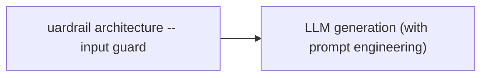
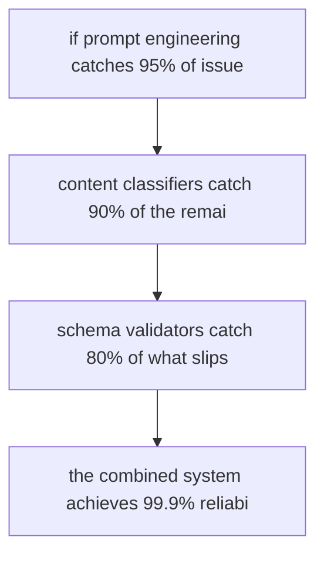

# Guardrails and Output Filtering

**One-Line Summary**: Guardrails are programmable safety layers that inspect, validate, and filter LLM outputs before they reach the user, functioning as quality control inspectors at the end of a production line.
**Prerequisites**: `prompt-injection-defense-techniques.md`, `05-structured-output-and-format-control/json-mode-and-schema-enforcement.md`.

## What Are Guardrails and Output Filtering?

Imagine a factory production line. The machines (LLMs) produce outputs at high speed, but before any product ships to a customer, it passes through quality control inspectors who check for defects, verify specifications, and reject anything that does not meet standards. Guardrails are those inspectors for LLM applications — automated systems that sit between the model's raw output and the end user, catching unsafe, incorrect, or malformed responses before they cause harm.

Output filtering is a specific subset of guardrails focused on post-generation checks. While input guardrails sanitize what goes into the model (see `prompt-injection-defense-techniques.md`), output guardrails validate what comes out. The complete architecture forms a pipeline: input guard, then LLM generation, then output guard. Each layer catches different classes of errors, and together they provide defense-in-depth.

The need for guardrails arises from a fundamental property of LLMs: they are probabilistic, not deterministic. Even a well-prompted model can occasionally produce hallucinations, PII leaks, off-topic responses, format violations, or harmful content. Guardrails transform these probabilistic outputs into reliable, production-grade responses by enforcing hard constraints that the model alone cannot guarantee.

Just as a factory would never ship products without quality control — even with the best manufacturing processes — a production LLM system should never deliver outputs to users or downstream systems without guardrail validation. The question is not whether you need guardrails, but which guardrails match your application's specific risk profile and quality requirements.

*Source: Adapted from Rebedea et al., "NeMo Guardrails," 2023 (NVIDIA), and Dong et al., "Building Guardrails for Large Language Models," 2024.*

*Source: Adapted from Inan et al., "Llama Guard," 2023 (Meta), and OWASP, "LLM AI Security and Governance Checklist," 2024.*

## How It Works

### Content Classification Guards

Content classifiers analyze the model's output for unsafe or policy-violating content before delivery. These classifiers may be rule-based (keyword lists, regex patterns), ML-based (fine-tuned classifiers for toxicity, hate speech, or self-harm content), or LLM-based (a secondary model that evaluates the primary model's output). OpenAI's moderation endpoint, Perspective API, and custom fine-tuned classifiers are common implementations. Content classifiers typically run in 20-80ms and catch 92-98% of policy violations when properly tuned.

The choice between classifier types depends on the application. Rule-based classifiers are fastest (under 5ms) and fully deterministic but are trivially evaded with rephrasing. ML-based classifiers balance speed (10-30ms) with robustness to rephrasing. LLM-based classifiers (like Llama Guard) are the most capable — they understand nuance, context, and novel phrasings — but they add 200-500ms and introduce their own potential for error. Production systems often layer all three: a fast rule-based filter first, then an ML classifier, then an LLM judge for borderline cases.

### Schema and Format Validators

For applications requiring structured output (JSON, XML, specific templates), schema validators verify that the model's response conforms to the expected format before downstream systems consume it. JSON Schema validation catches missing fields, wrong types, and invalid values. Regex validators enforce patterns like phone numbers, emails, or date formats. Pydantic-based validators (used by Guardrails AI) combine type checking with semantic validation — for example, ensuring a "confidence_score" field falls between 0 and 1. Schema validation failures can trigger automatic retries with corrective prompts, achieving 95-99% format compliance over retry loops.

### PII Detection and Redaction

PII (Personally Identifiable Information) guards scan outputs for names, addresses, Social Security numbers, credit card numbers, email addresses, and other sensitive data patterns. These guards use a combination of regex patterns (for structured PII like SSNs and credit cards), named entity recognition models (for names and addresses), and contextual classifiers (to distinguish between, say, a fictional character name and a real person's name). Microsoft Presidio and AWS Comprehend are popular PII detection engines. In production, PII guards typically operate with 95-98% recall on structured PII and 85-92% recall on unstructured PII like names.

PII redaction strategies include full removal (replacing the PII with a placeholder like "[REDACTED]"), tokenization (replacing with a reversible token for downstream processing), and generalization (replacing "123 Main Street, Springfield" with "an address in Springfield"). The choice depends on whether downstream processes need the information and how sensitive the data is. For financial and healthcare applications, full removal is typically the default.

### Topic Restriction and Factual Grounding

Topic restriction guards ensure the model stays within its designated domain. A medical information chatbot should not provide legal advice; a customer support bot should not discuss competitors. These guards use classifier models trained on in-scope vs. out-of-scope topics, or use an LLM-as-judge to evaluate whether the response addresses the user's question within bounds. Factual grounding guards cross-reference the model's claims against retrieved source documents (in RAG systems), flagging or removing statements that lack supporting evidence. This is particularly important for high-stakes domains like healthcare and finance.

### Retry and Fallback Mechanisms

When a guardrail flags an output, the system needs a recovery strategy. The simplest approach is **retry with feedback**: the flagged output and the guardrail's rejection reason are fed back to the LLM as corrective context, and the model generates a new response. This works well for format violations and minor content issues, resolving 80-90% of failures in one retry. For persistent failures or critical safety violations, a **fallback response** — a pre-written, human-approved template — replaces the LLM output entirely. For example, if a medical chatbot generates advice that fails the safety classifier three times, it falls back to "I cannot answer this question. Please consult a healthcare professional." Fallback strategies ensure that even worst-case failures produce safe, predictable behavior.

## Why It Matters

### Bridging the Reliability Gap

LLMs produce correct, safe, well-formatted outputs the vast majority of the time — but "vast majority" is not enough for production. If a chatbot serves 100,000 queries per day and produces harmful or incorrect outputs 0.5% of the time, that is 500 failures daily. Guardrails bridge this reliability gap, converting 99.5% reliability to 99.95% or higher by catching the long tail of problematic outputs. The math is simple but powerful: a three-layer defense where each layer catches 90% of remaining failures converts a 5% failure rate into a 0.005% failure rate.

### Regulatory and Legal Compliance

Industries like healthcare (HIPAA), finance (SOX, GDPR), and education (FERPA) have strict requirements about what information systems can expose. PII guards are not optional in these contexts — they are legal requirements. Content classifiers that prevent medical misinformation or unauthorized financial advice are similarly mandatory. Guardrails make LLM deployment possible in regulated environments where it would otherwise be blocked. Documented guardrail configurations and their measured performance metrics (precision, recall, false positive rates) form part of the compliance evidence required for audits and regulatory reviews.

### Defense-in-Depth Architecture

No single layer provides complete protection. Input sanitization misses some attacks. Prompt engineering reduces but does not eliminate hallucinations. Output guardrails are the last line of defense — the final checkpoint before a response reaches a user or triggers a downstream action. The multi-layer architecture (input guard, prompt engineering, output guard) follows the same defense-in-depth principle used in network security and is the industry standard for production LLM systems.

### Enabling Faster Iteration

Paradoxically, guardrails make teams move faster, not slower. Without guardrails, every prompt change requires extensive manual review because there is no safety net for unexpected outputs. With guardrails in place, teams can iterate on prompts more aggressively, knowing that the guardrail layer will catch egregious failures even if a prompt change introduces new issues. This shifts the development model from "prevent all failures in the prompt" to "catch residual failures in the guardrail layer," which is more practical and scalable.

The speed benefit is measurable: teams with production guardrails in place report deploying prompt changes 2-3x more frequently than teams without guardrails, because the safety net reduces the risk and review burden of each individual change. Guardrails lower the cost of experimentation, which in turn leads to faster improvement cycles and better prompts over time.

## Key Technical Details

- A typical multi-guard pipeline adds 50-200ms of latency per request, depending on the number and complexity of guards.
- Content classifiers achieve 92-98% precision on policy violations when calibrated with domain-specific training data.
- Schema validators with automatic retry loops achieve 95-99% format compliance, with most failures resolved in 1-2 retries.
- PII detection recall rates: 95-98% for structured PII (SSNs, credit cards), 85-92% for unstructured PII (names, addresses).
- NeMo Guardrails (NVIDIA) supports programmable conversation flows with Colang, a domain-specific language for guardrail logic.
- Guardrails AI (open source) provides Pydantic-based validation with built-in validators for common patterns and LLM-powered re-asking on failure.
- Running guards in parallel (rather than sequentially) reduces total latency overhead by 40-60% when guards are independent.
- False positive rates for production guardrails should be kept below 1-2% to avoid degrading user experience with unnecessary blocks.
- Retry loops with corrective feedback resolve 80-90% of format violations in a single retry attempt, with diminishing returns after 2-3 retries.
- Llama Guard (Meta) processes safety classifications in 50-150ms and supports customizable safety taxonomies with 6-13 harm categories.
- The total cost overhead of a multi-guard pipeline is typically 5-15% of the primary LLM inference cost, making it a cost-effective reliability investment.

## Common Misconceptions

- **"Guardrails replace good prompt engineering."** Guardrails are a safety net, not a substitute. A well-engineered prompt produces correct outputs 95-99% of the time; guardrails catch the remaining 1-5%. Relying solely on guardrails without investing in prompt quality leads to excessive retry loops and degraded latency.
- **"More guardrails always means better safety."** Each guard adds latency and introduces false positive risk. Over-guarding blocks legitimate responses and frustrates users. The goal is the minimum set of guards that covers the application's specific risk profile.
- **"Output filtering only matters for user-facing text."** Any LLM output that triggers downstream actions — tool calls, database writes, API requests, code execution — needs validation. An LLM generating a malformed SQL query or an unauthorized API call can cause more damage than an inappropriate chat response.
- **"LLM-based guards are always better than rule-based ones."** For structured patterns (PII formats, schema validation), rule-based guards are faster, cheaper, more deterministic, and more reliable. LLM-based guards excel at nuanced judgments (topic relevance, tone assessment) where rules cannot capture the full complexity.
- **"Guardrails eliminate the need for monitoring."** Guardrails reduce but do not eliminate failures. Production systems still need logging, alerting, and human review workflows to catch edge cases that slip through all layers.

## Connections to Other Concepts

- `prompt-injection-defense-techniques.md` — Input-side defenses complement output guardrails; together they form the complete defense-in-depth pipeline.
- `05-structured-output-and-format-control/json-mode-and-schema-enforcement.md` — Schema validators in guardrail systems enforce the same structured output requirements described in format control techniques.
- `prompt-testing-and-evaluation.md` — Guardrail performance (precision, recall, false positive rates) must be evaluated with the same rigor as prompt performance.
- `cost-and-latency-optimization.md` — Guardrail latency overhead is a key consideration in system design; parallel execution and guard selection directly impact response times.
- `prompt-debugging-and-failure-analysis.md` — When guardrails trigger, the blocked outputs provide valuable debugging data for improving the underlying prompt.
- `red-teaming-prompts.md` — Red-teaming reveals gaps in guardrail coverage and helps calibrate guardrail sensitivity thresholds for both false positives and false negatives.

## Further Reading

- Rebedea et al., "NeMo Guardrails: A Toolkit for Controllable and Safe LLM Applications with Programmable Rails," 2023. NVIDIA's open-source framework introducing Colang for programmable guardrail flows.
- Inan et al., "Llama Guard: LLM-based Input-Output Safeguard for Human-AI Conversations," 2023 (Meta). Demonstrates fine-tuned LLMs as safety classifiers with taxonomy-based content policies.
- Dong et al., "Building Guardrails for Large Language Models," 2024. Survey paper covering the full taxonomy of guardrail approaches with comparative benchmarks.
- Guardrails AI Documentation, 2024. Practical guide to Pydantic-based output validation with built-in and custom validators.
- OWASP, "LLM AI Security and Governance Checklist," 2024. Industry framework for production LLM safety that includes guardrail requirements.
- Markov et al., "A Holistic Approach to Undesired Content Detection in the Real World," 2023 (OpenAI). Describes the design and evaluation of content moderation systems at scale, with lessons applicable to guardrail classification.
