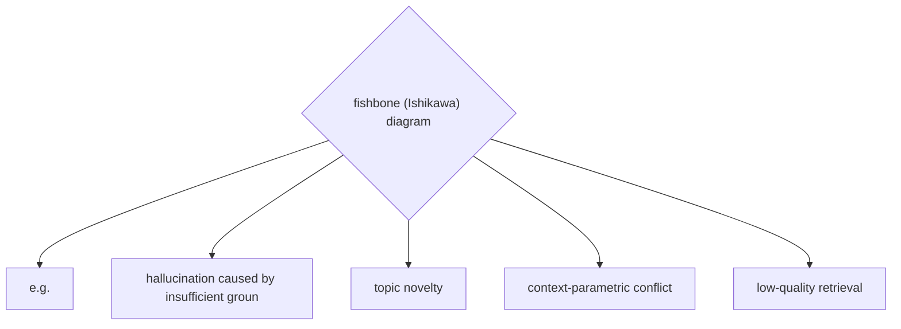
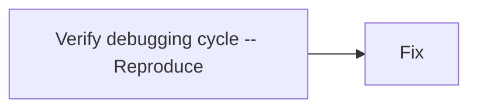

# Prompt Debugging and Failure Analysis

**One-Line Summary**: Prompt debugging systematically identifies why an LLM produces incorrect or unexpected outputs by reproducing failures, isolating causal components, and verifying fixes — applying the same disciplined methodology used to debug software.
**Prerequisites**: `prompt-testing-and-evaluation.md`, `prompt-optimization-techniques.md`, `04-system-prompts-and-instruction-design/system-prompt-anatomy.md`.

## What Is Prompt Debugging?

Debugging a prompt is remarkably similar to debugging code. When a program crashes or produces wrong output, a developer follows a standard workflow: reproduce the bug, read the error logs, form a hypothesis about the cause, isolate the faulty component, apply a fix, and verify the fix does not break anything else. Prompt debugging follows the same logic — except the "code" is natural language, the "runtime" is a neural network, and the "error messages" are the model's own outputs and reasoning traces.

The challenge is that LLM failures are often subtle and non-obvious. A program either crashes or it does not; an LLM might produce an output that is plausible, well-formatted, and confidently stated — but factually wrong, subtly off-topic, or violating an implicit constraint. Identifying these failures requires careful comparison against expected behavior and domain knowledge that automated checks may not capture. The failures are also non-deterministic: the same prompt may succeed 90% of the time and fail 10%, making reproduction less straightforward than in traditional software debugging.

Effective debugging requires both a systematic process (to avoid chasing symptoms instead of root causes) and a strong mental model of how LLMs process prompts (to form accurate hypotheses about failure mechanisms). This concept brings together everything in this section — testing reveals the failures, debugging diagnoses them, and optimization and guardrails fix them.

*Source: Adapted from Ji et al., "Survey of Hallucination in Natural Language Generation," 2023.*

*Source: Adapted from Ribeiro et al., "Adaptive Testing and Debugging of NLP Models," 2022 (Microsoft Research).*

## How It Works

### Common Failure Modes

Understanding the taxonomy of LLM failures is the first step toward diagnosing them:

**Hallucination**: The model generates information that is factually incorrect or fabricated. This includes fabricated citations, invented statistics, incorrect technical details, and confidently stated misinformation. Hallucination rates vary by domain — 5-15% for well-covered topics, 15-40% for niche or recent topics. Hallucinations are often internally consistent (the fabricated fact fits the narrative), making them hard to detect without external verification.

**Instruction non-compliance**: The model fails to follow explicit instructions — ignoring constraints ("respond in 3 sentences"), skipping required sections, using a prohibited format, or addressing a different task than requested. This often occurs when instructions conflict, when the prompt is too long for the model to track all requirements, or when the instruction contradicts the model's training biases.

**Format violations**: The output does not conform to the required structure — malformed JSON, missing fields, incorrect data types, or inconsistent formatting. These failures are common when the format specification is ambiguous, when few-shot examples contradict the stated schema, or when the task complexity leaves insufficient "cognitive budget" for format compliance.

**Reasoning errors**: The model's chain-of-thought or logical steps contain errors — incorrect arithmetic, flawed logical deductions, missing premises, or invalid conclusions. These are particularly insidious in multi-step reasoning tasks where an early error compounds through subsequent steps.

**Context confusion**: In long prompts or multi-turn conversations, the model conflates information from different parts of the context — attributing one document's claims to another, mixing up user instructions from different turns, or applying constraints from one section to an unrelated section. This worsens as context length increases and is a primary failure mode in RAG systems with multiple retrieved documents.

### The Reproduce-Isolate-Fix-Verify Workflow

**Step 1: Reproduce.** Capture the exact input that caused the failure, including the full prompt (system prompt + user message + any retrieved context), model parameters (temperature, max tokens, model version), and the specific output that was problematic. Because LLMs are stochastic, run the same input 5-10 times to determine the failure rate. A failure that occurs 2 out of 10 times requires different analysis than one that occurs 10 out of 10 times. Log the exact timestamp and model version — model provider updates can change behavior.

**Step 2: Isolate.** Determine which component of the prompt is causing the failure. Use the following attribution techniques:

- **Ablation debugging**: Remove one prompt component at a time and check if the failure persists. If removing the few-shot examples eliminates the hallucination, the examples are the likely cause.
- **Minimal reproduction**: Progressively simplify the prompt until you find the minimal input that still triggers the failure. This strips away incidental complexity and exposes the core issue.
- **Context attribution**: For RAG failures, test each retrieved document individually to identify which one contains conflicting or misleading information.
- **Instruction conflict detection**: Check for contradictory instructions by having a separate LLM analyze the prompt for internal inconsistencies.

**Step 3: Fix.** Apply a targeted correction based on the diagnosed root cause. Common fixes include: rewriting ambiguous instructions for clarity, adding explicit constraints to prevent the specific failure, reordering prompt components to improve attention to critical instructions, replacing misleading few-shot examples, adding negative examples that demonstrate what not to do, and strengthening format specifications with stricter schemas.

**Step 4: Verify.** Run the fix against the original failing input (10+ times to account for stochasticity), the full eval suite (to check for regressions), and a set of related inputs (to verify the fix generalizes). A fix that resolves the specific failure but introduces new failures in the eval suite should not be deployed.

### Log Analysis for Production Debugging

Production debugging adds the challenge of scale: you cannot manually review every response. Effective production debugging requires:

**Structured logging**: Log every request-response pair with metadata — timestamp, user ID, prompt version, model version, latency, token counts, guardrail triggers, and any automated quality scores. Store logs in a queryable format (not flat files).

**Automated failure detection**: Use LLM-as-judge, format validators, and custom heuristics to flag potentially problematic responses automatically. Target a flag rate of 1-5% of responses for human review — too low misses problems, too high overwhelms reviewers.

**Failure categorization**: Cluster flagged responses by failure type using the taxonomy above. This reveals patterns — for example, "hallucination rates spike on questions about topic X" or "format violations increase when context length exceeds 3,000 tokens." Patterns point to systematic issues that affect many users, not just the individual flagged response.

**Trend monitoring**: Track failure rates over time, broken down by failure type, user segment, and prompt version. Sudden spikes indicate model updates or new input patterns; gradual increases indicate drift. Set alerts for failure rate thresholds (e.g., alert if hallucination rate exceeds 8% over a 24-hour window).

### Attribution Techniques

When a failure occurs, determining which part of the prompt caused it is the hardest and most valuable step. Beyond ablation debugging, advanced attribution techniques include:

**Attention analysis**: Some models and APIs provide attention weights or token-level logits. Examining which input tokens the model attended to when generating the erroneous output can reveal whether the model focused on the wrong context section or misinterpreted a specific instruction.

**Counterfactual testing**: Generate variations of the input that change only the suspected causal factor. If the failure disappears when you rephrase one instruction, that instruction is likely the cause. If the failure persists across all variations, the cause is deeper (model limitation, task difficulty, or systemic context confusion).

**Prompt narration**: Ask the model to explain, step by step, how it interpreted the prompt and arrived at its output. This "thinking out loud" approach reveals misinterpretations that are not visible in the output alone. It is especially useful for reasoning errors and instruction non-compliance.

## Why It Matters

### Reducing Mean Time to Resolution

Without a systematic debugging workflow, teams spend hours or days chasing symptoms — tweaking wording randomly, adding more instructions (often making the prompt worse), or concluding the model "just cannot do this." A disciplined reproduce-isolate-fix-verify workflow reduces mean time to resolution from hours to 30-60 minutes for most failures. The key time saver is the isolation step: once you know which component is responsible, the fix is usually straightforward.

### Building Institutional Knowledge

Every debugged failure contributes to the team's understanding of how the model behaves and what patterns cause problems. Over time, this institutional knowledge accelerates future debugging and improves first-draft prompt quality. Teams that document their debugging findings — which phrasings cause confusion, which instruction patterns lead to non-compliance, which context structures trigger hallucinations — develop a growing "prompt engineering playbook" that prevents recurring mistakes.

### Continuous Improvement Loop

Debugging is the critical link between detecting failures and preventing them. The complete improvement loop is: monitoring detects failures, debugging diagnoses root causes, fixes are applied and verified, and the failing inputs are added to the eval suite as regression cases. Without the debugging step, teams can detect that something is wrong but cannot systematically make it right.

## Key Technical Details

- Hallucination rates vary from 5-15% on well-covered topics to 15-40% on niche or recent topics, depending on model and retrieval quality.
- Run failing inputs 5-10 times to determine stochastic failure rates; a 20% failure rate requires different fixes than a 100% failure rate.
- Ablation debugging on a 10-component prompt requires 10 eval runs (approximately 1-2 hours with a standard eval suite).
- Minimal reproduction typically reduces a failing prompt from thousands of tokens to 100-300 tokens that expose the core issue.
- Production log analysis should flag 1-5% of responses for human review; below 1% misses issues, above 5% overwhelms reviewers.
- Instruction non-compliance increases when prompts exceed 2,000-3,000 tokens, as the model's attention to individual constraints degrades.
- Context confusion failures increase roughly linearly with the number of distinct context sources (retrieved documents, tool outputs) in the prompt.
- Format violation rates can be reduced from 5-15% to under 1% by combining explicit schemas, few-shot examples, and output validators with retry loops.

## Common Misconceptions

- **"If it works on my examples, it works in general."** Development examples are typically clean, well-formed, and representative of the easy cases. Production traffic includes typos, ambiguous queries, edge cases, multilingual inputs, and adversarial probes. Always debug against production-representative inputs, not just development examples.
- **"Adding more instructions fixes non-compliance."** When the model ignores an instruction, adding more instructions often makes the problem worse by increasing cognitive load and creating opportunities for instruction conflicts. Instead, simplify: remove competing instructions, increase the salience of the critical one (move it to the end, emphasize with formatting), and test whether the model can follow it in isolation.
- **"Hallucinations are random and unpredictable."** Many hallucinations are systematic — they occur predictably for specific input patterns, topic areas, or context configurations. Debugging reveals these patterns, enabling targeted fixes (adding grounding documents, explicit "say I don't know" instructions, or retrieval-based verification).
- **"Model updates do not affect my prompts."** Provider model updates can change behavior in subtle ways. A prompt that worked perfectly with one model checkpoint may develop new failure modes after an update. This is why periodic re-evaluation (not just event-driven debugging) is essential.
- **"The model is just not smart enough for this task."** Before concluding that the task exceeds model capability, verify that the prompt is not the bottleneck. In the majority of debugging cases, the root cause is a prompt issue (ambiguous instructions, misleading examples, context overload), not a model limitation. Systematic debugging distinguishes between "the model cannot do this" and "the prompt does not ask for this correctly."

## Connections to Other Concepts

- `prompt-testing-and-evaluation.md` — The eval suite is the primary tool for detecting failures and verifying fixes; every debugged failure becomes a new test case.
- `prompt-optimization-techniques.md` — Ablation debugging uses the same methodology as ablation studies for optimization; the tools are identical, only the intent differs.
- `guardrails-and-output-filtering.md` — Guardrail trigger logs are a rich source of debugging data, revealing which outputs were blocked and why.
- `red-teaming-prompts.md` — Red-teaming discovers adversarial failures; debugging diagnoses their root causes and informs defense design.
- `prompt-injection-defense-techniques.md` — Injection attacks often manifest as unexpected behavior that requires systematic debugging to distinguish from benign failures.

## Further Reading

- Madaan et al., "Self-Refine: Iterative Refinement with Self-Feedback," 2023. Demonstrates how LLMs can diagnose and correct their own output failures, applicable to automated debugging workflows.
- Ji et al., "Survey of Hallucination in Natural Language Generation," 2023. Comprehensive taxonomy of hallucination types, causes, and detection methods, essential background for diagnosing factual failures.
- Dhuliawala et al., "Chain-of-Verification Reduces Hallucination in Large Language Models," 2023 (Meta). Technique for using the model's own verification capabilities to detect and correct hallucinations.
- Arawjo et al., "ChainForge: A Visual Toolkit for Prompt Engineering and LLM Hypothesis Testing," 2024. Open-source tool for structured prompt experimentation and failure analysis with visual workflows.
- Ribeiro et al., "Adaptive Testing and Debugging of NLP Models," 2022 (Microsoft Research). Systematic methodology for finding and diagnosing NLP model failures using behavioral testing principles.
